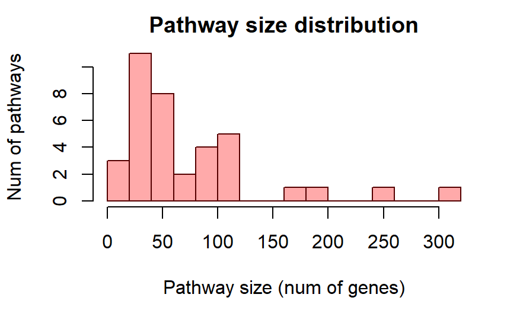

# Workflow 1: Exploration PancCanNet pathway collection

## Introduction

In this workflow, you will explore the PancCanNet pathway resource in
detail and study the pathways related to pancreatic cancer. You will
integrate knowledge from the Human Protein Atlas and TCGA about
pancreatic cancer prognostic markers and pancreatic cancer specific
genes. Lastly, you can visualize your gene or protein expression data in
the context of pancreatic cancer related processes.

The PancCanNet project is a collaboration between the Erasmus MC,
Maastricht University and Omnigen. The pathway portal is integrated in
the collaborative pathway database WikiPathways
(<http://panccannet.wikipathways.org>) and all analysis workflows are
available on Github (<https://panccannet.github.io>).

Pathway curation is an ongoing effort and we are continuously improving
current pathway models and adding new pathway models. The workflow will
always use the most-up-to-date information and results can slightly
differ to the information on the project website.

## R environment setup

First, we need to make sure all required R-packages are installed. Run
the following code snippet to install and load the libraries.

``` r
# check if libraries are installed > otherwise install
if (!requireNamespace("BiocManager", quietly = TRUE)) install.packages("BiocManager")
if(!"rstudioapi" %in% installed.packages()) BiocManager::install("rstudioapi")
if(!"rWikiPathways" %in% installed.packages()) BiocManager::install("rWikiPathways")
if(!"RCy3" %in% installed.packages()) BiocManager::install("RCy3")
if(!"data.table" %in% installed.packages()) BiocManager::install("data.table")
if(!"heatmaply" %in% installed.packages()) BiocManager::install("heatmaply")
if(!"igraph" %in% installed.packages()) BiocManager::install("igraph")
if(!"RColorBrewer" %in% installed.packages()) BiocManager::install("RColorBrewer")

# load required libraries
library(rstudioapi)
library(rWikiPathways)
library(RCy3)
library(data.table)
library(heatmaply)
library(igraph)
library(RColorBrewer)

# set working environment to source file
setwd(dirname(rstudioapi::getActiveDocumentContext()$path))
```

## Explore PancCanNet pathway resources

The following section will download the current PancCanNet pathway
collection and provide basic statistics and information about the
pathways.

``` r
# retrieve pathway list
pwys <- rWikiPathways::getPathwayIdsByCurationTag("Curation:PancCanNet")
print(paste0("The PancCanNet pathway portal currently contains ",length(pwys)," pathways."))

# retrieve gene list per pathway
mylist <- list()
x <- 1
for(p in pwys) {
  genes <- rWikiPathways::getXrefList(p,"En")
  for(g in genes) {
    mylist[[x]] <- c(p,g)
    x <- x+1
  }
}
pwy.genes <- as.data.frame(do.call("rbind",mylist))
rm(mylist,x,genes,p,g)

# report pathway size distribution
hist(table(pwy.genes$V1), breaks=15, xlab="Pathway size (num of genes)", ylab = "Num of pathways", main="Pathway size distribution", col="#FFAAAA",border="#550000")

# report unique number of genes in PancCanNet pathways
print(paste0("The pathways in the PancCanNet collection currently contain ",length(unique(pwy.genes$V2))," unique genes."))
```

**Output**
```
[1] "The PancCanNet pathway portal currently contains 37 pathways."
[2] "The pathways in the PancCanNet collection currently contain 1438 unique genes."
```



Let’s explore the overlap and crosstalk between the pathways in the
collection. We will first calculate the Jaccard similarity score (based
on gene content) and additionally, we will visualize the pathway-gene
network in Cytoscape which allows us to see which genes are present in
many pathways.

``` r
# calculate Jaccard index
jaccard <- matrix(ncol=length(pwys), nrow=length(pwys))
for(i in 1:length(pwys)) {
  for(j in i:length(pwys)) {
    genes1 <- pwy.genes[pwy.genes$V1 == pwys[i],2]
    genes2 <- pwy.genes[pwy.genes$V1 == pwys[j],2]
    intersection = length(intersect(genes1, genes2))
    union = length(genes1) + length(genes2) - intersection
    score <- (intersection/union)
    jaccard[i,j] <- score
    jaccard[j,i] <- score
  }
}

colnames(jaccard) <- pwys
rownames(jaccard) <- pwys

heatmaply(jaccard,main="Similarity plot PancCanNet pathways",plot_method = "plotly", colors = viridis(n = 256,  option = "magma"))
```

    ## PhantomJS not found. You can install it with webshot::install_phantomjs(). If it is installed, please make sure the phantomjs executable can be found via the PATH variable.

<div id="htmlwidget-659cef3294c2970eeec5" style="width:672px;height:480px;" class="plotly html-widget"></div>
<script type="application/json" data-for="htmlwidget-659cef3294c2970eeec5">{"x":{"data":[{"x":[17.978515625,6.03125,null,6.03125,6.03125,null,6.03125,2.5,null,2.5,2.5,null,2.5,1.5,null,1.5,1.5,null,1.5,1,null,1,1,null,1.5,2,null,2,2,null,2.5,3.5,null,3.5,3.5,null,3.5,3,null,3,3,null,3.5,4,null,4,4,null,6.03125,9.5625,null,9.5625,9.5625,null,9.5625,5.875,null,5.875,5.875,null,5.875,5,null,5,5,null,5.875,6.75,null,6.75,6.75,null,6.75,6,null,6,6,null,6.75,7.5,null,7.5,7.5,null,7.5,7,null,7,7,null,7.5,8,null,8,8,null,9.5625,13.25,null,13.25,13.25,null,13.25,11,null,11,11,null,11,9.5,null,9.5,9.5,null,9.5,9,null,9,9,null,9.5,10,null,10,10,null,11,12.5,null,12.5,12.5,null,12.5,11.5,null,11.5,11.5,null,11.5,11,null,11,11,null,11.5,12,null,12,12,null,12.5,13.5,null,13.5,13.5,null,13.5,13,null,13,13,null,13.5,14,null,14,14,null,13.25,15.5,null,15.5,15.5,null,15.5,15,null,15,15,null,15.5,16,null,16,16,null,17.978515625,29.92578125,null,29.92578125,29.92578125,null,29.92578125,23.9765625,null,23.9765625,23.9765625,null,23.9765625,18.5,null,18.5,18.5,null,18.5,17.5,null,17.5,17.5,null,17.5,17,null,17,17,null,17.5,18,null,18,18,null,18.5,19.5,null,19.5,19.5,null,19.5,19,null,19,19,null,19.5,20,null,20,20,null,23.9765625,29.453125,null,29.453125,29.453125,null,29.453125,26.40625,null,26.40625,26.40625,null,26.40625,23.3125,null,23.3125,23.3125,null,23.3125,21.5,null,21.5,21.5,null,21.5,21,null,21,21,null,21.5,22,null,22,22,null,23.3125,25.125,null,25.125,25.125,null,25.125,23.75,null,23.75,23.75,null,23.75,23,null,23,23,null,23.75,24.5,null,24.5,24.5,null,24.5,24,null,24,24,null,24.5,25,null,25,25,null,25.125,26.5,null,26.5,26.5,null,26.5,26,null,26,26,null,26.5,27,null,27,27,null,26.40625,29.5,null,29.5,29.5,null,29.5,28.5,null,28.5,28.5,null,28.5,28,null,28,28,null,28.5,29,null,29,29,null,29.5,30.5,null,30.5,30.5,null,30.5,30,null,30,30,null,30.5,31,null,31,31,null,29.453125,32.5,null,32.5,32.5,null,32.5,32,null,32,32,null,32.5,33,null,33,33,null,29.92578125,35.875,null,35.875,35.875,null,35.875,34.75,null,34.75,34.75,null,34.75,34,null,34,34,null,34.75,35.5,null,35.5,35.5,null,35.5,35,null,35,35,null,35.5,36,null,36,36,null,35.875,37,null,37,37],"y":[1.56178703683193,1.56178703683193,null,1.56178703683193,1.45681943452861,null,1.45681943452861,1.45681943452861,null,1.45681943452861,1.44010400077856,null,1.44010400077856,1.44010400077856,null,1.44010400077856,1.16958626872831,null,1.16958626872831,1.16958626872831,null,1.16958626872831,0,null,1.16958626872831,1.16958626872831,null,1.16958626872831,0,null,1.44010400077856,1.44010400077856,null,1.44010400077856,1.23371990140879,null,1.23371990140879,1.23371990140879,null,1.23371990140879,0,null,1.23371990140879,1.23371990140879,null,1.23371990140879,0,null,1.45681943452861,1.45681943452861,null,1.45681943452861,1.39704313193363,null,1.39704313193363,1.39704313193363,null,1.39704313193363,1.31101321037196,null,1.31101321037196,1.31101321037196,null,1.31101321037196,0,null,1.31101321037196,1.31101321037196,null,1.31101321037196,1.1531234432201,null,1.1531234432201,1.1531234432201,null,1.1531234432201,0,null,1.1531234432201,1.1531234432201,null,1.1531234432201,1.1363414699209,null,1.1363414699209,1.1363414699209,null,1.1363414699209,0,null,1.1363414699209,1.1363414699209,null,1.1363414699209,0,null,1.39704313193363,1.39704313193363,null,1.39704313193363,1.3912011491342,null,1.3912011491342,1.3912011491342,null,1.3912011491342,1.3348814874677,null,1.3348814874677,1.3348814874677,null,1.3348814874677,1.26822656858447,null,1.26822656858447,1.26822656858447,null,1.26822656858447,0,null,1.26822656858447,1.26822656858447,null,1.26822656858447,0,null,1.3348814874677,1.3348814874677,null,1.3348814874677,1.27437340490062,null,1.27437340490062,1.27437340490062,null,1.27437340490062,1.15400012988516,null,1.15400012988516,1.15400012988516,null,1.15400012988516,0,null,1.15400012988516,1.15400012988516,null,1.15400012988516,0,null,1.27437340490062,1.27437340490062,null,1.27437340490062,1.05549173667531,null,1.05549173667531,1.05549173667531,null,1.05549173667531,0,null,1.05549173667531,1.05549173667531,null,1.05549173667531,0,null,1.3912011491342,1.3912011491342,null,1.3912011491342,1.27846489173976,null,1.27846489173976,1.27846489173976,null,1.27846489173976,0,null,1.27846489173976,1.27846489173976,null,1.27846489173976,0,null,1.56178703683193,1.56178703683193,null,1.56178703683193,1.51260763688823,null,1.51260763688823,1.51260763688823,null,1.51260763688823,1.48018123636657,null,1.48018123636657,1.48018123636657,null,1.48018123636657,1.40742421513398,null,1.40742421513398,1.40742421513398,null,1.40742421513398,1.31867434232351,null,1.31867434232351,1.31867434232351,null,1.31867434232351,0,null,1.31867434232351,1.31867434232351,null,1.31867434232351,0,null,1.40742421513398,1.40742421513398,null,1.40742421513398,1.27311551968749,null,1.27311551968749,1.27311551968749,null,1.27311551968749,0,null,1.27311551968749,1.27311551968749,null,1.27311551968749,0,null,1.48018123636657,1.48018123636657,null,1.48018123636657,1.45707805720279,null,1.45707805720279,1.45707805720279,null,1.45707805720279,1.43560517616409,null,1.43560517616409,1.43560517616409,null,1.43560517616409,1.43010384431198,null,1.43010384431198,1.43010384431198,null,1.43010384431198,1.36693513044679,null,1.36693513044679,1.36693513044679,null,1.36693513044679,0,null,1.36693513044679,1.36693513044679,null,1.36693513044679,0,null,1.43010384431198,1.43010384431198,null,1.43010384431198,1.40052865297325,null,1.40052865297325,1.40052865297325,null,1.40052865297325,1.39041340603471,null,1.39041340603471,1.39041340603471,null,1.39041340603471,0,null,1.39041340603471,1.39041340603471,null,1.39041340603471,1.33966665529694,null,1.33966665529694,1.33966665529694,null,1.33966665529694,0,null,1.33966665529694,1.33966665529694,null,1.33966665529694,0,null,1.40052865297325,1.40052865297325,null,1.40052865297325,1.33440022766757,null,1.33440022766757,1.33440022766757,null,1.33440022766757,0,null,1.33440022766757,1.33440022766757,null,1.33440022766757,0,null,1.43560517616409,1.43560517616409,null,1.43560517616409,1.42360282196048,null,1.42360282196048,1.42360282196048,null,1.42360282196048,1.41528580983692,null,1.41528580983692,1.41528580983692,null,1.41528580983692,0,null,1.41528580983692,1.41528580983692,null,1.41528580983692,0,null,1.42360282196048,1.42360282196048,null,1.42360282196048,1.36971157194317,null,1.36971157194317,1.36971157194317,null,1.36971157194317,0,null,1.36971157194317,1.36971157194317,null,1.36971157194317,0,null,1.45707805720279,1.45707805720279,null,1.45707805720279,1.09604143536726,null,1.09604143536726,1.09604143536726,null,1.09604143536726,0,null,1.09604143536726,1.09604143536726,null,1.09604143536726,0,null,1.51260763688823,1.51260763688823,null,1.51260763688823,1.18817614216132,null,1.18817614216132,1.18817614216132,null,1.18817614216132,1.08091196696112,null,1.08091196696112,1.08091196696112,null,1.08091196696112,0,null,1.08091196696112,1.08091196696112,null,1.08091196696112,0.935751043511784,null,0.935751043511784,0.935751043511784,null,0.935751043511784,0,null,0.935751043511784,0.935751043511784,null,0.935751043511784,0,null,1.18817614216132,1.18817614216132,null,1.18817614216132,0],"type":"scatter","mode":"lines","showlegend":false,"hoverinfo":["y","y",null,"y","y",null,"y","y",null,"y","y",null,"y","y",null,"y","y",null,"y","y",null,"y","y",null,"y","y",null,"y","y",null,"y","y",null,"y","y",null,"y","y",null,"y","y",null,"y","y",null,"y","y",null,"y","y",null,"y","y",null,"y","y",null,"y","y",null,"y","y",null,"y","y",null,"y","y",null,"y","y",null,"y","y",null,"y","y",null,"y","y",null,"y","y",null,"y","y",null,"y","y",null,"y","y",null,"y","y",null,"y","y",null,"y","y",null,"y","y",null,"y","y",null,"y","y",null,"y","y",null,"y","y",null,"y","y",null,"y","y",null,"y","y",null,"y","y",null,"y","y",null,"y","y",null,"y","y",null,"y","y",null,"y","y",null,"y","y",null,"y","y",null,"y","y",null,"y","y",null,"y","y",null,"y","y",null,"y","y",null,"y","y",null,"y","y",null,"y","y",null,"y","y",null,"y","y",null,"y","y",null,"y","y",null,"y","y",null,"y","y",null,"y","y",null,"y","y",null,"y","y",null,"y","y",null,"y","y",null,"y","y",null,"y","y",null,"y","y",null,"y","y",null,"y","y",null,"y","y",null,"y","y",null,"y","y",null,"y","y",null,"y","y",null,"y","y",null,"y","y",null,"y","y",null,"y","y",null,"y","y",null,"y","y",null,"y","y",null,"y","y",null,"y","y",null,"y","y",null,"y","y",null,"y","y",null,"y","y",null,"y","y",null,"y","y",null,"y","y",null,"y","y",null,"y","y",null,"y","y",null,"y","y",null,"y","y",null,"y","y",null,"y","y",null,"y","y",null,"y","y",null,"y","y",null,"y","y",null,"y","y",null,"y","y",null,"y","y",null,"y","y",null,"y","y",null,"y","y",null,"y","y",null,"y","y",null,"y","y",null,"y","y",null,"y","y",null,"y","y",null,"y","y",null,"y","y",null,"y","y",null,"y","y",null,"y","y",null,"y","y",null,"y","y",null,"y","y",null,"y","y",null,"y","y",null,"y","y",null,"y","y",null,"y","y",null,"y","y",null,"y","y",null,"y","y",null,"y","y",null,"y","y",null,"y","y",null,"y","y",null,"y","y",null,"y","y",null,"y","y",null,"y","y",null,"y","y",null,"y","y"],"name":"1","marker":{"color":"rgba(0,0,0,1)","line":{"color":"rgba(0,0,0,1)"}},"textfont":{"color":"rgba(0,0,0,1)"},"error_y":{"color":"rgba(0,0,0,1)"},"error_x":{"color":"rgba(0,0,0,1)"},"line":{"color":"rgba(0,0,0,1)"},"xaxis":"x","yaxis":"y","frame":null},{"type":"scatter","mode":"markers","marker":{"color":"rgba(255,127,14,1)","line":{"color":"rgba(255,127,14,1)"}},"error_y":{"color":"rgba(255,127,14,1)"},"error_x":{"color":"rgba(255,127,14,1)"},"line":{"color":"rgba(255,127,14,1)"},"xaxis":"x2","yaxis":"y","frame":null},{"colorbar":{"ticklen":2,"lenmode":"fraction","xanchor":"left","x":1.1,"y":0,"yanchor":"bottom","len":0.3,"thickness":30},"colorscale":[["0","rgba(0,0,4,1)"],["0.0416666666666667","rgba(6,5,23,1)"],["0.0833333333333333","rgba(16,11,45,1)"],["0.125","rgba(29,17,71,1)"],["0.166666666666667","rgba(44,17,96,1)"],["0.208333333333333","rgba(63,15,114,1)"],["0.25","rgba(81,18,124,1)"],["0.291666666666667","rgba(97,24,128,1)"],["0.333333333333333","rgba(114,31,129,1)"],["0.375","rgba(130,38,129,1)"],["0.416666666666667","rgba(147,43,128,1)"],["0.458333333333333","rgba(165,49,126,1)"],["0.5","rgba(182,54,122,1)"],["0.541666666666667","rgba(199,61,115,1)"],["0.583333333333333","rgba(215,69,108,1)"],["0.625","rgba(230,81,100,1)"],["0.666666666666667","rgba(241,96,93,1)"],["0.708333333333333","rgba(248,115,92,1)"],["0.75","rgba(251,136,97,1)"],["0.791666666666667","rgba(253,155,107,1)"],["0.833333333333333","rgba(254,175,119,1)"],["0.875","rgba(254,194,135,1)"],["0.916666666666667","rgba(254,215,152,1)"],["0.958333333333333","rgba(253,234,171,1)"],["1","rgba(252,253,191,1)"]],"showscale":true,"z":[[1,0.210810810810811,0.00699300699300699,0.0135135135135135,0.00598802395209581,0,0.0261437908496732,0.0266666666666667,0.0242424242424242,0.0465116279069767,0.0240549828178694,0.0294117647058824,0.0252525252525253,0.0673575129533679,0.00938967136150235,0.00240963855421687,0.01,0,0,0.00598802395209581,0,0,0,0.0304878048780488,0.0136986301369863,0,0.00709219858156028,0.032258064516129,0.0328947368421053,0,0,0,0,0.0149253731343284,0.0229885057471264,0.0218340611353712,0.0224719101123595],[0.210810810810811,1,0.129032258064516,0.020979020979021,0.0379746835443038,0.0625,0.0774647887323944,0.0948905109489051,0.0645161290322581,0.0820668693009119,0.113636363636364,0.099601593625498,0.18452380952381,0.188235294117647,0.0710659898477157,0.0785340314136126,0.106145251396648,0.00847457627118644,0.0220588235294118,0.0718954248366013,0.0229007633587786,0,0,0.0645161290322581,0.0792079207920792,0.00740740740740741,0.0072992700729927,0.0196078431372549,0.02,0.012987012987013,0,0.00714285714285714,0,0.0471204188481675,0.0674846625766871,0.0747663551401869,0.0787878787878788],[0.00699300699300699,0.129032258064516,1,0.137931034482759,0.0632911392405063,0.0566037735849057,0.0735294117647059,0.0294117647058824,0.0365853658536585,0.0147058823529412,0.0541871921182266,0.0652173913043478,0.0818181818181818,0.14018691588785,0.0234375,0.0709677419354839,0.0260869565217391,0,0,0.024390243902439,0.0588235294117647,0,0,0.0119047619047619,0.0615384615384615,0,0.0175438596491228,0,0,0.027027027027027,0,0,0,0.00840336134453781,0.010752688172043,0.0135135135135135,0.0103092783505155],[0.0135135135135135,0.020979020979021,0.137931034482759,1,0.0843373493975904,0.0163934426229508,0.0394736842105263,0.027027027027027,0.0111111111111111,0.0143884892086331,0.0185185185185185,0.0150753768844221,0.0416666666666667,0.040650406504065,0.0223880597014925,0.0432098765432099,0.00813008130081301,0,0,0.0227272727272727,0.0169491525423729,0,0,0.0111111111111111,0.0285714285714286,0,0,0,0,0.0379746835443038,0,0,0,0,0,0,0],[0.00598802395209581,0.0379746835443038,0.0632911392405063,0.0843373493975904,1,0.0958904109589041,0.127906976744186,0.0930232558139535,0.0792079207920792,0.0344827586206897,0.0393013100436681,0.0526315789473684,0.0671641791044776,0.0735294117647059,0.054421768707483,0.0501474926253687,0.0142857142857143,0,0.0121951219512195,0.0188679245283019,0.012987012987013,0,0.0833333333333333,0.0283018867924528,0.0253164556962025,0,0,0,0,0.0101010101010101,0,0,0,0,0.00854700854700855,0,0.00826446280991736],[0,0.0625,0.0566037735849057,0.0163934426229508,0.0958904109589041,1,0.189655172413793,0.2,0.0657894736842105,0.0342205323193916,0.05,0.0726256983240224,0.0747663551401869,0.113207547169811,0.076271186440678,0.0445859872611465,0.00884955752212389,0,0,0.0810810810810811,0.0638297872340425,0.0384615384615385,0.05,0.0384615384615385,0.0307692307692308,0,0,0,0,0,0,0,0,0.00869565217391304,0,0,0],[0.0261437908496732,0.0774647887323944,0.0735294117647059,0.0394736842105263,0.127906976744186,0.189655172413793,1,0.202898550724638,0.113636363636364,0.0433212996389892,0.0707547169811321,0.0885416666666667,0.128205128205128,0.125,0.0666666666666667,0.0454545454545455,0.048,0.0196078431372549,0,0.0659340659340659,0.046875,0,0.0958904109589041,0.0537634408602151,0.0486111111111111,0.0147058823529412,0,0.0229885057471264,0,0,0,0,0,0.00757575757575758,0,0.0124223602484472,0],[0.0266666666666667,0.0948905109489051,0.0294117647058824,0.027027027027027,0.0930232558139535,0.2,0.202898550724638,1,0.158536585365854,0.0916030534351145,0.114427860696517,0.113513513513514,0.141592920353982,0.137931034482759,0.0930232558139535,0.0363636363636364,0.0578512396694215,0.0652173913043478,0.0147058823529412,0.0681818181818182,0.0666666666666667,0.025,0.0405405405405405,0.0919540229885057,0.0422535211267606,0.0153846153846154,0,0,0,0.0117647058823529,0,0,0,0.00775193798449612,0,0,0],[0.0242424242424242,0.0645161290322581,0.0365853658536585,0.0111111111111111,0.0792079207920792,0.0657894736842105,0.113636363636364,0.158536585365854,1,0.114814814814815,0.0765765765765766,0.0676328502415459,0.107692307692308,0.0970149253731343,0.0469798657718121,0.0288184438040346,0.0916030534351145,0.103448275862069,0.037037037037037,0.0792079207920792,0.0533333333333333,0,0.0222222222222222,0.0377358490566038,0.0516129032258065,0.0253164556962025,0.0121951219512195,0,0,0.0306122448979592,0,0,0,0,0,0,0],[0.0465116279069767,0.0820668693009119,0.0147058823529412,0.0143884892086331,0.0344827586206897,0.0342205323193916,0.0433212996389892,0.0916030534351145,0.114814814814815,1,0.178082191780822,0.0899470899470899,0.120401337792642,0.108196721311475,0.084375,0.096,0.0569620253164557,0.0240963855421687,0.0261194029850746,0.0676156583629893,0.0227272727272727,0,0.00711743772241993,0.0379310344827586,0.0381231671554252,0.0187265917602996,0.00735294117647059,0,0.0176056338028169,0.0245614035087719,0,0,0,0.0181818181818182,0.00977198697068404,0.0194986072423398,0.0161812297734628],[0.0240549828178694,0.113636363636364,0.0541871921182266,0.0185185185185185,0.0393013100436681,0.05,0.0707547169811321,0.114427860696517,0.0765765765765766,0.178082191780822,1,0.19047619047619,0.192139737991266,0.194805194805195,0.0961538461538462,0.127610208816705,0.0461538461538462,0.0265957446808511,0.0142857142857143,0.0672645739910314,0.0452261306532663,0,0.00454545454545455,0.0170212765957447,0.0174216027874564,0,0,0,0.0133928571428571,0.013215859030837,0,0,0,0.00735294117647059,0,0.0033003300330033,0.00398406374501992],[0.0294117647058824,0.099601593625498,0.0652173913043478,0.0150753768844221,0.0526315789473684,0.0726256983240224,0.0885416666666667,0.113513513513514,0.0676328502415459,0.0899470899470899,0.19047619047619,1,0.123348017621145,0.136563876651982,0.117154811715481,0.0985915492957746,0.036734693877551,0.0355029585798817,0.0103626943005181,0.0526315789473684,0.021505376344086,0,0.0304568527918782,0.0231481481481481,0.0300751879699248,0,0.0210526315789474,0,0.0245098039215686,0.00952380952380952,0,0,0,0.00392156862745098,0,0.00350877192982456,0],[0.0252525252525253,0.18452380952381,0.0818181818181818,0.0416666666666667,0.0671641791044776,0.0747663551401869,0.128205128205128,0.141592920353982,0.107692307692308,0.120401337792642,0.192139737991266,0.123348017621145,1,0.265734265734266,0.117647058823529,0.0712328767123288,0.0925925925925926,0.0537634408602151,0.0535714285714286,0.172131147540984,0.036697247706422,0,0.024390243902439,0.099236641221374,0.0706521739130435,0.0087719298245614,0,0,0.00763358778625954,0.0227272727272727,0,0,0,0.0591715976331361,0.0774647887323944,0.1,0.0979020979020979],[0.0673575129533679,0.188235294117647,0.14018691588785,0.040650406504065,0.0735294117647059,0.113207547169811,0.125,0.137931034482759,0.0970149253731343,0.108196721311475,0.194805194805195,0.136563876651982,0.265734265734266,1,0.148809523809524,0.0883977900552486,0.0588235294117647,0,0,0.0895522388059701,0.0545454545454545,0.0108695652173913,0,0.0352112676056338,0.0695187165775401,0,0.0169491525423729,0,0.00746268656716418,0.0072992700729927,0,0,0,0.0520231213872832,0.04,0.0392156862745098,0.0457516339869281],[0.00938967136150235,0.0710659898477157,0.0234375,0.0223880597014925,0.054421768707483,0.076271186440678,0.0666666666666667,0.0930232558139535,0.0469798657718121,0.084375,0.0961538461538462,0.117154811715481,0.117647058823529,0.148809523809524,1,0.101092896174863,0.0106951871657754,0,0,0.0689655172413793,0.0330578512396694,0.0099009900990099,0,0.012987012987013,0.0346534653465347,0,0,0,0,0,0,0,0,0.00526315789473684,0,0,0],[0.00240963855421687,0.0785340314136126,0.0709677419354839,0.0432098765432099,0.0501474926253687,0.0445859872611465,0.0454545454545455,0.0363636363636364,0.0288184438040346,0.096,0.127610208816705,0.0985915492957746,0.0712328767123288,0.0883977900552486,0.101092896174863,1,0.0236220472440945,0.00647249190938511,0.0153374233128834,0.0532544378698225,0.0482315112540193,0,0.0119402985074627,0.02,0.0594315245478036,0.0154798761609907,0.00303951367781155,0,0,0.0175438596491228,0,0,0,0.0103092783505155,0.0252100840336134,0.00956937799043062,0.0136986301369863],[0.01,0.106145251396648,0.0260869565217391,0.00813008130081301,0.0142857142857143,0.00884955752212389,0.048,0.0578512396694215,0.0916030534351145,0.0569620253164557,0.0461538461538462,0.036734693877551,0.0925925925925926,0.0588235294117647,0.0106951871657754,0.0236220472440945,1,0.0777777777777778,0.0173913043478261,0.0215827338129496,0.00900900900900901,0,0.0245901639344262,0.0214285714285714,0.0537634408602151,0.00884955752212389,0.0357142857142857,0,0.00769230769230769,0.0151515151515152,0,0,0,0.0289017341040462,0.027027027027027,0.0196078431372549,0.0985915492957746],[0,0.00847457627118644,0,0,0,0,0.0196078431372549,0.0652173913043478,0.103448275862069,0.0240963855421687,0.0265957446808511,0.0355029585798817,0.0537634408602151,0,0,0.00647249190938511,0.0777777777777778,1,0.0555555555555556,0.0327868852459016,0,0,0,0.032258064516129,0.00862068965517241,0.0606060606060606,0.0277777777777778,0,0,0.0377358490566038,0,0,0,0,0,0,0],[0,0.0220588235294118,0,0,0.0121951219512195,0,0,0.0147058823529412,0.037037037037037,0.0261194029850746,0.0142857142857143,0.0103626943005181,0.0535714285714286,0,0,0.0153374233128834,0.0173913043478261,0.0555555555555556,1,0.121621621621622,0.0192307692307692,0,0,0.024390243902439,0.00735294117647059,0.0377358490566038,0,0,0,0.0135135135135135,0,0,0,0,0,0.0205479452054795,0],[0.00598802395209581,0.0718954248366013,0.024390243902439,0.0227272727272727,0.0188679245283019,0.0810810810810811,0.0659340659340659,0.0681818181818182,0.0792079207920792,0.0676156583629893,0.0672645739910314,0.0526315789473684,0.172131147540984,0.0895522388059701,0.0689655172413793,0.0532544378698225,0.0215827338129496,0.0327868852459016,0.121621621621622,1,0.114285714285714,0.0185185185185185,0,0.101010101010101,0.0588235294117647,0.0126582278481013,0,0,0,0.0101010101010101,0,0,0,0.0285714285714286,0.0350877192982456,0.0609756097560976,0.0338983050847458],[0,0.0229007633587786,0.0588235294117647,0.0169491525423729,0.012987012987013,0.0638297872340425,0.046875,0.0666666666666667,0.0533333333333333,0.0227272727272727,0.0452261306532663,0.021505376344086,0.036697247706422,0.0545454545454545,0.0330578512396694,0.0482315112540193,0.00900900900900901,0,0.0192307692307692,0.114285714285714,1,0.0416666666666667,0,0.025974025974026,0.0232558139534884,0,0,0.0144927536231884,0,0,0,0,0,0,0,0,0],[0,0,0,0,0,0.0384615384615385,0,0.025,0,0,0,0,0,0.0108695652173913,0.0099009900990099,0,0,0,0,0.0185185185185185,0.0416666666666667,1,0,0,0.00925925925925926,0,0,0,0,0,0,0,0,0,0,0,0],[0,0,0,0,0.0833333333333333,0.05,0.0958904109589041,0.0405405405405405,0.0222222222222222,0.00711743772241993,0.00454545454545455,0.0304568527918782,0.024390243902439,0,0,0.0119402985074627,0.0245901639344262,0,0,0,0,0,1,0.0337078651685393,0.0283687943262411,0.05,0.015625,0,0,0,0,0,0,0,0,0,0],[0.0304878048780488,0.0645161290322581,0.0119047619047619,0.0111111111111111,0.0283018867924528,0.0384615384615385,0.0537634408602151,0.0919540229885057,0.0377358490566038,0.0379310344827586,0.0170212765957447,0.0231481481481481,0.099236641221374,0.0352112676056338,0.012987012987013,0.02,0.0214285714285714,0.032258064516129,0.024390243902439,0.101010101010101,0.025974025974026,0,0.0337078651685393,1,0.0584415584415584,0.0384615384615385,0.0246913580246914,0.01,0,0.01,0,0,0,0,0,0.0294117647058824,0],[0.0136986301369863,0.0792079207920792,0.0615384615384615,0.0285714285714286,0.0253164556962025,0.0307692307692308,0.0486111111111111,0.0422535211267606,0.0516129032258065,0.0381231671554252,0.0174216027874564,0.0300751879699248,0.0706521739130435,0.0695187165775401,0.0346534653465347,0.0594315245478036,0.0537634408602151,0.00862068965517241,0.00735294117647059,0.0588235294117647,0.0232558139534884,0.00925925925925926,0.0283687943262411,0.0584415584415584,1,0.0634920634920635,0.0225563909774436,0,0.00666666666666667,0.0065359477124183,0,0.0072463768115942,0.00769230769230769,0.0476190476190476,0.0487804878048781,0.0604651162790698,0.0352941176470588],[0,0.00740740740740741,0,0,0,0,0.0147058823529412,0.0153846153846154,0.0253164556962025,0.0187265917602996,0,0,0.0087719298245614,0,0,0.0154798761609907,0.00884955752212389,0.0606060606060606,0.0377358490566038,0.0126582278481013,0,0,0.05,0.0384615384615385,0.0634920634920635,1,0.0588235294117647,0,0,0,0,0,0,0,0,0.00689655172413793,0],[0.00709219858156028,0.0072992700729927,0.0175438596491228,0,0,0,0,0,0.0121951219512195,0.00735294117647059,0,0.0210526315789474,0,0.0169491525423729,0,0.00303951367781155,0.0357142857142857,0.0277777777777778,0,0,0,0,0.015625,0.0246913580246914,0.0225563909774436,0.0588235294117647,1,0.0136986301369863,0,0,0,0,0,0.00854700854700855,0.010989010989011,0.00680272108843537,0.0105263157894737],[0.032258064516129,0.0196078431372549,0,0,0,0,0.0229885057471264,0,0,0,0,0,0,0,0,0,0,0,0,0,0.0144927536231884,0,0,0.01,0,0,0.0136986301369863,1,0,0,0,0,0,0.00740740740740741,0,0.0121951219512195,0],[0.0328947368421053,0.02,0,0,0,0,0,0,0,0.0176056338028169,0.0133928571428571,0.0245098039215686,0.00763358778625954,0.00746268656716418,0,0,0.00769230769230769,0,0,0,0,0,0,0,0.00666666666666667,0,0,0,1,0,0,0,0,0.00757575757575758,0.019047619047619,0.0124223602484472,0.018348623853211],[0,0.012987012987013,0.027027027027027,0.0379746835443038,0.0101010101010101,0,0,0.0117647058823529,0.0306122448979592,0.0245614035087719,0.013215859030837,0.00952380952380952,0.0227272727272727,0.0072992700729927,0,0.0175438596491228,0.0151515151515152,0.0377358490566038,0.0135135135135135,0.0101010101010101,0,0,0,0.01,0.0065359477124183,0,0,0,0,1,0.037037037037037,0,0,0.0303030303030303,0.0185185185185185,0.0506329113924051,0.117647058823529],[0,0,0,0,0,0,0,0,0,0,0,0,0,0,0,0,0,0,0,0,0,0,0,0,0,0,0,0,0,0.037037037037037,1,0.025,0,0.0101010101010101,0,0.00775193798449612,0.012987012987013],[0,0.00714285714285714,0,0,0,0,0,0,0,0,0,0,0,0,0,0,0,0,0,0,0,0,0,0,0.0072463768115942,0,0,0,0,0,0.025,1,0.227272727272727,0.0431034482758621,0.0326086956521739,0.00666666666666667,0],[0,0,0,0,0,0,0,0,0,0,0,0,0,0,0,0,0,0,0,0,0,0,0,0,0.00769230769230769,0,0,0,0,0,0,0.227272727272727,1,0.107843137254902,0.0740740740740741,0.00704225352112676,0.0224719101123595],[0.0149253731343284,0.0471204188481675,0.00840336134453781,0,0,0.00869565217391304,0.00757575757575758,0.00775193798449612,0,0.0181818181818182,0.00735294117647059,0.00392156862745098,0.0591715976331361,0.0520231213872832,0.00526315789473684,0.0103092783505155,0.0289017341040462,0,0,0.0285714285714286,0,0,0,0,0.0476190476190476,0,0.00854700854700855,0.00740740740740741,0.00757575757575758,0.0303030303030303,0.0101010101010101,0.0431034482758621,0.107843137254902,1,0.294117647058824,0.242603550295858,0.17037037037037],[0.0229885057471264,0.0674846625766871,0.010752688172043,0,0.00854700854700855,0,0,0,0,0.00977198697068404,0,0,0.0774647887323944,0.04,0,0.0252100840336134,0.027027027027027,0,0,0.0350877192982456,0,0,0,0,0.0487804878048781,0,0.010989010989011,0,0.019047619047619,0.0185185185185185,0,0.0326086956521739,0.0740740740740741,0.294117647058824,1,0.343065693430657,0.2],[0.0218340611353712,0.0747663551401869,0.0135135135135135,0,0,0,0.0124223602484472,0,0,0.0194986072423398,0.0033003300330033,0.00350877192982456,0.1,0.0392156862745098,0,0.00956937799043062,0.0196078431372549,0,0.0205479452054795,0.0609756097560976,0,0,0,0.0294117647058824,0.0604651162790698,0.00689655172413793,0.00680272108843537,0.0121951219512195,0.0124223602484472,0.0506329113924051,0.00775193798449612,0.00666666666666667,0.00704225352112676,0.242603550295858,0.343065693430657,1,0.205128205128205],[0.0224719101123595,0.0787878787878788,0.0103092783505155,0,0.00826446280991736,0,0,0,0,0.0161812297734628,0.00398406374501992,0,0.0979020979020979,0.0457516339869281,0,0.0136986301369863,0.0985915492957746,0,0,0.0338983050847458,0,0,0,0,0.0352941176470588,0,0.0105263157894737,0,0.018348623853211,0.117647058823529,0.012987012987013,0,0.0224719101123595,0.17037037037037,0.2,0.205128205128205,1]],"x":[1,2,3,4,5,6,7,8,9,10,11,12,13,14,15,16,17,18,19,20,21,22,23,24,25,26,27,28,29,30,31,32,33,34,35,36,37],"y":[1,2,3,4,5,6,7,8,9,10,11,12,13,14,15,16,17,18,19,20,21,22,23,24,25,26,27,28,29,30,31,32,33,34,35,36,37],"text":[["row: WP428<br>column: WP428<br>value: 1","row: WP428<br>column: WP710<br>value: 0.210810810810811","row: WP428<br>column: WP3844<br>value: 0.00699300699300699","row: WP428<br>column: WP1471<br>value: 0.0135135135135135","row: WP428<br>column: WP585<br>value: 0.00598802395209581","row: WP428<br>column: WP581<br>value: 0","row: WP428<br>column: WP364<br>value: 0.0261437908496732","row: WP428<br>column: WP2526<br>value: 0.0266666666666667","row: WP428<br>column: WP195<br>value: 0.0242424242424242","row: WP428<br>column: WP382<br>value: 0.0465116279069767","row: WP428<br>column: WP4223<br>value: 0.0240549828178694","row: WP428<br>column: WP3929<br>value: 0.0294117647058824","row: WP428<br>column: WP4263<br>value: 0.0252525252525253","row: WP428<br>column: WP673<br>value: 0.0673575129533679","row: WP428<br>column: WP185<br>value: 0.00938967136150235","row: WP428<br>column: WP3932<br>value: 0.00240963855421687","row: WP428<br>column: WP254<br>value: 0.01","row: WP428<br>column: WP4480<br>value: 0","row: WP428<br>column: WP5078<br>value: 0","row: WP428<br>column: WP5144<br>value: 0.00598802395209581","row: WP428<br>column: WP1539<br>value: 0","row: WP428<br>column: WP5080<br>value: 0","row: WP428<br>column: WP619<br>value: 0","row: WP428<br>column: WP560<br>value: 0.0304878048780488","row: WP428<br>column: WP615<br>value: 0.0136986301369863","row: WP428<br>column: WP530<br>value: 0","row: WP428<br>column: WP5092<br>value: 0.00709219858156028","row: WP428<br>column: WP268<br>value: 0.032258064516129","row: WP428<br>column: WP4249<br>value: 0.0328947368421053","row: WP428<br>column: WP3878<br>value: 0","row: WP428<br>column: WP438<br>value: 0","row: WP428<br>column: WP4752<br>value: 0","row: WP428<br>column: WP531<br>value: 0","row: WP428<br>column: WP2446<br>value: 0.0149253731343284","row: WP428<br>column: WP45<br>value: 0.0229885057471264","row: WP428<br>column: WP179<br>value: 0.0218340611353712","row: WP428<br>column: WP707<br>value: 0.0224719101123595"],["row: WP710<br>column: WP428<br>value: 0.210810810810811","row: WP710<br>column: WP710<br>value: 1","row: WP710<br>column: WP3844<br>value: 0.129032258064516","row: WP710<br>column: WP1471<br>value: 0.020979020979021","row: WP710<br>column: WP585<br>value: 0.0379746835443038","row: WP710<br>column: WP581<br>value: 0.0625","row: WP710<br>column: WP364<br>value: 0.0774647887323944","row: WP710<br>column: WP2526<br>value: 0.0948905109489051","row: WP710<br>column: WP195<br>value: 0.0645161290322581","row: WP710<br>column: WP382<br>value: 0.0820668693009119","row: WP710<br>column: WP4223<br>value: 0.113636363636364","row: WP710<br>column: WP3929<br>value: 0.099601593625498","row: WP710<br>column: WP4263<br>value: 0.18452380952381","row: WP710<br>column: WP673<br>value: 0.188235294117647","row: WP710<br>column: WP185<br>value: 0.0710659898477157","row: WP710<br>column: WP3932<br>value: 0.0785340314136126","row: WP710<br>column: WP254<br>value: 0.106145251396648","row: WP710<br>column: WP4480<br>value: 0.00847457627118644","row: WP710<br>column: WP5078<br>value: 0.0220588235294118","row: WP710<br>column: WP5144<br>value: 0.0718954248366013","row: WP710<br>column: WP1539<br>value: 0.0229007633587786","row: WP710<br>column: WP5080<br>value: 0","row: WP710<br>column: WP619<br>value: 0","row: WP710<br>column: WP560<br>value: 0.0645161290322581","row: WP710<br>column: WP615<br>value: 0.0792079207920792","row: WP710<br>column: WP530<br>value: 0.00740740740740741","row: WP710<br>column: WP5092<br>value: 0.0072992700729927","row: WP710<br>column: WP268<br>value: 0.0196078431372549","row: WP710<br>column: WP4249<br>value: 0.02","row: WP710<br>column: WP3878<br>value: 0.012987012987013","row: WP710<br>column: WP438<br>value: 0","row: WP710<br>column: WP4752<br>value: 0.00714285714285714","row: WP710<br>column: WP531<br>value: 0","row: WP710<br>column: WP2446<br>value: 0.0471204188481675","row: WP710<br>column: WP45<br>value: 0.0674846625766871","row: WP710<br>column: WP179<br>value: 0.0747663551401869","row: WP710<br>column: WP707<br>value: 0.0787878787878788"],["row: WP3844<br>column: WP428<br>value: 0.00699300699300699","row: WP3844<br>column: WP710<br>value: 0.129032258064516","row: WP3844<br>column: WP3844<br>value: 1","row: WP3844<br>column: WP1471<br>value: 0.137931034482759","row: WP3844<br>column: WP585<br>value: 0.0632911392405063","row: WP3844<br>column: WP581<br>value: 0.0566037735849057","row: WP3844<br>column: WP364<br>value: 0.0735294117647059","row: WP3844<br>column: WP2526<br>value: 0.0294117647058824","row: WP3844<br>column: WP195<br>value: 0.0365853658536585","row: WP3844<br>column: WP382<br>value: 0.0147058823529412","row: WP3844<br>column: WP4223<br>value: 0.0541871921182266","row: WP3844<br>column: WP3929<br>value: 0.0652173913043478","row: WP3844<br>column: WP4263<br>value: 0.0818181818181818","row: WP3844<br>column: WP673<br>value: 0.14018691588785","row: WP3844<br>column: WP185<br>value: 0.0234375","row: WP3844<br>column: WP3932<br>value: 0.0709677419354839","row: WP3844<br>column: WP254<br>value: 0.0260869565217391","row: WP3844<br>column: WP4480<br>value: 0","row: WP3844<br>column: WP5078<br>value: 0","row: WP3844<br>column: WP5144<br>value: 0.024390243902439","row: WP3844<br>column: WP1539<br>value: 0.0588235294117647","row: WP3844<br>column: WP5080<br>value: 0","row: WP3844<br>column: WP619<br>value: 0","row: WP3844<br>column: WP560<br>value: 0.0119047619047619","row: WP3844<br>column: WP615<br>value: 0.0615384615384615","row: WP3844<br>column: WP530<br>value: 0","row: WP3844<br>column: WP5092<br>value: 0.0175438596491228","row: WP3844<br>column: WP268<br>value: 0","row: WP3844<br>column: WP4249<br>value: 0","row: WP3844<br>column: WP3878<br>value: 0.027027027027027","row: WP3844<br>column: WP438<br>value: 0","row: WP3844<br>column: WP4752<br>value: 0","row: WP3844<br>column: WP531<br>value: 0","row: WP3844<br>column: WP2446<br>value: 0.00840336134453781","row: WP3844<br>column: WP45<br>value: 0.010752688172043","row: WP3844<br>column: WP179<br>value: 0.0135135135135135","row: WP3844<br>column: WP707<br>value: 0.0103092783505155"],["row: WP1471<br>column: WP428<br>value: 0.0135135135135135","row: WP1471<br>column: WP710<br>value: 0.020979020979021","row: WP1471<br>column: WP3844<br>value: 0.137931034482759","row: WP1471<br>column: WP1471<br>value: 1","row: WP1471<br>column: WP585<br>value: 0.0843373493975904","row: WP1471<br>column: WP581<br>value: 0.0163934426229508","row: WP1471<br>column: WP364<br>value: 0.0394736842105263","row: WP1471<br>column: WP2526<br>value: 0.027027027027027","row: WP1471<br>column: WP195<br>value: 0.0111111111111111","row: WP1471<br>column: WP382<br>value: 0.0143884892086331","row: WP1471<br>column: WP4223<br>value: 0.0185185185185185","row: WP1471<br>column: WP3929<br>value: 0.0150753768844221","row: WP1471<br>column: WP4263<br>value: 0.0416666666666667","row: WP1471<br>column: WP673<br>value: 0.040650406504065","row: WP1471<br>column: WP185<br>value: 0.0223880597014925","row: WP1471<br>column: WP3932<br>value: 0.0432098765432099","row: WP1471<br>column: WP254<br>value: 0.00813008130081301","row: WP1471<br>column: WP4480<br>value: 0","row: WP1471<br>column: WP5078<br>value: 0","row: WP1471<br>column: WP5144<br>value: 0.0227272727272727","row: WP1471<br>column: WP1539<br>value: 0.0169491525423729","row: WP1471<br>column: WP5080<br>value: 0","row: WP1471<br>column: WP619<br>value: 0","row: WP1471<br>column: WP560<br>value: 0.0111111111111111","row: WP1471<br>column: WP615<br>value: 0.0285714285714286","row: WP1471<br>column: WP530<br>value: 0","row: WP1471<br>column: WP5092<br>value: 0","row: WP1471<br>column: WP268<br>value: 0","row: WP1471<br>column: WP4249<br>value: 0","row: WP1471<br>column: WP3878<br>value: 0.0379746835443038","row: WP1471<br>column: WP438<br>value: 0","row: WP1471<br>column: WP4752<br>value: 0","row: WP1471<br>column: WP531<br>value: 0","row: WP1471<br>column: WP2446<br>value: 0","row: WP1471<br>column: WP45<br>value: 0","row: WP1471<br>column: WP179<br>value: 0","row: WP1471<br>column: WP707<br>value: 0"],["row: WP585<br>column: WP428<br>value: 0.00598802395209581","row: WP585<br>column: WP710<br>value: 0.0379746835443038","row: WP585<br>column: WP3844<br>value: 0.0632911392405063","row: WP585<br>column: WP1471<br>value: 0.0843373493975904","row: WP585<br>column: WP585<br>value: 1","row: WP585<br>column: WP581<br>value: 0.0958904109589041","row: WP585<br>column: WP364<br>value: 0.127906976744186","row: WP585<br>column: WP2526<br>value: 0.0930232558139535","row: WP585<br>column: WP195<br>value: 0.0792079207920792","row: WP585<br>column: WP382<br>value: 0.0344827586206897","row: WP585<br>column: WP4223<br>value: 0.0393013100436681","row: WP585<br>column: WP3929<br>value: 0.0526315789473684","row: WP585<br>column: WP4263<br>value: 0.0671641791044776","row: WP585<br>column: WP673<br>value: 0.0735294117647059","row: WP585<br>column: WP185<br>value: 0.054421768707483","row: WP585<br>column: WP3932<br>value: 0.0501474926253687","row: WP585<br>column: WP254<br>value: 0.0142857142857143","row: WP585<br>column: WP4480<br>value: 0","row: WP585<br>column: WP5078<br>value: 0.0121951219512195","row: WP585<br>column: WP5144<br>value: 0.0188679245283019","row: WP585<br>column: WP1539<br>value: 0.012987012987013","row: WP585<br>column: WP5080<br>value: 0","row: WP585<br>column: WP619<br>value: 0.0833333333333333","row: WP585<br>column: WP560<br>value: 0.0283018867924528","row: WP585<br>column: WP615<br>value: 0.0253164556962025","row: WP585<br>column: WP530<br>value: 0","row: WP585<br>column: WP5092<br>value: 0","row: WP585<br>column: WP268<br>value: 0","row: WP585<br>column: WP4249<br>value: 0","row: WP585<br>column: WP3878<br>value: 0.0101010101010101","row: WP585<br>column: WP438<br>value: 0","row: WP585<br>column: WP4752<br>value: 0","row: WP585<br>column: WP531<br>value: 0","row: WP585<br>column: WP2446<br>value: 0","row: WP585<br>column: WP45<br>value: 0.00854700854700855","row: WP585<br>column: WP179<br>value: 0","row: WP585<br>column: WP707<br>value: 0.00826446280991736"],["row: WP581<br>column: WP428<br>value: 0","row: WP581<br>column: WP710<br>value: 0.0625","row: WP581<br>column: WP3844<br>value: 0.0566037735849057","row: WP581<br>column: WP1471<br>value: 0.0163934426229508","row: WP581<br>column: WP585<br>value: 0.0958904109589041","row: WP581<br>column: WP581<br>value: 1","row: WP581<br>column: WP364<br>value: 0.189655172413793","row: WP581<br>column: WP2526<br>value: 0.2","row: WP581<br>column: WP195<br>value: 0.0657894736842105","row: WP581<br>column: WP382<br>value: 0.0342205323193916","row: WP581<br>column: WP4223<br>value: 0.05","row: WP581<br>column: WP3929<br>value: 0.0726256983240224","row: WP581<br>column: WP4263<br>value: 0.0747663551401869","row: WP581<br>column: WP673<br>value: 0.113207547169811","row: WP581<br>column: WP185<br>value: 0.076271186440678","row: WP581<br>column: WP3932<br>value: 0.0445859872611465","row: WP581<br>column: WP254<br>value: 0.00884955752212389","row: WP581<br>column: WP4480<br>value: 0","row: WP581<br>column: WP5078<br>value: 0","row: WP581<br>column: WP5144<br>value: 0.0810810810810811","row: WP581<br>column: WP1539<br>value: 0.0638297872340425","row: WP581<br>column: WP5080<br>value: 0.0384615384615385","row: WP581<br>column: WP619<br>value: 0.05","row: WP581<br>column: WP560<br>value: 0.0384615384615385","row: WP581<br>column: WP615<br>value: 0.0307692307692308","row: WP581<br>column: WP530<br>value: 0","row: WP581<br>column: WP5092<br>value: 0","row: WP581<br>column: WP268<br>value: 0","row: WP581<br>column: WP4249<br>value: 0","row: WP581<br>column: WP3878<br>value: 0","row: WP581<br>column: WP438<br>value: 0","row: WP581<br>column: WP4752<br>value: 0","row: WP581<br>column: WP531<br>value: 0","row: WP581<br>column: WP2446<br>value: 0.00869565217391304","row: WP581<br>column: WP45<br>value: 0","row: WP581<br>column: WP179<br>value: 0","row: WP581<br>column: WP707<br>value: 0"],["row: WP364<br>column: WP428<br>value: 0.0261437908496732","row: WP364<br>column: WP710<br>value: 0.0774647887323944","row: WP364<br>column: WP3844<br>value: 0.0735294117647059","row: WP364<br>column: WP1471<br>value: 0.0394736842105263","row: WP364<br>column: WP585<br>value: 0.127906976744186","row: WP364<br>column: WP581<br>value: 0.189655172413793","row: WP364<br>column: WP364<br>value: 1","row: WP364<br>column: WP2526<br>value: 0.202898550724638","row: WP364<br>column: WP195<br>value: 0.113636363636364","row: WP364<br>column: WP382<br>value: 0.0433212996389892","row: WP364<br>column: WP4223<br>value: 0.0707547169811321","row: WP364<br>column: WP3929<br>value: 0.0885416666666667","row: WP364<br>column: WP4263<br>value: 0.128205128205128","row: WP364<br>column: WP673<br>value: 0.125","row: WP364<br>column: WP185<br>value: 0.0666666666666667","row: WP364<br>column: WP3932<br>value: 0.0454545454545455","row: WP364<br>column: WP254<br>value: 0.048","row: WP364<br>column: WP4480<br>value: 0.0196078431372549","row: WP364<br>column: WP5078<br>value: 0","row: WP364<br>column: WP5144<br>value: 0.0659340659340659","row: WP364<br>column: WP1539<br>value: 0.046875","row: WP364<br>column: WP5080<br>value: 0","row: WP364<br>column: WP619<br>value: 0.0958904109589041","row: WP364<br>column: WP560<br>value: 0.0537634408602151","row: WP364<br>column: WP615<br>value: 0.0486111111111111","row: WP364<br>column: WP530<br>value: 0.0147058823529412","row: WP364<br>column: WP5092<br>value: 0","row: WP364<br>column: WP268<br>value: 0.0229885057471264","row: WP364<br>column: WP4249<br>value: 0","row: WP364<br>column: WP3878<br>value: 0","row: WP364<br>column: WP438<br>value: 0","row: WP364<br>column: WP4752<br>value: 0","row: WP364<br>column: WP531<br>value: 0","row: WP364<br>column: WP2446<br>value: 0.00757575757575758","row: WP364<br>column: WP45<br>value: 0","row: WP364<br>column: WP179<br>value: 0.0124223602484472","row: WP364<br>column: WP707<br>value: 0"],["row: WP2526<br>column: WP428<br>value: 0.0266666666666667","row: WP2526<br>column: WP710<br>value: 0.0948905109489051","row: WP2526<br>column: WP3844<br>value: 0.0294117647058824","row: WP2526<br>column: WP1471<br>value: 0.027027027027027","row: WP2526<br>column: WP585<br>value: 0.0930232558139535","row: WP2526<br>column: WP581<br>value: 0.2","row: WP2526<br>column: WP364<br>value: 0.202898550724638","row: WP2526<br>column: WP2526<br>value: 1","row: WP2526<br>column: WP195<br>value: 0.158536585365854","row: WP2526<br>column: WP382<br>value: 0.0916030534351145","row: WP2526<br>column: WP4223<br>value: 0.114427860696517","row: WP2526<br>column: WP3929<br>value: 0.113513513513514","row: WP2526<br>column: WP4263<br>value: 0.141592920353982","row: WP2526<br>column: WP673<br>value: 0.137931034482759","row: WP2526<br>column: WP185<br>value: 0.0930232558139535","row: WP2526<br>column: WP3932<br>value: 0.0363636363636364","row: WP2526<br>column: WP254<br>value: 0.0578512396694215","row: WP2526<br>column: WP4480<br>value: 0.0652173913043478","row: WP2526<br>column: WP5078<br>value: 0.0147058823529412","row: WP2526<br>column: WP5144<br>value: 0.0681818181818182","row: WP2526<br>column: WP1539<br>value: 0.0666666666666667","row: WP2526<br>column: WP5080<br>value: 0.025","row: WP2526<br>column: WP619<br>value: 0.0405405405405405","row: WP2526<br>column: WP560<br>value: 0.0919540229885057","row: WP2526<br>column: WP615<br>value: 0.0422535211267606","row: WP2526<br>column: WP530<br>value: 0.0153846153846154","row: WP2526<br>column: WP5092<br>value: 0","row: WP2526<br>column: WP268<br>value: 0","row: WP2526<br>column: WP4249<br>value: 0","row: WP2526<br>column: WP3878<br>value: 0.0117647058823529","row: WP2526<br>column: WP438<br>value: 0","row: WP2526<br>column: WP4752<br>value: 0","row: WP2526<br>column: WP531<br>value: 0","row: WP2526<br>column: WP2446<br>value: 0.00775193798449612","row: WP2526<br>column: WP45<br>value: 0","row: WP2526<br>column: WP179<br>value: 0","row: WP2526<br>column: WP707<br>value: 0"],["row: WP195<br>column: WP428<br>value: 0.0242424242424242","row: WP195<br>column: WP710<br>value: 0.0645161290322581","row: WP195<br>column: WP3844<br>value: 0.0365853658536585","row: WP195<br>column: WP1471<br>value: 0.0111111111111111","row: WP195<br>column: WP585<br>value: 0.0792079207920792","row: WP195<br>column: WP581<br>value: 0.0657894736842105","row: WP195<br>column: WP364<br>value: 0.113636363636364","row: WP195<br>column: WP2526<br>value: 0.158536585365854","row: WP195<br>column: WP195<br>value: 1","row: WP195<br>column: WP382<br>value: 0.114814814814815","row: WP195<br>column: WP4223<br>value: 0.0765765765765766","row: WP195<br>column: WP3929<br>value: 0.0676328502415459","row: WP195<br>column: WP4263<br>value: 0.107692307692308","row: WP195<br>column: WP673<br>value: 0.0970149253731343","row: WP195<br>column: WP185<br>value: 0.0469798657718121","row: WP195<br>column: WP3932<br>value: 0.0288184438040346","row: WP195<br>column: WP254<br>value: 0.0916030534351145","row: WP195<br>column: WP4480<br>value: 0.103448275862069","row: WP195<br>column: WP5078<br>value: 0.037037037037037","row: WP195<br>column: WP5144<br>value: 0.0792079207920792","row: WP195<br>column: WP1539<br>value: 0.0533333333333333","row: WP195<br>column: WP5080<br>value: 0","row: WP195<br>column: WP619<br>value: 0.0222222222222222","row: WP195<br>column: WP560<br>value: 0.0377358490566038","row: WP195<br>column: WP615<br>value: 0.0516129032258065","row: WP195<br>column: WP530<br>value: 0.0253164556962025","row: WP195<br>column: WP5092<br>value: 0.0121951219512195","row: WP195<br>column: WP268<br>value: 0","row: WP195<br>column: WP4249<br>value: 0","row: WP195<br>column: WP3878<br>value: 0.0306122448979592","row: WP195<br>column: WP438<br>value: 0","row: WP195<br>column: WP4752<br>value: 0","row: WP195<br>column: WP531<br>value: 0","row: WP195<br>column: WP2446<br>value: 0","row: WP195<br>column: WP45<br>value: 0","row: WP195<br>column: WP179<br>value: 0","row: WP195<br>column: WP707<br>value: 0"],["row: WP382<br>column: WP428<br>value: 0.0465116279069767","row: WP382<br>column: WP710<br>value: 0.0820668693009119","row: WP382<br>column: WP3844<br>value: 0.0147058823529412","row: WP382<br>column: WP1471<br>value: 0.0143884892086331","row: WP382<br>column: WP585<br>value: 0.0344827586206897","row: WP382<br>column: WP581<br>value: 0.0342205323193916","row: WP382<br>column: WP364<br>value: 0.0433212996389892","row: WP382<br>column: WP2526<br>value: 0.0916030534351145","row: WP382<br>column: WP195<br>value: 0.114814814814815","row: WP382<br>column: WP382<br>value: 1","row: WP382<br>column: WP4223<br>value: 0.178082191780822","row: WP382<br>column: WP3929<br>value: 0.0899470899470899","row: WP382<br>column: WP4263<br>value: 0.120401337792642","row: WP382<br>column: WP673<br>value: 0.108196721311475","row: WP382<br>column: WP185<br>value: 0.084375","row: WP382<br>column: WP3932<br>value: 0.096","row: WP382<br>column: WP254<br>value: 0.0569620253164557","row: WP382<br>column: WP4480<br>value: 0.0240963855421687","row: WP382<br>column: WP5078<br>value: 0.0261194029850746","row: WP382<br>column: WP5144<br>value: 0.0676156583629893","row: WP382<br>column: WP1539<br>value: 0.0227272727272727","row: WP382<br>column: WP5080<br>value: 0","row: WP382<br>column: WP619<br>value: 0.00711743772241993","row: WP382<br>column: WP560<br>value: 0.0379310344827586","row: WP382<br>column: WP615<br>value: 0.0381231671554252","row: WP382<br>column: WP530<br>value: 0.0187265917602996","row: WP382<br>column: WP5092<br>value: 0.00735294117647059","row: WP382<br>column: WP268<br>value: 0","row: WP382<br>column: WP4249<br>value: 0.0176056338028169","row: WP382<br>column: WP3878<br>value: 0.0245614035087719","row: WP382<br>column: WP438<br>value: 0","row: WP382<br>column: WP4752<br>value: 0","row: WP382<br>column: WP531<br>value: 0","row: WP382<br>column: WP2446<br>value: 0.0181818181818182","row: WP382<br>column: WP45<br>value: 0.00977198697068404","row: WP382<br>column: WP179<br>value: 0.0194986072423398","row: WP382<br>column: WP707<br>value: 0.0161812297734628"],["row: WP4223<br>column: WP428<br>value: 0.0240549828178694","row: WP4223<br>column: WP710<br>value: 0.113636363636364","row: WP4223<br>column: WP3844<br>value: 0.0541871921182266","row: WP4223<br>column: WP1471<br>value: 0.0185185185185185","row: WP4223<br>column: WP585<br>value: 0.0393013100436681","row: WP4223<br>column: WP581<br>value: 0.05","row: WP4223<br>column: WP364<br>value: 0.0707547169811321","row: WP4223<br>column: WP2526<br>value: 0.114427860696517","row: WP4223<br>column: WP195<br>value: 0.0765765765765766","row: WP4223<br>column: WP382<br>value: 0.178082191780822","row: WP4223<br>column: WP4223<br>value: 1","row: WP4223<br>column: WP3929<br>value: 0.19047619047619","row: WP4223<br>column: WP4263<br>value: 0.192139737991266","row: WP4223<br>column: WP673<br>value: 0.194805194805195","row: WP4223<br>column: WP185<br>value: 0.0961538461538462","row: WP4223<br>column: WP3932<br>value: 0.127610208816705","row: WP4223<br>column: WP254<br>value: 0.0461538461538462","row: WP4223<br>column: WP4480<br>value: 0.0265957446808511","row: WP4223<br>column: WP5078<br>value: 0.0142857142857143","row: WP4223<br>column: WP5144<br>value: 0.0672645739910314","row: WP4223<br>column: WP1539<br>value: 0.0452261306532663","row: WP4223<br>column: WP5080<br>value: 0","row: WP4223<br>column: WP619<br>value: 0.00454545454545455","row: WP4223<br>column: WP560<br>value: 0.0170212765957447","row: WP4223<br>column: WP615<br>value: 0.0174216027874564","row: WP4223<br>column: WP530<br>value: 0","row: WP4223<br>column: WP5092<br>value: 0","row: WP4223<br>column: WP268<br>value: 0","row: WP4223<br>column: WP4249<br>value: 0.0133928571428571","row: WP4223<br>column: WP3878<br>value: 0.013215859030837","row: WP4223<br>column: WP438<br>value: 0","row: WP4223<br>column: WP4752<br>value: 0","row: WP4223<br>column: WP531<br>value: 0","row: WP4223<br>column: WP2446<br>value: 0.00735294117647059","row: WP4223<br>column: WP45<br>value: 0","row: WP4223<br>column: WP179<br>value: 0.0033003300330033","row: WP4223<br>column: WP707<br>value: 0.00398406374501992"],["row: WP3929<br>column: WP428<br>value: 0.0294117647058824","row: WP3929<br>column: WP710<br>value: 0.099601593625498","row: WP3929<br>column: WP3844<br>value: 0.0652173913043478","row: WP3929<br>column: WP1471<br>value: 0.0150753768844221","row: WP3929<br>column: WP585<br>value: 0.0526315789473684","row: WP3929<br>column: WP581<br>value: 0.0726256983240224","row: WP3929<br>column: WP364<br>value: 0.0885416666666667","row: WP3929<br>column: WP2526<br>value: 0.113513513513514","row: WP3929<br>column: WP195<br>value: 0.0676328502415459","row: WP3929<br>column: WP382<br>value: 0.0899470899470899","row: WP3929<br>column: WP4223<br>value: 0.19047619047619","row: WP3929<br>column: WP3929<br>value: 1","row: WP3929<br>column: WP4263<br>value: 0.123348017621145","row: WP3929<br>column: WP673<br>value: 0.136563876651982","row: WP3929<br>column: WP185<br>value: 0.117154811715481","row: WP3929<br>column: WP3932<br>value: 0.0985915492957746","row: WP3929<br>column: WP254<br>value: 0.036734693877551","row: WP3929<br>column: WP4480<br>value: 0.0355029585798817","row: WP3929<br>column: WP5078<br>value: 0.0103626943005181","row: WP3929<br>column: WP5144<br>value: 0.0526315789473684","row: WP3929<br>column: WP1539<br>value: 0.021505376344086","row: WP3929<br>column: WP5080<br>value: 0","row: WP3929<br>column: WP619<br>value: 0.0304568527918782","row: WP3929<br>column: WP560<br>value: 0.0231481481481481","row: WP3929<br>column: WP615<br>value: 0.0300751879699248","row: WP3929<br>column: WP530<br>value: 0","row: WP3929<br>column: WP5092<br>value: 0.0210526315789474","row: WP3929<br>column: WP268<br>value: 0","row: WP3929<br>column: WP4249<br>value: 0.0245098039215686","row: WP3929<br>column: WP3878<br>value: 0.00952380952380952","row: WP3929<br>column: WP438<br>value: 0","row: WP3929<br>column: WP4752<br>value: 0","row: WP3929<br>column: WP531<br>value: 0","row: WP3929<br>column: WP2446<br>value: 0.00392156862745098","row: WP3929<br>column: WP45<br>value: 0","row: WP3929<br>column: WP179<br>value: 0.00350877192982456","row: WP3929<br>column: WP707<br>value: 0"],["row: WP4263<br>column: WP428<br>value: 0.0252525252525253","row: WP4263<br>column: WP710<br>value: 0.18452380952381","row: WP4263<br>column: WP3844<br>value: 0.0818181818181818","row: WP4263<br>column: WP1471<br>value: 0.0416666666666667","row: WP4263<br>column: WP585<br>value: 0.0671641791044776","row: WP4263<br>column: WP581<br>value: 0.0747663551401869","row: WP4263<br>column: WP364<br>value: 0.128205128205128","row: WP4263<br>column: WP2526<br>value: 0.141592920353982","row: WP4263<br>column: WP195<br>value: 0.107692307692308","row: WP4263<br>column: WP382<br>value: 0.120401337792642","row: WP4263<br>column: WP4223<br>value: 0.192139737991266","row: WP4263<br>column: WP3929<br>value: 0.123348017621145","row: WP4263<br>column: WP4263<br>value: 1","row: WP4263<br>column: WP673<br>value: 0.265734265734266","row: WP4263<br>column: WP185<br>value: 0.117647058823529","row: WP4263<br>column: WP3932<br>value: 0.0712328767123288","row: WP4263<br>column: WP254<br>value: 0.0925925925925926","row: WP4263<br>column: WP4480<br>value: 0.0537634408602151","row: WP4263<br>column: WP5078<br>value: 0.0535714285714286","row: WP4263<br>column: WP5144<br>value: 0.172131147540984","row: WP4263<br>column: WP1539<br>value: 0.036697247706422","row: WP4263<br>column: WP5080<br>value: 0","row: WP4263<br>column: WP619<br>value: 0.024390243902439","row: WP4263<br>column: WP560<br>value: 0.099236641221374","row: WP4263<br>column: WP615<br>value: 0.0706521739130435","row: WP4263<br>column: WP530<br>value: 0.0087719298245614","row: WP4263<br>column: WP5092<br>value: 0","row: WP4263<br>column: WP268<br>value: 0","row: WP4263<br>column: WP4249<br>value: 0.00763358778625954","row: WP4263<br>column: WP3878<br>value: 0.0227272727272727","row: WP4263<br>column: WP438<br>value: 0","row: WP4263<br>column: WP4752<br>value: 0","row: WP4263<br>column: WP531<br>value: 0","row: WP4263<br>column: WP2446<br>value: 0.0591715976331361","row: WP4263<br>column: WP45<br>value: 0.0774647887323944","row: WP4263<br>column: WP179<br>value: 0.1","row: WP4263<br>column: WP707<br>value: 0.0979020979020979"],["row: WP673<br>column: WP428<br>value: 0.0673575129533679","row: WP673<br>column: WP710<br>value: 0.188235294117647","row: WP673<br>column: WP3844<br>value: 0.14018691588785","row: WP673<br>column: WP1471<br>value: 0.040650406504065","row: WP673<br>column: WP585<br>value: 0.0735294117647059","row: WP673<br>column: WP581<br>value: 0.113207547169811","row: WP673<br>column: WP364<br>value: 0.125","row: WP673<br>column: WP2526<br>value: 0.137931034482759","row: WP673<br>column: WP195<br>value: 0.0970149253731343","row: WP673<br>column: WP382<br>value: 0.108196721311475","row: WP673<br>column: WP4223<br>value: 0.194805194805195","row: WP673<br>column: WP3929<br>value: 0.136563876651982","row: WP673<br>column: WP4263<br>value: 0.265734265734266","row: WP673<br>column: WP673<br>value: 1","row: WP673<br>column: WP185<br>value: 0.148809523809524","row: WP673<br>column: WP3932<br>value: 0.0883977900552486","row: WP673<br>column: WP254<br>value: 0.0588235294117647","row: WP673<br>column: WP4480<br>value: 0","row: WP673<br>column: WP5078<br>value: 0","row: WP673<br>column: WP5144<br>value: 0.0895522388059701","row: WP673<br>column: WP1539<br>value: 0.0545454545454545","row: WP673<br>column: WP5080<br>value: 0.0108695652173913","row: WP673<br>column: WP619<br>value: 0","row: WP673<br>column: WP560<br>value: 0.0352112676056338","row: WP673<br>column: WP615<br>value: 0.0695187165775401","row: WP673<br>column: WP530<br>value: 0","row: WP673<br>column: WP5092<br>value: 0.0169491525423729","row: WP673<br>column: WP268<br>value: 0","row: WP673<br>column: WP4249<br>value: 0.00746268656716418","row: WP673<br>column: WP3878<br>value: 0.0072992700729927","row: WP673<br>column: WP438<br>value: 0","row: WP673<br>column: WP4752<br>value: 0","row: WP673<br>column: WP531<br>value: 0","row: WP673<br>column: WP2446<br>value: 0.0520231213872832","row: WP673<br>column: WP45<br>value: 0.04","row: WP673<br>column: WP179<br>value: 0.0392156862745098","row: WP673<br>column: WP707<br>value: 0.0457516339869281"],["row: WP185<br>column: WP428<br>value: 0.00938967136150235","row: WP185<br>column: WP710<br>value: 0.0710659898477157","row: WP185<br>column: WP3844<br>value: 0.0234375","row: WP185<br>column: WP1471<br>value: 0.0223880597014925","row: WP185<br>column: WP585<br>value: 0.054421768707483","row: WP185<br>column: WP581<br>value: 0.076271186440678","row: WP185<br>column: WP364<br>value: 0.0666666666666667","row: WP185<br>column: WP2526<br>value: 0.0930232558139535","row: WP185<br>column: WP195<br>value: 0.0469798657718121","row: WP185<br>column: WP382<br>value: 0.084375","row: WP185<br>column: WP4223<br>value: 0.0961538461538462","row: WP185<br>column: WP3929<br>value: 0.117154811715481","row: WP185<br>column: WP4263<br>value: 0.117647058823529","row: WP185<br>column: WP673<br>value: 0.148809523809524","row: WP185<br>column: WP185<br>value: 1","row: WP185<br>column: WP3932<br>value: 0.101092896174863","row: WP185<br>column: WP254<br>value: 0.0106951871657754","row: WP185<br>column: WP4480<br>value: 0","row: WP185<br>column: WP5078<br>value: 0","row: WP185<br>column: WP5144<br>value: 0.0689655172413793","row: WP185<br>column: WP1539<br>value: 0.0330578512396694","row: WP185<br>column: WP5080<br>value: 0.0099009900990099","row: WP185<br>column: WP619<br>value: 0","row: WP185<br>column: WP560<br>value: 0.012987012987013","row: WP185<br>column: WP615<br>value: 0.0346534653465347","row: WP185<br>column: WP530<br>value: 0","row: WP185<br>column: WP5092<br>value: 0","row: WP185<br>column: WP268<br>value: 0","row: WP185<br>column: WP4249<br>value: 0","row: WP185<br>column: WP3878<br>value: 0","row: WP185<br>column: WP438<br>value: 0","row: WP185<br>column: WP4752<br>value: 0","row: WP185<br>column: WP531<br>value: 0","row: WP185<br>column: WP2446<br>value: 0.00526315789473684","row: WP185<br>column: WP45<br>value: 0","row: WP185<br>column: WP179<br>value: 0","row: WP185<br>column: WP707<br>value: 0"],["row: WP3932<br>column: WP428<br>value: 0.00240963855421687","row: WP3932<br>column: WP710<br>value: 0.0785340314136126","row: WP3932<br>column: WP3844<br>value: 0.0709677419354839","row: WP3932<br>column: WP1471<br>value: 0.0432098765432099","row: WP3932<br>column: WP585<br>value: 0.0501474926253687","row: WP3932<br>column: WP581<br>value: 0.0445859872611465","row: WP3932<br>column: WP364<br>value: 0.0454545454545455","row: WP3932<br>column: WP2526<br>value: 0.0363636363636364","row: WP3932<br>column: WP195<br>value: 0.0288184438040346","row: WP3932<br>column: WP382<br>value: 0.096","row: WP3932<br>column: WP4223<br>value: 0.127610208816705","row: WP3932<br>column: WP3929<br>value: 0.0985915492957746","row: WP3932<br>column: WP4263<br>value: 0.0712328767123288","row: WP3932<br>column: WP673<br>value: 0.0883977900552486","row: WP3932<br>column: WP185<br>value: 0.101092896174863","row: WP3932<br>column: WP3932<br>value: 1","row: WP3932<br>column: WP254<br>value: 0.0236220472440945","row: WP3932<br>column: WP4480<br>value: 0.00647249190938511","row: WP3932<br>column: WP5078<br>value: 0.0153374233128834","row: WP3932<br>column: WP5144<br>value: 0.0532544378698225","row: WP3932<br>column: WP1539<br>value: 0.0482315112540193","row: WP3932<br>column: WP5080<br>value: 0","row: WP3932<br>column: WP619<br>value: 0.0119402985074627","row: WP3932<br>column: WP560<br>value: 0.02","row: WP3932<br>column: WP615<br>value: 0.0594315245478036","row: WP3932<br>column: WP530<br>value: 0.0154798761609907","row: WP3932<br>column: WP5092<br>value: 0.00303951367781155","row: WP3932<br>column: WP268<br>value: 0","row: WP3932<br>column: WP4249<br>value: 0","row: WP3932<br>column: WP3878<br>value: 0.0175438596491228","row: WP3932<br>column: WP438<br>value: 0","row: WP3932<br>column: WP4752<br>value: 0","row: WP3932<br>column: WP531<br>value: 0","row: WP3932<br>column: WP2446<br>value: 0.0103092783505155","row: WP3932<br>column: WP45<br>value: 0.0252100840336134","row: WP3932<br>column: WP179<br>value: 0.00956937799043062","row: WP3932<br>column: WP707<br>value: 0.0136986301369863"],["row: WP254<br>column: WP428<br>value: 0.01","row: WP254<br>column: WP710<br>value: 0.106145251396648","row: WP254<br>column: WP3844<br>value: 0.0260869565217391","row: WP254<br>column: WP1471<br>value: 0.00813008130081301","row: WP254<br>column: WP585<br>value: 0.0142857142857143","row: WP254<br>column: WP581<br>value: 0.00884955752212389","row: WP254<br>column: WP364<br>value: 0.048","row: WP254<br>column: WP2526<br>value: 0.0578512396694215","row: WP254<br>column: WP195<br>value: 0.0916030534351145","row: WP254<br>column: WP382<br>value: 0.0569620253164557","row: WP254<br>column: WP4223<br>value: 0.0461538461538462","row: WP254<br>column: WP3929<br>value: 0.036734693877551","row: WP254<br>column: WP4263<br>value: 0.0925925925925926","row: WP254<br>column: WP673<br>value: 0.0588235294117647","row: WP254<br>column: WP185<br>value: 0.0106951871657754","row: WP254<br>column: WP3932<br>value: 0.0236220472440945","row: WP254<br>column: WP254<br>value: 1","row: WP254<br>column: WP4480<br>value: 0.0777777777777778","row: WP254<br>column: WP5078<br>value: 0.0173913043478261","row: WP254<br>column: WP5144<br>value: 0.0215827338129496","row: WP254<br>column: WP1539<br>value: 0.00900900900900901","row: WP254<br>column: WP5080<br>value: 0","row: WP254<br>column: WP619<br>value: 0.0245901639344262","row: WP254<br>column: WP560<br>value: 0.0214285714285714","row: WP254<br>column: WP615<br>value: 0.0537634408602151","row: WP254<br>column: WP530<br>value: 0.00884955752212389","row: WP254<br>column: WP5092<br>value: 0.0357142857142857","row: WP254<br>column: WP268<br>value: 0","row: WP254<br>column: WP4249<br>value: 0.00769230769230769","row: WP254<br>column: WP3878<br>value: 0.0151515151515152","row: WP254<br>column: WP438<br>value: 0","row: WP254<br>column: WP4752<br>value: 0","row: WP254<br>column: WP531<br>value: 0","row: WP254<br>column: WP2446<br>value: 0.0289017341040462","row: WP254<br>column: WP45<br>value: 0.027027027027027","row: WP254<br>column: WP179<br>value: 0.0196078431372549","row: WP254<br>column: WP707<br>value: 0.0985915492957746"],["row: WP4480<br>column: WP428<br>value: 0","row: WP4480<br>column: WP710<br>value: 0.00847457627118644","row: WP4480<br>column: WP3844<br>value: 0","row: WP4480<br>column: WP1471<br>value: 0","row: WP4480<br>column: WP585<br>value: 0","row: WP4480<br>column: WP581<br>value: 0","row: WP4480<br>column: WP364<br>value: 0.0196078431372549","row: WP4480<br>column: WP2526<br>value: 0.0652173913043478","row: WP4480<br>column: WP195<br>value: 0.103448275862069","row: WP4480<br>column: WP382<br>value: 0.0240963855421687","row: WP4480<br>column: WP4223<br>value: 0.0265957446808511","row: WP4480<br>column: WP3929<br>value: 0.0355029585798817","row: WP4480<br>column: WP4263<br>value: 0.0537634408602151","row: WP4480<br>column: WP673<br>value: 0","row: WP4480<br>column: WP185<br>value: 0","row: WP4480<br>column: WP3932<br>value: 0.00647249190938511","row: WP4480<br>column: WP254<br>value: 0.0777777777777778","row: WP4480<br>column: WP4480<br>value: 1","row: WP4480<br>column: WP5078<br>value: 0.0555555555555556","row: WP4480<br>column: WP5144<br>value: 0.0327868852459016","row: WP4480<br>column: WP1539<br>value: 0","row: WP4480<br>column: WP5080<br>value: 0","row: WP4480<br>column: WP619<br>value: 0","row: WP4480<br>column: WP560<br>value: 0.032258064516129","row: WP4480<br>column: WP615<br>value: 0.00862068965517241","row: WP4480<br>column: WP530<br>value: 0.0606060606060606","row: WP4480<br>column: WP5092<br>value: 0.0277777777777778","row: WP4480<br>column: WP268<br>value: 0","row: WP4480<br>column: WP4249<br>value: 0","row: WP4480<br>column: WP3878<br>value: 0.0377358490566038","row: WP4480<br>column: WP438<br>value: 0","row: WP4480<br>column: WP4752<br>value: 0","row: WP4480<br>column: WP531<br>value: 0","row: WP4480<br>column: WP2446<br>value: 0","row: WP4480<br>column: WP45<br>value: 0","row: WP4480<br>column: WP179<br>value: 0","row: WP4480<br>column: WP707<br>value: 0"],["row: WP5078<br>column: WP428<br>value: 0","row: WP5078<br>column: WP710<br>value: 0.0220588235294118","row: WP5078<br>column: WP3844<br>value: 0","row: WP5078<br>column: WP1471<br>value: 0","row: WP5078<br>column: WP585<br>value: 0.0121951219512195","row: WP5078<br>column: WP581<br>value: 0","row: WP5078<br>column: WP364<br>value: 0","row: WP5078<br>column: WP2526<br>value: 0.0147058823529412","row: WP5078<br>column: WP195<br>value: 0.037037037037037","row: WP5078<br>column: WP382<br>value: 0.0261194029850746","row: WP5078<br>column: WP4223<br>value: 0.0142857142857143","row: WP5078<br>column: WP3929<br>value: 0.0103626943005181","row: WP5078<br>column: WP4263<br>value: 0.0535714285714286","row: WP5078<br>column: WP673<br>value: 0","row: WP5078<br>column: WP185<br>value: 0","row: WP5078<br>column: WP3932<br>value: 0.0153374233128834","row: WP5078<br>column: WP254<br>value: 0.0173913043478261","row: WP5078<br>column: WP4480<br>value: 0.0555555555555556","row: WP5078<br>column: WP5078<br>value: 1","row: WP5078<br>column: WP5144<br>value: 0.121621621621622","row: WP5078<br>column: WP1539<br>value: 0.0192307692307692","row: WP5078<br>column: WP5080<br>value: 0","row: WP5078<br>column: WP619<br>value: 0","row: WP5078<br>column: WP560<br>value: 0.024390243902439","row: WP5078<br>column: WP615<br>value: 0.00735294117647059","row: WP5078<br>column: WP530<br>value: 0.0377358490566038","row: WP5078<br>column: WP5092<br>value: 0","row: WP5078<br>column: WP268<br>value: 0","row: WP5078<br>column: WP4249<br>value: 0","row: WP5078<br>column: WP3878<br>value: 0.0135135135135135","row: WP5078<br>column: WP438<br>value: 0","row: WP5078<br>column: WP4752<br>value: 0","row: WP5078<br>column: WP531<br>value: 0","row: WP5078<br>column: WP2446<br>value: 0","row: WP5078<br>column: WP45<br>value: 0","row: WP5078<br>column: WP179<br>value: 0.0205479452054795","row: WP5078<br>column: WP707<br>value: 0"],["row: WP5144<br>column: WP428<br>value: 0.00598802395209581","row: WP5144<br>column: WP710<br>value: 0.0718954248366013","row: WP5144<br>column: WP3844<br>value: 0.024390243902439","row: WP5144<br>column: WP1471<br>value: 0.0227272727272727","row: WP5144<br>column: WP585<br>value: 0.0188679245283019","row: WP5144<br>column: WP581<br>value: 0.0810810810810811","row: WP5144<br>column: WP364<br>value: 0.0659340659340659","row: WP5144<br>column: WP2526<br>value: 0.0681818181818182","row: WP5144<br>column: WP195<br>value: 0.0792079207920792","row: WP5144<br>column: WP382<br>value: 0.0676156583629893","row: WP5144<br>column: WP4223<br>value: 0.0672645739910314","row: WP5144<br>column: WP3929<br>value: 0.0526315789473684","row: WP5144<br>column: WP4263<br>value: 0.172131147540984","row: WP5144<br>column: WP673<br>value: 0.0895522388059701","row: WP5144<br>column: WP185<br>value: 0.0689655172413793","row: WP5144<br>column: WP3932<br>value: 0.0532544378698225","row: WP5144<br>column: WP254<br>value: 0.0215827338129496","row: WP5144<br>column: WP4480<br>value: 0.0327868852459016","row: WP5144<br>column: WP5078<br>value: 0.121621621621622","row: WP5144<br>column: WP5144<br>value: 1","row: WP5144<br>column: WP1539<br>value: 0.114285714285714","row: WP5144<br>column: WP5080<br>value: 0.0185185185185185","row: WP5144<br>column: WP619<br>value: 0","row: WP5144<br>column: WP560<br>value: 0.101010101010101","row: WP5144<br>column: WP615<br>value: 0.0588235294117647","row: WP5144<br>column: WP530<br>value: 0.0126582278481013","row: WP5144<br>column: WP5092<br>value: 0","row: WP5144<br>column: WP268<br>value: 0","row: WP5144<br>column: WP4249<br>value: 0","row: WP5144<br>column: WP3878<br>value: 0.0101010101010101","row: WP5144<br>column: WP438<br>value: 0","row: WP5144<br>column: WP4752<br>value: 0","row: WP5144<br>column: WP531<br>value: 0","row: WP5144<br>column: WP2446<br>value: 0.0285714285714286","row: WP5144<br>column: WP45<br>value: 0.0350877192982456","row: WP5144<br>column: WP179<br>value: 0.0609756097560976","row: WP5144<br>column: WP707<br>value: 0.0338983050847458"],["row: WP1539<br>column: WP428<br>value: 0","row: WP1539<br>column: WP710<br>value: 0.0229007633587786","row: WP1539<br>column: WP3844<br>value: 0.0588235294117647","row: WP1539<br>column: WP1471<br>value: 0.0169491525423729","row: WP1539<br>column: WP585<br>value: 0.012987012987013","row: WP1539<br>column: WP581<br>value: 0.0638297872340425","row: WP1539<br>column: WP364<br>value: 0.046875","row: WP1539<br>column: WP2526<br>value: 0.0666666666666667","row: WP1539<br>column: WP195<br>value: 0.0533333333333333","row: WP1539<br>column: WP382<br>value: 0.0227272727272727","row: WP1539<br>column: WP4223<br>value: 0.0452261306532663","row: WP1539<br>column: WP3929<br>value: 0.021505376344086","row: WP1539<br>column: WP4263<br>value: 0.036697247706422","row: WP1539<br>column: WP673<br>value: 0.0545454545454545","row: WP1539<br>column: WP185<br>value: 0.0330578512396694","row: WP1539<br>column: WP3932<br>value: 0.0482315112540193","row: WP1539<br>column: WP254<br>value: 0.00900900900900901","row: WP1539<br>column: WP4480<br>value: 0","row: WP1539<br>column: WP5078<br>value: 0.0192307692307692","row: WP1539<br>column: WP5144<br>value: 0.114285714285714","row: WP1539<br>column: WP1539<br>value: 1","row: WP1539<br>column: WP5080<br>value: 0.0416666666666667","row: WP1539<br>column: WP619<br>value: 0","row: WP1539<br>column: WP560<br>value: 0.025974025974026","row: WP1539<br>column: WP615<br>value: 0.0232558139534884","row: WP1539<br>column: WP530<br>value: 0","row: WP1539<br>column: WP5092<br>value: 0","row: WP1539<br>column: WP268<br>value: 0.0144927536231884","row: WP1539<br>column: WP4249<br>value: 0","row: WP1539<br>column: WP3878<br>value: 0","row: WP1539<br>column: WP438<br>value: 0","row: WP1539<br>column: WP4752<br>value: 0","row: WP1539<br>column: WP531<br>value: 0","row: WP1539<br>column: WP2446<br>value: 0","row: WP1539<br>column: WP45<br>value: 0","row: WP1539<br>column: WP179<br>value: 0","row: WP1539<br>column: WP707<br>value: 0"],["row: WP5080<br>column: WP428<br>value: 0","row: WP5080<br>column: WP710<br>value: 0","row: WP5080<br>column: WP3844<br>value: 0","row: WP5080<br>column: WP1471<br>value: 0","row: WP5080<br>column: WP585<br>value: 0","row: WP5080<br>column: WP581<br>value: 0.0384615384615385","row: WP5080<br>column: WP364<br>value: 0","row: WP5080<br>column: WP2526<br>value: 0.025","row: WP5080<br>column: WP195<br>value: 0","row: WP5080<br>column: WP382<br>value: 0","row: WP5080<br>column: WP4223<br>value: 0","row: WP5080<br>column: WP3929<br>value: 0","row: WP5080<br>column: WP4263<br>value: 0","row: WP5080<br>column: WP673<br>value: 0.0108695652173913","row: WP5080<br>column: WP185<br>value: 0.0099009900990099","row: WP5080<br>column: WP3932<br>value: 0","row: WP5080<br>column: WP254<br>value: 0","row: WP5080<br>column: WP4480<br>value: 0","row: WP5080<br>column: WP5078<br>value: 0","row: WP5080<br>column: WP5144<br>value: 0.0185185185185185","row: WP5080<br>column: WP1539<br>value: 0.0416666666666667","row: WP5080<br>column: WP5080<br>value: 1","row: WP5080<br>column: WP619<br>value: 0","row: WP5080<br>column: WP560<br>value: 0","row: WP5080<br>column: WP615<br>value: 0.00925925925925926","row: WP5080<br>column: WP530<br>value: 0","row: WP5080<br>column: WP5092<br>value: 0","row: WP5080<br>column: WP268<br>value: 0","row: WP5080<br>column: WP4249<br>value: 0","row: WP5080<br>column: WP3878<br>value: 0","row: WP5080<br>column: WP438<br>value: 0","row: WP5080<br>column: WP4752<br>value: 0","row: WP5080<br>column: WP531<br>value: 0","row: WP5080<br>column: WP2446<br>value: 0","row: WP5080<br>column: WP45<br>value: 0","row: WP5080<br>column: WP179<br>value: 0","row: WP5080<br>column: WP707<br>value: 0"],["row: WP619<br>column: WP428<br>value: 0","row: WP619<br>column: WP710<br>value: 0","row: WP619<br>column: WP3844<br>value: 0","row: WP619<br>column: WP1471<br>value: 0","row: WP619<br>column: WP585<br>value: 0.0833333333333333","row: WP619<br>column: WP581<br>value: 0.05","row: WP619<br>column: WP364<br>value: 0.0958904109589041","row: WP619<br>column: WP2526<br>value: 0.0405405405405405","row: WP619<br>column: WP195<br>value: 0.0222222222222222","row: WP619<br>column: WP382<br>value: 0.00711743772241993","row: WP619<br>column: WP4223<br>value: 0.00454545454545455","row: WP619<br>column: WP3929<br>value: 0.0304568527918782","row: WP619<br>column: WP4263<br>value: 0.024390243902439","row: WP619<br>column: WP673<br>value: 0","row: WP619<br>column: WP185<br>value: 0","row: WP619<br>column: WP3932<br>value: 0.0119402985074627","row: WP619<br>column: WP254<br>value: 0.0245901639344262","row: WP619<br>column: WP4480<br>value: 0","row: WP619<br>column: WP5078<br>value: 0","row: WP619<br>column: WP5144<br>value: 0","row: WP619<br>column: WP1539<br>value: 0","row: WP619<br>column: WP5080<br>value: 0","row: WP619<br>column: WP619<br>value: 1","row: WP619<br>column: WP560<br>value: 0.0337078651685393","row: WP619<br>column: WP615<br>value: 0.0283687943262411","row: WP619<br>column: WP530<br>value: 0.05","row: WP619<br>column: WP5092<br>value: 0.015625","row: WP619<br>column: WP268<br>value: 0","row: WP619<br>column: WP4249<br>value: 0","row: WP619<br>column: WP3878<br>value: 0","row: WP619<br>column: WP438<br>value: 0","row: WP619<br>column: WP4752<br>value: 0","row: WP619<br>column: WP531<br>value: 0","row: WP619<br>column: WP2446<br>value: 0","row: WP619<br>column: WP45<br>value: 0","row: WP619<br>column: WP179<br>value: 0","row: WP619<br>column: WP707<br>value: 0"],["row: WP560<br>column: WP428<br>value: 0.0304878048780488","row: WP560<br>column: WP710<br>value: 0.0645161290322581","row: WP560<br>column: WP3844<br>value: 0.0119047619047619","row: WP560<br>column: WP1471<br>value: 0.0111111111111111","row: WP560<br>column: WP585<br>value: 0.0283018867924528","row: WP560<br>column: WP581<br>value: 0.0384615384615385","row: WP560<br>column: WP364<br>value: 0.0537634408602151","row: WP560<br>column: WP2526<br>value: 0.0919540229885057","row: WP560<br>column: WP195<br>value: 0.0377358490566038","row: WP560<br>column: WP382<br>value: 0.0379310344827586","row: WP560<br>column: WP4223<br>value: 0.0170212765957447","row: WP560<br>column: WP3929<br>value: 0.0231481481481481","row: WP560<br>column: WP4263<br>value: 0.099236641221374","row: WP560<br>column: WP673<br>value: 0.0352112676056338","row: WP560<br>column: WP185<br>value: 0.012987012987013","row: WP560<br>column: WP3932<br>value: 0.02","row: WP560<br>column: WP254<br>value: 0.0214285714285714","row: WP560<br>column: WP4480<br>value: 0.032258064516129","row: WP560<br>column: WP5078<br>value: 0.024390243902439","row: WP560<br>column: WP5144<br>value: 0.101010101010101","row: WP560<br>column: WP1539<br>value: 0.025974025974026","row: WP560<br>column: WP5080<br>value: 0","row: WP560<br>column: WP619<br>value: 0.0337078651685393","row: WP560<br>column: WP560<br>value: 1","row: WP560<br>column: WP615<br>value: 0.0584415584415584","row: WP560<br>column: WP530<br>value: 0.0384615384615385","row: WP560<br>column: WP5092<br>value: 0.0246913580246914","row: WP560<br>column: WP268<br>value: 0.01","row: WP560<br>column: WP4249<br>value: 0","row: WP560<br>column: WP3878<br>value: 0.01","row: WP560<br>column: WP438<br>value: 0","row: WP560<br>column: WP4752<br>value: 0","row: WP560<br>column: WP531<br>value: 0","row: WP560<br>column: WP2446<br>value: 0","row: WP560<br>column: WP45<br>value: 0","row: WP560<br>column: WP179<br>value: 0.0294117647058824","row: WP560<br>column: WP707<br>value: 0"],["row: WP615<br>column: WP428<br>value: 0.0136986301369863","row: WP615<br>column: WP710<br>value: 0.0792079207920792","row: WP615<br>column: WP3844<br>value: 0.0615384615384615","row: WP615<br>column: WP1471<br>value: 0.0285714285714286","row: WP615<br>column: WP585<br>value: 0.0253164556962025","row: WP615<br>column: WP581<br>value: 0.0307692307692308","row: WP615<br>column: WP364<br>value: 0.0486111111111111","row: WP615<br>column: WP2526<br>value: 0.0422535211267606","row: WP615<br>column: WP195<br>value: 0.0516129032258065","row: WP615<br>column: WP382<br>value: 0.0381231671554252","row: WP615<br>column: WP4223<br>value: 0.0174216027874564","row: WP615<br>column: WP3929<br>value: 0.0300751879699248","row: WP615<br>column: WP4263<br>value: 0.0706521739130435","row: WP615<br>column: WP673<br>value: 0.0695187165775401","row: WP615<br>column: WP185<br>value: 0.0346534653465347","row: WP615<br>column: WP3932<br>value: 0.0594315245478036","row: WP615<br>column: WP254<br>value: 0.0537634408602151","row: WP615<br>column: WP4480<br>value: 0.00862068965517241","row: WP615<br>column: WP5078<br>value: 0.00735294117647059","row: WP615<br>column: WP5144<br>value: 0.0588235294117647","row: WP615<br>column: WP1539<br>value: 0.0232558139534884","row: WP615<br>column: WP5080<br>value: 0.00925925925925926","row: WP615<br>column: WP619<br>value: 0.0283687943262411","row: WP615<br>column: WP560<br>value: 0.0584415584415584","row: WP615<br>column: WP615<br>value: 1","row: WP615<br>column: WP530<br>value: 0.0634920634920635","row: WP615<br>column: WP5092<br>value: 0.0225563909774436","row: WP615<br>column: WP268<br>value: 0","row: WP615<br>column: WP4249<br>value: 0.00666666666666667","row: WP615<br>column: WP3878<br>value: 0.0065359477124183","row: WP615<br>column: WP438<br>value: 0","row: WP615<br>column: WP4752<br>value: 0.0072463768115942","row: WP615<br>column: WP531<br>value: 0.00769230769230769","row: WP615<br>column: WP2446<br>value: 0.0476190476190476","row: WP615<br>column: WP45<br>value: 0.0487804878048781","row: WP615<br>column: WP179<br>value: 0.0604651162790698","row: WP615<br>column: WP707<br>value: 0.0352941176470588"],["row: WP530<br>column: WP428<br>value: 0","row: WP530<br>column: WP710<br>value: 0.00740740740740741","row: WP530<br>column: WP3844<br>value: 0","row: WP530<br>column: WP1471<br>value: 0","row: WP530<br>column: WP585<br>value: 0","row: WP530<br>column: WP581<br>value: 0","row: WP530<br>column: WP364<br>value: 0.0147058823529412","row: WP530<br>column: WP2526<br>value: 0.0153846153846154","row: WP530<br>column: WP195<br>value: 0.0253164556962025","row: WP530<br>column: WP382<br>value: 0.0187265917602996","row: WP530<br>column: WP4223<br>value: 0","row: WP530<br>column: WP3929<br>value: 0","row: WP530<br>column: WP4263<br>value: 0.0087719298245614","row: WP530<br>column: WP673<br>value: 0","row: WP530<br>column: WP185<br>value: 0","row: WP530<br>column: WP3932<br>value: 0.0154798761609907","row: WP530<br>column: WP254<br>value: 0.00884955752212389","row: WP530<br>column: WP4480<br>value: 0.0606060606060606","row: WP530<br>column: WP5078<br>value: 0.0377358490566038","row: WP530<br>column: WP5144<br>value: 0.0126582278481013","row: WP530<br>column: WP1539<br>value: 0","row: WP530<br>column: WP5080<br>value: 0","row: WP530<br>column: WP619<br>value: 0.05","row: WP530<br>column: WP560<br>value: 0.0384615384615385","row: WP530<br>column: WP615<br>value: 0.0634920634920635","row: WP530<br>column: WP530<br>value: 1","row: WP530<br>column: WP5092<br>value: 0.0588235294117647","row: WP530<br>column: WP268<br>value: 0","row: WP530<br>column: WP4249<br>value: 0","row: WP530<br>column: WP3878<br>value: 0","row: WP530<br>column: WP438<br>value: 0","row: WP530<br>column: WP4752<br>value: 0","row: WP530<br>column: WP531<br>value: 0","row: WP530<br>column: WP2446<br>value: 0","row: WP530<br>column: WP45<br>value: 0","row: WP530<br>column: WP179<br>value: 0.00689655172413793","row: WP530<br>column: WP707<br>value: 0"],["row: WP5092<br>column: WP428<br>value: 0.00709219858156028","row: WP5092<br>column: WP710<br>value: 0.0072992700729927","row: WP5092<br>column: WP3844<br>value: 0.0175438596491228","row: WP5092<br>column: WP1471<br>value: 0","row: WP5092<br>column: WP585<br>value: 0","row: WP5092<br>column: WP581<br>value: 0","row: WP5092<br>column: WP364<br>value: 0","row: WP5092<br>column: WP2526<br>value: 0","row: WP5092<br>column: WP195<br>value: 0.0121951219512195","row: WP5092<br>column: WP382<br>value: 0.00735294117647059","row: WP5092<br>column: WP4223<br>value: 0","row: WP5092<br>column: WP3929<br>value: 0.0210526315789474","row: WP5092<br>column: WP4263<br>value: 0","row: WP5092<br>column: WP673<br>value: 0.0169491525423729","row: WP5092<br>column: WP185<br>value: 0","row: WP5092<br>column: WP3932<br>value: 0.00303951367781155","row: WP5092<br>column: WP254<br>value: 0.0357142857142857","row: WP5092<br>column: WP4480<br>value: 0.0277777777777778","row: WP5092<br>column: WP5078<br>value: 0","row: WP5092<br>column: WP5144<br>value: 0","row: WP5092<br>column: WP1539<br>value: 0","row: WP5092<br>column: WP5080<br>value: 0","row: WP5092<br>column: WP619<br>value: 0.015625","row: WP5092<br>column: WP560<br>value: 0.0246913580246914","row: WP5092<br>column: WP615<br>value: 0.0225563909774436","row: WP5092<br>column: WP530<br>value: 0.0588235294117647","row: WP5092<br>column: WP5092<br>value: 1","row: WP5092<br>column: WP268<br>value: 0.0136986301369863","row: WP5092<br>column: WP4249<br>value: 0","row: WP5092<br>column: WP3878<br>value: 0","row: WP5092<br>column: WP438<br>value: 0","row: WP5092<br>column: WP4752<br>value: 0","row: WP5092<br>column: WP531<br>value: 0","row: WP5092<br>column: WP2446<br>value: 0.00854700854700855","row: WP5092<br>column: WP45<br>value: 0.010989010989011","row: WP5092<br>column: WP179<br>value: 0.00680272108843537","row: WP5092<br>column: WP707<br>value: 0.0105263157894737"],["row: WP268<br>column: WP428<br>value: 0.032258064516129","row: WP268<br>column: WP710<br>value: 0.0196078431372549","row: WP268<br>column: WP3844<br>value: 0","row: WP268<br>column: WP1471<br>value: 0","row: WP268<br>column: WP585<br>value: 0","row: WP268<br>column: WP581<br>value: 0","row: WP268<br>column: WP364<br>value: 0.0229885057471264","row: WP268<br>column: WP2526<br>value: 0","row: WP268<br>column: WP195<br>value: 0","row: WP268<br>column: WP382<br>value: 0","row: WP268<br>column: WP4223<br>value: 0","row: WP268<br>column: WP3929<br>value: 0","row: WP268<br>column: WP4263<br>value: 0","row: WP268<br>column: WP673<br>value: 0","row: WP268<br>column: WP185<br>value: 0","row: WP268<br>column: WP3932<br>value: 0","row: WP268<br>column: WP254<br>value: 0","row: WP268<br>column: WP4480<br>value: 0","row: WP268<br>column: WP5078<br>value: 0","row: WP268<br>column: WP5144<br>value: 0","row: WP268<br>column: WP1539<br>value: 0.0144927536231884","row: WP268<br>column: WP5080<br>value: 0","row: WP268<br>column: WP619<br>value: 0","row: WP268<br>column: WP560<br>value: 0.01","row: WP268<br>column: WP615<br>value: 0","row: WP268<br>column: WP530<br>value: 0","row: WP268<br>column: WP5092<br>value: 0.0136986301369863","row: WP268<br>column: WP268<br>value: 1","row: WP268<br>column: WP4249<br>value: 0","row: WP268<br>column: WP3878<br>value: 0","row: WP268<br>column: WP438<br>value: 0","row: WP268<br>column: WP4752<br>value: 0","row: WP268<br>column: WP531<br>value: 0","row: WP268<br>column: WP2446<br>value: 0.00740740740740741","row: WP268<br>column: WP45<br>value: 0","row: WP268<br>column: WP179<br>value: 0.0121951219512195","row: WP268<br>column: WP707<br>value: 0"],["row: WP4249<br>column: WP428<br>value: 0.0328947368421053","row: WP4249<br>column: WP710<br>value: 0.02","row: WP4249<br>column: WP3844<br>value: 0","row: WP4249<br>column: WP1471<br>value: 0","row: WP4249<br>column: WP585<br>value: 0","row: WP4249<br>column: WP581<br>value: 0","row: WP4249<br>column: WP364<br>value: 0","row: WP4249<br>column: WP2526<br>value: 0","row: WP4249<br>column: WP195<br>value: 0","row: WP4249<br>column: WP382<br>value: 0.0176056338028169","row: WP4249<br>column: WP4223<br>value: 0.0133928571428571","row: WP4249<br>column: WP3929<br>value: 0.0245098039215686","row: WP4249<br>column: WP4263<br>value: 0.00763358778625954","row: WP4249<br>column: WP673<br>value: 0.00746268656716418","row: WP4249<br>column: WP185<br>value: 0","row: WP4249<br>column: WP3932<br>value: 0","row: WP4249<br>column: WP254<br>value: 0.00769230769230769","row: WP4249<br>column: WP4480<br>value: 0","row: WP4249<br>column: WP5078<br>value: 0","row: WP4249<br>column: WP5144<br>value: 0","row: WP4249<br>column: WP1539<br>value: 0","row: WP4249<br>column: WP5080<br>value: 0","row: WP4249<br>column: WP619<br>value: 0","row: WP4249<br>column: WP560<br>value: 0","row: WP4249<br>column: WP615<br>value: 0.00666666666666667","row: WP4249<br>column: WP530<br>value: 0","row: WP4249<br>column: WP5092<br>value: 0","row: WP4249<br>column: WP268<br>value: 0","row: WP4249<br>column: WP4249<br>value: 1","row: WP4249<br>column: WP3878<br>value: 0","row: WP4249<br>column: WP438<br>value: 0","row: WP4249<br>column: WP4752<br>value: 0","row: WP4249<br>column: WP531<br>value: 0","row: WP4249<br>column: WP2446<br>value: 0.00757575757575758","row: WP4249<br>column: WP45<br>value: 0.019047619047619","row: WP4249<br>column: WP179<br>value: 0.0124223602484472","row: WP4249<br>column: WP707<br>value: 0.018348623853211"],["row: WP3878<br>column: WP428<br>value: 0","row: WP3878<br>column: WP710<br>value: 0.012987012987013","row: WP3878<br>column: WP3844<br>value: 0.027027027027027","row: WP3878<br>column: WP1471<br>value: 0.0379746835443038","row: WP3878<br>column: WP585<br>value: 0.0101010101010101","row: WP3878<br>column: WP581<br>value: 0","row: WP3878<br>column: WP364<br>value: 0","row: WP3878<br>column: WP2526<br>value: 0.0117647058823529","row: WP3878<br>column: WP195<br>value: 0.0306122448979592","row: WP3878<br>column: WP382<br>value: 0.0245614035087719","row: WP3878<br>column: WP4223<br>value: 0.013215859030837","row: WP3878<br>column: WP3929<br>value: 0.00952380952380952","row: WP3878<br>column: WP4263<br>value: 0.0227272727272727","row: WP3878<br>column: WP673<br>value: 0.0072992700729927","row: WP3878<br>column: WP185<br>value: 0","row: WP3878<br>column: WP3932<br>value: 0.0175438596491228","row: WP3878<br>column: WP254<br>value: 0.0151515151515152","row: WP3878<br>column: WP4480<br>value: 0.0377358490566038","row: WP3878<br>column: WP5078<br>value: 0.0135135135135135","row: WP3878<br>column: WP5144<br>value: 0.0101010101010101","row: WP3878<br>column: WP1539<br>value: 0","row: WP3878<br>column: WP5080<br>value: 0","row: WP3878<br>column: WP619<br>value: 0","row: WP3878<br>column: WP560<br>value: 0.01","row: WP3878<br>column: WP615<br>value: 0.0065359477124183","row: WP3878<br>column: WP530<br>value: 0","row: WP3878<br>column: WP5092<br>value: 0","row: WP3878<br>column: WP268<br>value: 0","row: WP3878<br>column: WP4249<br>value: 0","row: WP3878<br>column: WP3878<br>value: 1","row: WP3878<br>column: WP438<br>value: 0.037037037037037","row: WP3878<br>column: WP4752<br>value: 0","row: WP3878<br>column: WP531<br>value: 0","row: WP3878<br>column: WP2446<br>value: 0.0303030303030303","row: WP3878<br>column: WP45<br>value: 0.0185185185185185","row: WP3878<br>column: WP179<br>value: 0.0506329113924051","row: WP3878<br>column: WP707<br>value: 0.117647058823529"],["row: WP438<br>column: WP428<br>value: 0","row: WP438<br>column: WP710<br>value: 0","row: WP438<br>column: WP3844<br>value: 0","row: WP438<br>column: WP1471<br>value: 0","row: WP438<br>column: WP585<br>value: 0","row: WP438<br>column: WP581<br>value: 0","row: WP438<br>column: WP364<br>value: 0","row: WP438<br>column: WP2526<br>value: 0","row: WP438<br>column: WP195<br>value: 0","row: WP438<br>column: WP382<br>value: 0","row: WP438<br>column: WP4223<br>value: 0","row: WP438<br>column: WP3929<br>value: 0","row: WP438<br>column: WP4263<br>value: 0","row: WP438<br>column: WP673<br>value: 0","row: WP438<br>column: WP185<br>value: 0","row: WP438<br>column: WP3932<br>value: 0","row: WP438<br>column: WP254<br>value: 0","row: WP438<br>column: WP4480<br>value: 0","row: WP438<br>column: WP5078<br>value: 0","row: WP438<br>column: WP5144<br>value: 0","row: WP438<br>column: WP1539<br>value: 0","row: WP438<br>column: WP5080<br>value: 0","row: WP438<br>column: WP619<br>value: 0","row: WP438<br>column: WP560<br>value: 0","row: WP438<br>column: WP615<br>value: 0","row: WP438<br>column: WP530<br>value: 0","row: WP438<br>column: WP5092<br>value: 0","row: WP438<br>column: WP268<br>value: 0","row: WP438<br>column: WP4249<br>value: 0","row: WP438<br>column: WP3878<br>value: 0.037037037037037","row: WP438<br>column: WP438<br>value: 1","row: WP438<br>column: WP4752<br>value: 0.025","row: WP438<br>column: WP531<br>value: 0","row: WP438<br>column: WP2446<br>value: 0.0101010101010101","row: WP438<br>column: WP45<br>value: 0","row: WP438<br>column: WP179<br>value: 0.00775193798449612","row: WP438<br>column: WP707<br>value: 0.012987012987013"],["row: WP4752<br>column: WP428<br>value: 0","row: WP4752<br>column: WP710<br>value: 0.00714285714285714","row: WP4752<br>column: WP3844<br>value: 0","row: WP4752<br>column: WP1471<br>value: 0","row: WP4752<br>column: WP585<br>value: 0","row: WP4752<br>column: WP581<br>value: 0","row: WP4752<br>column: WP364<br>value: 0","row: WP4752<br>column: WP2526<br>value: 0","row: WP4752<br>column: WP195<br>value: 0","row: WP4752<br>column: WP382<br>value: 0","row: WP4752<br>column: WP4223<br>value: 0","row: WP4752<br>column: WP3929<br>value: 0","row: WP4752<br>column: WP4263<br>value: 0","row: WP4752<br>column: WP673<br>value: 0","row: WP4752<br>column: WP185<br>value: 0","row: WP4752<br>column: WP3932<br>value: 0","row: WP4752<br>column: WP254<br>value: 0","row: WP4752<br>column: WP4480<br>value: 0","row: WP4752<br>column: WP5078<br>value: 0","row: WP4752<br>column: WP5144<br>value: 0","row: WP4752<br>column: WP1539<br>value: 0","row: WP4752<br>column: WP5080<br>value: 0","row: WP4752<br>column: WP619<br>value: 0","row: WP4752<br>column: WP560<br>value: 0","row: WP4752<br>column: WP615<br>value: 0.0072463768115942","row: WP4752<br>column: WP530<br>value: 0","row: WP4752<br>column: WP5092<br>value: 0","row: WP4752<br>column: WP268<br>value: 0","row: WP4752<br>column: WP4249<br>value: 0","row: WP4752<br>column: WP3878<br>value: 0","row: WP4752<br>column: WP438<br>value: 0.025","row: WP4752<br>column: WP4752<br>value: 1","row: WP4752<br>column: WP531<br>value: 0.227272727272727","row: WP4752<br>column: WP2446<br>value: 0.0431034482758621","row: WP4752<br>column: WP45<br>value: 0.0326086956521739","row: WP4752<br>column: WP179<br>value: 0.00666666666666667","row: WP4752<br>column: WP707<br>value: 0"],["row: WP531<br>column: WP428<br>value: 0","row: WP531<br>column: WP710<br>value: 0","row: WP531<br>column: WP3844<br>value: 0","row: WP531<br>column: WP1471<br>value: 0","row: WP531<br>column: WP585<br>value: 0","row: WP531<br>column: WP581<br>value: 0","row: WP531<br>column: WP364<br>value: 0","row: WP531<br>column: WP2526<br>value: 0","row: WP531<br>column: WP195<br>value: 0","row: WP531<br>column: WP382<br>value: 0","row: WP531<br>column: WP4223<br>value: 0","row: WP531<br>column: WP3929<br>value: 0","row: WP531<br>column: WP4263<br>value: 0","row: WP531<br>column: WP673<br>value: 0","row: WP531<br>column: WP185<br>value: 0","row: WP531<br>column: WP3932<br>value: 0","row: WP531<br>column: WP254<br>value: 0","row: WP531<br>column: WP4480<br>value: 0","row: WP531<br>column: WP5078<br>value: 0","row: WP531<br>column: WP5144<br>value: 0","row: WP531<br>column: WP1539<br>value: 0","row: WP531<br>column: WP5080<br>value: 0","row: WP531<br>column: WP619<br>value: 0","row: WP531<br>column: WP560<br>value: 0","row: WP531<br>column: WP615<br>value: 0.00769230769230769","row: WP531<br>column: WP530<br>value: 0","row: WP531<br>column: WP5092<br>value: 0","row: WP531<br>column: WP268<br>value: 0","row: WP531<br>column: WP4249<br>value: 0","row: WP531<br>column: WP3878<br>value: 0","row: WP531<br>column: WP438<br>value: 0","row: WP531<br>column: WP4752<br>value: 0.227272727272727","row: WP531<br>column: WP531<br>value: 1","row: WP531<br>column: WP2446<br>value: 0.107843137254902","row: WP531<br>column: WP45<br>value: 0.0740740740740741","row: WP531<br>column: WP179<br>value: 0.00704225352112676","row: WP531<br>column: WP707<br>value: 0.0224719101123595"],["row: WP2446<br>column: WP428<br>value: 0.0149253731343284","row: WP2446<br>column: WP710<br>value: 0.0471204188481675","row: WP2446<br>column: WP3844<br>value: 0.00840336134453781","row: WP2446<br>column: WP1471<br>value: 0","row: WP2446<br>column: WP585<br>value: 0","row: WP2446<br>column: WP581<br>value: 0.00869565217391304","row: WP2446<br>column: WP364<br>value: 0.00757575757575758","row: WP2446<br>column: WP2526<br>value: 0.00775193798449612","row: WP2446<br>column: WP195<br>value: 0","row: WP2446<br>column: WP382<br>value: 0.0181818181818182","row: WP2446<br>column: WP4223<br>value: 0.00735294117647059","row: WP2446<br>column: WP3929<br>value: 0.00392156862745098","row: WP2446<br>column: WP4263<br>value: 0.0591715976331361","row: WP2446<br>column: WP673<br>value: 0.0520231213872832","row: WP2446<br>column: WP185<br>value: 0.00526315789473684","row: WP2446<br>column: WP3932<br>value: 0.0103092783505155","row: WP2446<br>column: WP254<br>value: 0.0289017341040462","row: WP2446<br>column: WP4480<br>value: 0","row: WP2446<br>column: WP5078<br>value: 0","row: WP2446<br>column: WP5144<br>value: 0.0285714285714286","row: WP2446<br>column: WP1539<br>value: 0","row: WP2446<br>column: WP5080<br>value: 0","row: WP2446<br>column: WP619<br>value: 0","row: WP2446<br>column: WP560<br>value: 0","row: WP2446<br>column: WP615<br>value: 0.0476190476190476","row: WP2446<br>column: WP530<br>value: 0","row: WP2446<br>column: WP5092<br>value: 0.00854700854700855","row: WP2446<br>column: WP268<br>value: 0.00740740740740741","row: WP2446<br>column: WP4249<br>value: 0.00757575757575758","row: WP2446<br>column: WP3878<br>value: 0.0303030303030303","row: WP2446<br>column: WP438<br>value: 0.0101010101010101","row: WP2446<br>column: WP4752<br>value: 0.0431034482758621","row: WP2446<br>column: WP531<br>value: 0.107843137254902","row: WP2446<br>column: WP2446<br>value: 1","row: WP2446<br>column: WP45<br>value: 0.294117647058824","row: WP2446<br>column: WP179<br>value: 0.242603550295858","row: WP2446<br>column: WP707<br>value: 0.17037037037037"],["row: WP45<br>column: WP428<br>value: 0.0229885057471264","row: WP45<br>column: WP710<br>value: 0.0674846625766871","row: WP45<br>column: WP3844<br>value: 0.010752688172043","row: WP45<br>column: WP1471<br>value: 0","row: WP45<br>column: WP585<br>value: 0.00854700854700855","row: WP45<br>column: WP581<br>value: 0","row: WP45<br>column: WP364<br>value: 0","row: WP45<br>column: WP2526<br>value: 0","row: WP45<br>column: WP195<br>value: 0","row: WP45<br>column: WP382<br>value: 0.00977198697068404","row: WP45<br>column: WP4223<br>value: 0","row: WP45<br>column: WP3929<br>value: 0","row: WP45<br>column: WP4263<br>value: 0.0774647887323944","row: WP45<br>column: WP673<br>value: 0.04","row: WP45<br>column: WP185<br>value: 0","row: WP45<br>column: WP3932<br>value: 0.0252100840336134","row: WP45<br>column: WP254<br>value: 0.027027027027027","row: WP45<br>column: WP4480<br>value: 0","row: WP45<br>column: WP5078<br>value: 0","row: WP45<br>column: WP5144<br>value: 0.0350877192982456","row: WP45<br>column: WP1539<br>value: 0","row: WP45<br>column: WP5080<br>value: 0","row: WP45<br>column: WP619<br>value: 0","row: WP45<br>column: WP560<br>value: 0","row: WP45<br>column: WP615<br>value: 0.0487804878048781","row: WP45<br>column: WP530<br>value: 0","row: WP45<br>column: WP5092<br>value: 0.010989010989011","row: WP45<br>column: WP268<br>value: 0","row: WP45<br>column: WP4249<br>value: 0.019047619047619","row: WP45<br>column: WP3878<br>value: 0.0185185185185185","row: WP45<br>column: WP438<br>value: 0","row: WP45<br>column: WP4752<br>value: 0.0326086956521739","row: WP45<br>column: WP531<br>value: 0.0740740740740741","row: WP45<br>column: WP2446<br>value: 0.294117647058824","row: WP45<br>column: WP45<br>value: 1","row: WP45<br>column: WP179<br>value: 0.343065693430657","row: WP45<br>column: WP707<br>value: 0.2"],["row: WP179<br>column: WP428<br>value: 0.0218340611353712","row: WP179<br>column: WP710<br>value: 0.0747663551401869","row: WP179<br>column: WP3844<br>value: 0.0135135135135135","row: WP179<br>column: WP1471<br>value: 0","row: WP179<br>column: WP585<br>value: 0","row: WP179<br>column: WP581<br>value: 0","row: WP179<br>column: WP364<br>value: 0.0124223602484472","row: WP179<br>column: WP2526<br>value: 0","row: WP179<br>column: WP195<br>value: 0","row: WP179<br>column: WP382<br>value: 0.0194986072423398","row: WP179<br>column: WP4223<br>value: 0.0033003300330033","row: WP179<br>column: WP3929<br>value: 0.00350877192982456","row: WP179<br>column: WP4263<br>value: 0.1","row: WP179<br>column: WP673<br>value: 0.0392156862745098","row: WP179<br>column: WP185<br>value: 0","row: WP179<br>column: WP3932<br>value: 0.00956937799043062","row: WP179<br>column: WP254<br>value: 0.0196078431372549","row: WP179<br>column: WP4480<br>value: 0","row: WP179<br>column: WP5078<br>value: 0.0205479452054795","row: WP179<br>column: WP5144<br>value: 0.0609756097560976","row: WP179<br>column: WP1539<br>value: 0","row: WP179<br>column: WP5080<br>value: 0","row: WP179<br>column: WP619<br>value: 0","row: WP179<br>column: WP560<br>value: 0.0294117647058824","row: WP179<br>column: WP615<br>value: 0.0604651162790698","row: WP179<br>column: WP530<br>value: 0.00689655172413793","row: WP179<br>column: WP5092<br>value: 0.00680272108843537","row: WP179<br>column: WP268<br>value: 0.0121951219512195","row: WP179<br>column: WP4249<br>value: 0.0124223602484472","row: WP179<br>column: WP3878<br>value: 0.0506329113924051","row: WP179<br>column: WP438<br>value: 0.00775193798449612","row: WP179<br>column: WP4752<br>value: 0.00666666666666667","row: WP179<br>column: WP531<br>value: 0.00704225352112676","row: WP179<br>column: WP2446<br>value: 0.242603550295858","row: WP179<br>column: WP45<br>value: 0.343065693430657","row: WP179<br>column: WP179<br>value: 1","row: WP179<br>column: WP707<br>value: 0.205128205128205"],["row: WP707<br>column: WP428<br>value: 0.0224719101123595","row: WP707<br>column: WP710<br>value: 0.0787878787878788","row: WP707<br>column: WP3844<br>value: 0.0103092783505155","row: WP707<br>column: WP1471<br>value: 0","row: WP707<br>column: WP585<br>value: 0.00826446280991736","row: WP707<br>column: WP581<br>value: 0","row: WP707<br>column: WP364<br>value: 0","row: WP707<br>column: WP2526<br>value: 0","row: WP707<br>column: WP195<br>value: 0","row: WP707<br>column: WP382<br>value: 0.0161812297734628","row: WP707<br>column: WP4223<br>value: 0.00398406374501992","row: WP707<br>column: WP3929<br>value: 0","row: WP707<br>column: WP4263<br>value: 0.0979020979020979","row: WP707<br>column: WP673<br>value: 0.0457516339869281","row: WP707<br>column: WP185<br>value: 0","row: WP707<br>column: WP3932<br>value: 0.0136986301369863","row: WP707<br>column: WP254<br>value: 0.0985915492957746","row: WP707<br>column: WP4480<br>value: 0","row: WP707<br>column: WP5078<br>value: 0","row: WP707<br>column: WP5144<br>value: 0.0338983050847458","row: WP707<br>column: WP1539<br>value: 0","row: WP707<br>column: WP5080<br>value: 0","row: WP707<br>column: WP619<br>value: 0","row: WP707<br>column: WP560<br>value: 0","row: WP707<br>column: WP615<br>value: 0.0352941176470588","row: WP707<br>column: WP530<br>value: 0","row: WP707<br>column: WP5092<br>value: 0.0105263157894737","row: WP707<br>column: WP268<br>value: 0","row: WP707<br>column: WP4249<br>value: 0.018348623853211","row: WP707<br>column: WP3878<br>value: 0.117647058823529","row: WP707<br>column: WP438<br>value: 0.012987012987013","row: WP707<br>column: WP4752<br>value: 0","row: WP707<br>column: WP531<br>value: 0.0224719101123595","row: WP707<br>column: WP2446<br>value: 0.17037037037037","row: WP707<br>column: WP45<br>value: 0.2","row: WP707<br>column: WP179<br>value: 0.205128205128205","row: WP707<br>column: WP707<br>value: 1"]],"showlegend":false,"hoverinfo":"text","type":"heatmap","xaxis":"x","yaxis":"y2","frame":null},{"x":[1.56178703683193,1.56178703683193,null,1.56178703683193,1.45681943452861,null,1.45681943452861,1.45681943452861,null,1.45681943452861,1.44010400077856,null,1.44010400077856,1.44010400077856,null,1.44010400077856,1.16958626872831,null,1.16958626872831,1.16958626872831,null,1.16958626872831,0,null,1.16958626872831,1.16958626872831,null,1.16958626872831,0,null,1.44010400077856,1.44010400077856,null,1.44010400077856,1.23371990140879,null,1.23371990140879,1.23371990140879,null,1.23371990140879,0,null,1.23371990140879,1.23371990140879,null,1.23371990140879,0,null,1.45681943452861,1.45681943452861,null,1.45681943452861,1.39704313193363,null,1.39704313193363,1.39704313193363,null,1.39704313193363,1.31101321037196,null,1.31101321037196,1.31101321037196,null,1.31101321037196,0,null,1.31101321037196,1.31101321037196,null,1.31101321037196,1.1531234432201,null,1.1531234432201,1.1531234432201,null,1.1531234432201,0,null,1.1531234432201,1.1531234432201,null,1.1531234432201,1.1363414699209,null,1.1363414699209,1.1363414699209,null,1.1363414699209,0,null,1.1363414699209,1.1363414699209,null,1.1363414699209,0,null,1.39704313193363,1.39704313193363,null,1.39704313193363,1.3912011491342,null,1.3912011491342,1.3912011491342,null,1.3912011491342,1.3348814874677,null,1.3348814874677,1.3348814874677,null,1.3348814874677,1.26822656858447,null,1.26822656858447,1.26822656858447,null,1.26822656858447,0,null,1.26822656858447,1.26822656858447,null,1.26822656858447,0,null,1.3348814874677,1.3348814874677,null,1.3348814874677,1.27437340490062,null,1.27437340490062,1.27437340490062,null,1.27437340490062,1.15400012988516,null,1.15400012988516,1.15400012988516,null,1.15400012988516,0,null,1.15400012988516,1.15400012988516,null,1.15400012988516,0,null,1.27437340490062,1.27437340490062,null,1.27437340490062,1.05549173667531,null,1.05549173667531,1.05549173667531,null,1.05549173667531,0,null,1.05549173667531,1.05549173667531,null,1.05549173667531,0,null,1.3912011491342,1.3912011491342,null,1.3912011491342,1.27846489173976,null,1.27846489173976,1.27846489173976,null,1.27846489173976,0,null,1.27846489173976,1.27846489173976,null,1.27846489173976,0,null,1.56178703683193,1.56178703683193,null,1.56178703683193,1.51260763688823,null,1.51260763688823,1.51260763688823,null,1.51260763688823,1.48018123636657,null,1.48018123636657,1.48018123636657,null,1.48018123636657,1.40742421513398,null,1.40742421513398,1.40742421513398,null,1.40742421513398,1.31867434232351,null,1.31867434232351,1.31867434232351,null,1.31867434232351,0,null,1.31867434232351,1.31867434232351,null,1.31867434232351,0,null,1.40742421513398,1.40742421513398,null,1.40742421513398,1.27311551968749,null,1.27311551968749,1.27311551968749,null,1.27311551968749,0,null,1.27311551968749,1.27311551968749,null,1.27311551968749,0,null,1.48018123636657,1.48018123636657,null,1.48018123636657,1.45707805720279,null,1.45707805720279,1.45707805720279,null,1.45707805720279,1.43560517616409,null,1.43560517616409,1.43560517616409,null,1.43560517616409,1.43010384431198,null,1.43010384431198,1.43010384431198,null,1.43010384431198,1.36693513044679,null,1.36693513044679,1.36693513044679,null,1.36693513044679,0,null,1.36693513044679,1.36693513044679,null,1.36693513044679,0,null,1.43010384431198,1.43010384431198,null,1.43010384431198,1.40052865297325,null,1.40052865297325,1.40052865297325,null,1.40052865297325,1.39041340603471,null,1.39041340603471,1.39041340603471,null,1.39041340603471,0,null,1.39041340603471,1.39041340603471,null,1.39041340603471,1.33966665529694,null,1.33966665529694,1.33966665529694,null,1.33966665529694,0,null,1.33966665529694,1.33966665529694,null,1.33966665529694,0,null,1.40052865297325,1.40052865297325,null,1.40052865297325,1.33440022766757,null,1.33440022766757,1.33440022766757,null,1.33440022766757,0,null,1.33440022766757,1.33440022766757,null,1.33440022766757,0,null,1.43560517616409,1.43560517616409,null,1.43560517616409,1.42360282196048,null,1.42360282196048,1.42360282196048,null,1.42360282196048,1.41528580983692,null,1.41528580983692,1.41528580983692,null,1.41528580983692,0,null,1.41528580983692,1.41528580983692,null,1.41528580983692,0,null,1.42360282196048,1.42360282196048,null,1.42360282196048,1.36971157194317,null,1.36971157194317,1.36971157194317,null,1.36971157194317,0,null,1.36971157194317,1.36971157194317,null,1.36971157194317,0,null,1.45707805720279,1.45707805720279,null,1.45707805720279,1.09604143536726,null,1.09604143536726,1.09604143536726,null,1.09604143536726,0,null,1.09604143536726,1.09604143536726,null,1.09604143536726,0,null,1.51260763688823,1.51260763688823,null,1.51260763688823,1.18817614216132,null,1.18817614216132,1.18817614216132,null,1.18817614216132,1.08091196696112,null,1.08091196696112,1.08091196696112,null,1.08091196696112,0,null,1.08091196696112,1.08091196696112,null,1.08091196696112,0.935751043511784,null,0.935751043511784,0.935751043511784,null,0.935751043511784,0,null,0.935751043511784,0.935751043511784,null,0.935751043511784,0,null,1.18817614216132,1.18817614216132,null,1.18817614216132,0],"y":[17.978515625,6.03125,null,6.03125,6.03125,null,6.03125,2.5,null,2.5,2.5,null,2.5,1.5,null,1.5,1.5,null,1.5,1,null,1,1,null,1.5,2,null,2,2,null,2.5,3.5,null,3.5,3.5,null,3.5,3,null,3,3,null,3.5,4,null,4,4,null,6.03125,9.5625,null,9.5625,9.5625,null,9.5625,5.875,null,5.875,5.875,null,5.875,5,null,5,5,null,5.875,6.75,null,6.75,6.75,null,6.75,6,null,6,6,null,6.75,7.5,null,7.5,7.5,null,7.5,7,null,7,7,null,7.5,8,null,8,8,null,9.5625,13.25,null,13.25,13.25,null,13.25,11,null,11,11,null,11,9.5,null,9.5,9.5,null,9.5,9,null,9,9,null,9.5,10,null,10,10,null,11,12.5,null,12.5,12.5,null,12.5,11.5,null,11.5,11.5,null,11.5,11,null,11,11,null,11.5,12,null,12,12,null,12.5,13.5,null,13.5,13.5,null,13.5,13,null,13,13,null,13.5,14,null,14,14,null,13.25,15.5,null,15.5,15.5,null,15.5,15,null,15,15,null,15.5,16,null,16,16,null,17.978515625,29.92578125,null,29.92578125,29.92578125,null,29.92578125,23.9765625,null,23.9765625,23.9765625,null,23.9765625,18.5,null,18.5,18.5,null,18.5,17.5,null,17.5,17.5,null,17.5,17,null,17,17,null,17.5,18,null,18,18,null,18.5,19.5,null,19.5,19.5,null,19.5,19,null,19,19,null,19.5,20,null,20,20,null,23.9765625,29.453125,null,29.453125,29.453125,null,29.453125,26.40625,null,26.40625,26.40625,null,26.40625,23.3125,null,23.3125,23.3125,null,23.3125,21.5,null,21.5,21.5,null,21.5,21,null,21,21,null,21.5,22,null,22,22,null,23.3125,25.125,null,25.125,25.125,null,25.125,23.75,null,23.75,23.75,null,23.75,23,null,23,23,null,23.75,24.5,null,24.5,24.5,null,24.5,24,null,24,24,null,24.5,25,null,25,25,null,25.125,26.5,null,26.5,26.5,null,26.5,26,null,26,26,null,26.5,27,null,27,27,null,26.40625,29.5,null,29.5,29.5,null,29.5,28.5,null,28.5,28.5,null,28.5,28,null,28,28,null,28.5,29,null,29,29,null,29.5,30.5,null,30.5,30.5,null,30.5,30,null,30,30,null,30.5,31,null,31,31,null,29.453125,32.5,null,32.5,32.5,null,32.5,32,null,32,32,null,32.5,33,null,33,33,null,29.92578125,35.875,null,35.875,35.875,null,35.875,34.75,null,34.75,34.75,null,34.75,34,null,34,34,null,34.75,35.5,null,35.5,35.5,null,35.5,35,null,35,35,null,35.5,36,null,36,36,null,35.875,37,null,37,37],"type":"scatter","mode":"lines","showlegend":false,"hoverinfo":["x","x",null,"x","x",null,"x","x",null,"x","x",null,"x","x",null,"x","x",null,"x","x",null,"x","x",null,"x","x",null,"x","x",null,"x","x",null,"x","x",null,"x","x",null,"x","x",null,"x","x",null,"x","x",null,"x","x",null,"x","x",null,"x","x",null,"x","x",null,"x","x",null,"x","x",null,"x","x",null,"x","x",null,"x","x",null,"x","x",null,"x","x",null,"x","x",null,"x","x",null,"x","x",null,"x","x",null,"x","x",null,"x","x",null,"x","x",null,"x","x",null,"x","x",null,"x","x",null,"x","x",null,"x","x",null,"x","x",null,"x","x",null,"x","x",null,"x","x",null,"x","x",null,"x","x",null,"x","x",null,"x","x",null,"x","x",null,"x","x",null,"x","x",null,"x","x",null,"x","x",null,"x","x",null,"x","x",null,"x","x",null,"x","x",null,"x","x",null,"x","x",null,"x","x",null,"x","x",null,"x","x",null,"x","x",null,"x","x",null,"x","x",null,"x","x",null,"x","x",null,"x","x",null,"x","x",null,"x","x",null,"x","x",null,"x","x",null,"x","x",null,"x","x",null,"x","x",null,"x","x",null,"x","x",null,"x","x",null,"x","x",null,"x","x",null,"x","x",null,"x","x",null,"x","x",null,"x","x",null,"x","x",null,"x","x",null,"x","x",null,"x","x",null,"x","x",null,"x","x",null,"x","x",null,"x","x",null,"x","x",null,"x","x",null,"x","x",null,"x","x",null,"x","x",null,"x","x",null,"x","x",null,"x","x",null,"x","x",null,"x","x",null,"x","x",null,"x","x",null,"x","x",null,"x","x",null,"x","x",null,"x","x",null,"x","x",null,"x","x",null,"x","x",null,"x","x",null,"x","x",null,"x","x",null,"x","x",null,"x","x",null,"x","x",null,"x","x",null,"x","x",null,"x","x",null,"x","x",null,"x","x",null,"x","x",null,"x","x",null,"x","x",null,"x","x",null,"x","x",null,"x","x",null,"x","x",null,"x","x",null,"x","x",null,"x","x",null,"x","x",null,"x","x",null,"x","x",null,"x","x",null,"x","x",null,"x","x",null,"x","x",null,"x","x",null,"x","x",null,"x","x",null,"x","x",null,"x","x",null,"x","x"],"name":"1","marker":{"color":"rgba(0,0,0,1)","line":{"color":"rgba(0,0,0,1)"}},"textfont":{"color":"rgba(0,0,0,1)"},"error_y":{"color":"rgba(0,0,0,1)"},"error_x":{"color":"rgba(0,0,0,1)"},"line":{"color":"rgba(0,0,0,1)"},"xaxis":"x2","yaxis":"y2","frame":null}],"layout":{"xaxis":{"domain":[0,0.8],"automargin":true,"title":"","range":[0.5,37.5],"linecolor":"#ffffff","showgrid":false,"anchor":"y2","tickfont":{"size":10},"tickangle":45,"tickvals":[1,2,3,4,5,6,7,8,9,10,11,12,13,14,15,16,17,18,19,20,21,22,23,24,25,26,27,28,29,30,31,32,33,34,35,36,37],"ticktext":["WP428","WP710","WP3844","WP1471","WP585","WP581","WP364","WP2526","WP195","WP382","WP4223","WP3929","WP4263","WP673","WP185","WP3932","WP254","WP4480","WP5078","WP5144","WP1539","WP5080","WP619","WP560","WP615","WP530","WP5092","WP268","WP4249","WP3878","WP438","WP4752","WP531","WP2446","WP45","WP179","WP707"],"showticklabels":true},"xaxis2":{"domain":[0.8,1],"automargin":true,"showticklabels":false,"showgrid":false,"zeroline":false,"anchor":"y2","title":"","range":[0,1.56178703683193],"linecolor":"#ffffff"},"yaxis2":{"domain":[0,0.8],"automargin":true,"title":"","range":[0.5,37.5],"linecolor":"#ffffff","showgrid":false,"anchor":"x","tickfont":{"size":10},"tickangle":0,"tickvals":[1,2,3,4,5,6,7,8,9,10,11,12,13,14,15,16,17,18,19,20,21,22,23,24,25,26,27,28,29,30,31,32,33,34,35,36,37],"ticktext":["WP428","WP710","WP3844","WP1471","WP585","WP581","WP364","WP2526","WP195","WP382","WP4223","WP3929","WP4263","WP673","WP185","WP3932","WP254","WP4480","WP5078","WP5144","WP1539","WP5080","WP619","WP560","WP615","WP530","WP5092","WP268","WP4249","WP3878","WP438","WP4752","WP531","WP2446","WP45","WP179","WP707"],"showticklabels":true},"yaxis":{"domain":[0.8,1],"automargin":true,"showticklabels":false,"showgrid":false,"zeroline":false,"anchor":"x","title":"","range":[0,1.56178703683193],"linecolor":"#ffffff"},"annotations":[],"shapes":[],"images":[],"margin":{"b":36,"l":36,"t":30,"r":null},"hovermode":"closest","showlegend":false,"scene":{"zaxis":{"title":[]}},"title":"Similarity plot PancCanNet pathways","legend":{"y":1,"yanchor":"top"}},"attrs":{"4f882f047d2b":{"alpha_stroke":1,"sizes":[10,100],"spans":[1,20],"x":{},"y":{},"xend":{},"yend":{},"type":"scatter","mode":"lines","color":{},"showlegend":false,"colors":"1","hoverinfo":"y","inherit":true},"4f8853033087":{"alpha_stroke":1,"sizes":[10,100],"spans":[1,20]},"4f88162ea76":{"z":[[1,0.210810810810811,0.00699300699300699,0.0135135135135135,0.00598802395209581,0,0.0261437908496732,0.0266666666666667,0.0242424242424242,0.0465116279069767,0.0240549828178694,0.0294117647058824,0.0252525252525253,0.0673575129533679,0.00938967136150235,0.00240963855421687,0.01,0,0,0.00598802395209581,0,0,0,0.0304878048780488,0.0136986301369863,0,0.00709219858156028,0.032258064516129,0.0328947368421053,0,0,0,0,0.0149253731343284,0.0229885057471264,0.0218340611353712,0.0224719101123595],[0.210810810810811,1,0.129032258064516,0.020979020979021,0.0379746835443038,0.0625,0.0774647887323944,0.0948905109489051,0.0645161290322581,0.0820668693009119,0.113636363636364,0.099601593625498,0.18452380952381,0.188235294117647,0.0710659898477157,0.0785340314136126,0.106145251396648,0.00847457627118644,0.0220588235294118,0.0718954248366013,0.0229007633587786,0,0,0.0645161290322581,0.0792079207920792,0.00740740740740741,0.0072992700729927,0.0196078431372549,0.02,0.012987012987013,0,0.00714285714285714,0,0.0471204188481675,0.0674846625766871,0.0747663551401869,0.0787878787878788],[0.00699300699300699,0.129032258064516,1,0.137931034482759,0.0632911392405063,0.0566037735849057,0.0735294117647059,0.0294117647058824,0.0365853658536585,0.0147058823529412,0.0541871921182266,0.0652173913043478,0.0818181818181818,0.14018691588785,0.0234375,0.0709677419354839,0.0260869565217391,0,0,0.024390243902439,0.0588235294117647,0,0,0.0119047619047619,0.0615384615384615,0,0.0175438596491228,0,0,0.027027027027027,0,0,0,0.00840336134453781,0.010752688172043,0.0135135135135135,0.0103092783505155],[0.0135135135135135,0.020979020979021,0.137931034482759,1,0.0843373493975904,0.0163934426229508,0.0394736842105263,0.027027027027027,0.0111111111111111,0.0143884892086331,0.0185185185185185,0.0150753768844221,0.0416666666666667,0.040650406504065,0.0223880597014925,0.0432098765432099,0.00813008130081301,0,0,0.0227272727272727,0.0169491525423729,0,0,0.0111111111111111,0.0285714285714286,0,0,0,0,0.0379746835443038,0,0,0,0,0,0,0],[0.00598802395209581,0.0379746835443038,0.0632911392405063,0.0843373493975904,1,0.0958904109589041,0.127906976744186,0.0930232558139535,0.0792079207920792,0.0344827586206897,0.0393013100436681,0.0526315789473684,0.0671641791044776,0.0735294117647059,0.054421768707483,0.0501474926253687,0.0142857142857143,0,0.0121951219512195,0.0188679245283019,0.012987012987013,0,0.0833333333333333,0.0283018867924528,0.0253164556962025,0,0,0,0,0.0101010101010101,0,0,0,0,0.00854700854700855,0,0.00826446280991736],[0,0.0625,0.0566037735849057,0.0163934426229508,0.0958904109589041,1,0.189655172413793,0.2,0.0657894736842105,0.0342205323193916,0.05,0.0726256983240224,0.0747663551401869,0.113207547169811,0.076271186440678,0.0445859872611465,0.00884955752212389,0,0,0.0810810810810811,0.0638297872340425,0.0384615384615385,0.05,0.0384615384615385,0.0307692307692308,0,0,0,0,0,0,0,0,0.00869565217391304,0,0,0],[0.0261437908496732,0.0774647887323944,0.0735294117647059,0.0394736842105263,0.127906976744186,0.189655172413793,1,0.202898550724638,0.113636363636364,0.0433212996389892,0.0707547169811321,0.0885416666666667,0.128205128205128,0.125,0.0666666666666667,0.0454545454545455,0.048,0.0196078431372549,0,0.0659340659340659,0.046875,0,0.0958904109589041,0.0537634408602151,0.0486111111111111,0.0147058823529412,0,0.0229885057471264,0,0,0,0,0,0.00757575757575758,0,0.0124223602484472,0],[0.0266666666666667,0.0948905109489051,0.0294117647058824,0.027027027027027,0.0930232558139535,0.2,0.202898550724638,1,0.158536585365854,0.0916030534351145,0.114427860696517,0.113513513513514,0.141592920353982,0.137931034482759,0.0930232558139535,0.0363636363636364,0.0578512396694215,0.0652173913043478,0.0147058823529412,0.0681818181818182,0.0666666666666667,0.025,0.0405405405405405,0.0919540229885057,0.0422535211267606,0.0153846153846154,0,0,0,0.0117647058823529,0,0,0,0.00775193798449612,0,0,0],[0.0242424242424242,0.0645161290322581,0.0365853658536585,0.0111111111111111,0.0792079207920792,0.0657894736842105,0.113636363636364,0.158536585365854,1,0.114814814814815,0.0765765765765766,0.0676328502415459,0.107692307692308,0.0970149253731343,0.0469798657718121,0.0288184438040346,0.0916030534351145,0.103448275862069,0.037037037037037,0.0792079207920792,0.0533333333333333,0,0.0222222222222222,0.0377358490566038,0.0516129032258065,0.0253164556962025,0.0121951219512195,0,0,0.0306122448979592,0,0,0,0,0,0,0],[0.0465116279069767,0.0820668693009119,0.0147058823529412,0.0143884892086331,0.0344827586206897,0.0342205323193916,0.0433212996389892,0.0916030534351145,0.114814814814815,1,0.178082191780822,0.0899470899470899,0.120401337792642,0.108196721311475,0.084375,0.096,0.0569620253164557,0.0240963855421687,0.0261194029850746,0.0676156583629893,0.0227272727272727,0,0.00711743772241993,0.0379310344827586,0.0381231671554252,0.0187265917602996,0.00735294117647059,0,0.0176056338028169,0.0245614035087719,0,0,0,0.0181818181818182,0.00977198697068404,0.0194986072423398,0.0161812297734628],[0.0240549828178694,0.113636363636364,0.0541871921182266,0.0185185185185185,0.0393013100436681,0.05,0.0707547169811321,0.114427860696517,0.0765765765765766,0.178082191780822,1,0.19047619047619,0.192139737991266,0.194805194805195,0.0961538461538462,0.127610208816705,0.0461538461538462,0.0265957446808511,0.0142857142857143,0.0672645739910314,0.0452261306532663,0,0.00454545454545455,0.0170212765957447,0.0174216027874564,0,0,0,0.0133928571428571,0.013215859030837,0,0,0,0.00735294117647059,0,0.0033003300330033,0.00398406374501992],[0.0294117647058824,0.099601593625498,0.0652173913043478,0.0150753768844221,0.0526315789473684,0.0726256983240224,0.0885416666666667,0.113513513513514,0.0676328502415459,0.0899470899470899,0.19047619047619,1,0.123348017621145,0.136563876651982,0.117154811715481,0.0985915492957746,0.036734693877551,0.0355029585798817,0.0103626943005181,0.0526315789473684,0.021505376344086,0,0.0304568527918782,0.0231481481481481,0.0300751879699248,0,0.0210526315789474,0,0.0245098039215686,0.00952380952380952,0,0,0,0.00392156862745098,0,0.00350877192982456,0],[0.0252525252525253,0.18452380952381,0.0818181818181818,0.0416666666666667,0.0671641791044776,0.0747663551401869,0.128205128205128,0.141592920353982,0.107692307692308,0.120401337792642,0.192139737991266,0.123348017621145,1,0.265734265734266,0.117647058823529,0.0712328767123288,0.0925925925925926,0.0537634408602151,0.0535714285714286,0.172131147540984,0.036697247706422,0,0.024390243902439,0.099236641221374,0.0706521739130435,0.0087719298245614,0,0,0.00763358778625954,0.0227272727272727,0,0,0,0.0591715976331361,0.0774647887323944,0.1,0.0979020979020979],[0.0673575129533679,0.188235294117647,0.14018691588785,0.040650406504065,0.0735294117647059,0.113207547169811,0.125,0.137931034482759,0.0970149253731343,0.108196721311475,0.194805194805195,0.136563876651982,0.265734265734266,1,0.148809523809524,0.0883977900552486,0.0588235294117647,0,0,0.0895522388059701,0.0545454545454545,0.0108695652173913,0,0.0352112676056338,0.0695187165775401,0,0.0169491525423729,0,0.00746268656716418,0.0072992700729927,0,0,0,0.0520231213872832,0.04,0.0392156862745098,0.0457516339869281],[0.00938967136150235,0.0710659898477157,0.0234375,0.0223880597014925,0.054421768707483,0.076271186440678,0.0666666666666667,0.0930232558139535,0.0469798657718121,0.084375,0.0961538461538462,0.117154811715481,0.117647058823529,0.148809523809524,1,0.101092896174863,0.0106951871657754,0,0,0.0689655172413793,0.0330578512396694,0.0099009900990099,0,0.012987012987013,0.0346534653465347,0,0,0,0,0,0,0,0,0.00526315789473684,0,0,0],[0.00240963855421687,0.0785340314136126,0.0709677419354839,0.0432098765432099,0.0501474926253687,0.0445859872611465,0.0454545454545455,0.0363636363636364,0.0288184438040346,0.096,0.127610208816705,0.0985915492957746,0.0712328767123288,0.0883977900552486,0.101092896174863,1,0.0236220472440945,0.00647249190938511,0.0153374233128834,0.0532544378698225,0.0482315112540193,0,0.0119402985074627,0.02,0.0594315245478036,0.0154798761609907,0.00303951367781155,0,0,0.0175438596491228,0,0,0,0.0103092783505155,0.0252100840336134,0.00956937799043062,0.0136986301369863],[0.01,0.106145251396648,0.0260869565217391,0.00813008130081301,0.0142857142857143,0.00884955752212389,0.048,0.0578512396694215,0.0916030534351145,0.0569620253164557,0.0461538461538462,0.036734693877551,0.0925925925925926,0.0588235294117647,0.0106951871657754,0.0236220472440945,1,0.0777777777777778,0.0173913043478261,0.0215827338129496,0.00900900900900901,0,0.0245901639344262,0.0214285714285714,0.0537634408602151,0.00884955752212389,0.0357142857142857,0,0.00769230769230769,0.0151515151515152,0,0,0,0.0289017341040462,0.027027027027027,0.0196078431372549,0.0985915492957746],[0,0.00847457627118644,0,0,0,0,0.0196078431372549,0.0652173913043478,0.103448275862069,0.0240963855421687,0.0265957446808511,0.0355029585798817,0.0537634408602151,0,0,0.00647249190938511,0.0777777777777778,1,0.0555555555555556,0.0327868852459016,0,0,0,0.032258064516129,0.00862068965517241,0.0606060606060606,0.0277777777777778,0,0,0.0377358490566038,0,0,0,0,0,0,0],[0,0.0220588235294118,0,0,0.0121951219512195,0,0,0.0147058823529412,0.037037037037037,0.0261194029850746,0.0142857142857143,0.0103626943005181,0.0535714285714286,0,0,0.0153374233128834,0.0173913043478261,0.0555555555555556,1,0.121621621621622,0.0192307692307692,0,0,0.024390243902439,0.00735294117647059,0.0377358490566038,0,0,0,0.0135135135135135,0,0,0,0,0,0.0205479452054795,0],[0.00598802395209581,0.0718954248366013,0.024390243902439,0.0227272727272727,0.0188679245283019,0.0810810810810811,0.0659340659340659,0.0681818181818182,0.0792079207920792,0.0676156583629893,0.0672645739910314,0.0526315789473684,0.172131147540984,0.0895522388059701,0.0689655172413793,0.0532544378698225,0.0215827338129496,0.0327868852459016,0.121621621621622,1,0.114285714285714,0.0185185185185185,0,0.101010101010101,0.0588235294117647,0.0126582278481013,0,0,0,0.0101010101010101,0,0,0,0.0285714285714286,0.0350877192982456,0.0609756097560976,0.0338983050847458],[0,0.0229007633587786,0.0588235294117647,0.0169491525423729,0.012987012987013,0.0638297872340425,0.046875,0.0666666666666667,0.0533333333333333,0.0227272727272727,0.0452261306532663,0.021505376344086,0.036697247706422,0.0545454545454545,0.0330578512396694,0.0482315112540193,0.00900900900900901,0,0.0192307692307692,0.114285714285714,1,0.0416666666666667,0,0.025974025974026,0.0232558139534884,0,0,0.0144927536231884,0,0,0,0,0,0,0,0,0],[0,0,0,0,0,0.0384615384615385,0,0.025,0,0,0,0,0,0.0108695652173913,0.0099009900990099,0,0,0,0,0.0185185185185185,0.0416666666666667,1,0,0,0.00925925925925926,0,0,0,0,0,0,0,0,0,0,0,0],[0,0,0,0,0.0833333333333333,0.05,0.0958904109589041,0.0405405405405405,0.0222222222222222,0.00711743772241993,0.00454545454545455,0.0304568527918782,0.024390243902439,0,0,0.0119402985074627,0.0245901639344262,0,0,0,0,0,1,0.0337078651685393,0.0283687943262411,0.05,0.015625,0,0,0,0,0,0,0,0,0,0],[0.0304878048780488,0.0645161290322581,0.0119047619047619,0.0111111111111111,0.0283018867924528,0.0384615384615385,0.0537634408602151,0.0919540229885057,0.0377358490566038,0.0379310344827586,0.0170212765957447,0.0231481481481481,0.099236641221374,0.0352112676056338,0.012987012987013,0.02,0.0214285714285714,0.032258064516129,0.024390243902439,0.101010101010101,0.025974025974026,0,0.0337078651685393,1,0.0584415584415584,0.0384615384615385,0.0246913580246914,0.01,0,0.01,0,0,0,0,0,0.0294117647058824,0],[0.0136986301369863,0.0792079207920792,0.0615384615384615,0.0285714285714286,0.0253164556962025,0.0307692307692308,0.0486111111111111,0.0422535211267606,0.0516129032258065,0.0381231671554252,0.0174216027874564,0.0300751879699248,0.0706521739130435,0.0695187165775401,0.0346534653465347,0.0594315245478036,0.0537634408602151,0.00862068965517241,0.00735294117647059,0.0588235294117647,0.0232558139534884,0.00925925925925926,0.0283687943262411,0.0584415584415584,1,0.0634920634920635,0.0225563909774436,0,0.00666666666666667,0.0065359477124183,0,0.0072463768115942,0.00769230769230769,0.0476190476190476,0.0487804878048781,0.0604651162790698,0.0352941176470588],[0,0.00740740740740741,0,0,0,0,0.0147058823529412,0.0153846153846154,0.0253164556962025,0.0187265917602996,0,0,0.0087719298245614,0,0,0.0154798761609907,0.00884955752212389,0.0606060606060606,0.0377358490566038,0.0126582278481013,0,0,0.05,0.0384615384615385,0.0634920634920635,1,0.0588235294117647,0,0,0,0,0,0,0,0,0.00689655172413793,0],[0.00709219858156028,0.0072992700729927,0.0175438596491228,0,0,0,0,0,0.0121951219512195,0.00735294117647059,0,0.0210526315789474,0,0.0169491525423729,0,0.00303951367781155,0.0357142857142857,0.0277777777777778,0,0,0,0,0.015625,0.0246913580246914,0.0225563909774436,0.0588235294117647,1,0.0136986301369863,0,0,0,0,0,0.00854700854700855,0.010989010989011,0.00680272108843537,0.0105263157894737],[0.032258064516129,0.0196078431372549,0,0,0,0,0.0229885057471264,0,0,0,0,0,0,0,0,0,0,0,0,0,0.0144927536231884,0,0,0.01,0,0,0.0136986301369863,1,0,0,0,0,0,0.00740740740740741,0,0.0121951219512195,0],[0.0328947368421053,0.02,0,0,0,0,0,0,0,0.0176056338028169,0.0133928571428571,0.0245098039215686,0.00763358778625954,0.00746268656716418,0,0,0.00769230769230769,0,0,0,0,0,0,0,0.00666666666666667,0,0,0,1,0,0,0,0,0.00757575757575758,0.019047619047619,0.0124223602484472,0.018348623853211],[0,0.012987012987013,0.027027027027027,0.0379746835443038,0.0101010101010101,0,0,0.0117647058823529,0.0306122448979592,0.0245614035087719,0.013215859030837,0.00952380952380952,0.0227272727272727,0.0072992700729927,0,0.0175438596491228,0.0151515151515152,0.0377358490566038,0.0135135135135135,0.0101010101010101,0,0,0,0.01,0.0065359477124183,0,0,0,0,1,0.037037037037037,0,0,0.0303030303030303,0.0185185185185185,0.0506329113924051,0.117647058823529],[0,0,0,0,0,0,0,0,0,0,0,0,0,0,0,0,0,0,0,0,0,0,0,0,0,0,0,0,0,0.037037037037037,1,0.025,0,0.0101010101010101,0,0.00775193798449612,0.012987012987013],[0,0.00714285714285714,0,0,0,0,0,0,0,0,0,0,0,0,0,0,0,0,0,0,0,0,0,0,0.0072463768115942,0,0,0,0,0,0.025,1,0.227272727272727,0.0431034482758621,0.0326086956521739,0.00666666666666667,0],[0,0,0,0,0,0,0,0,0,0,0,0,0,0,0,0,0,0,0,0,0,0,0,0,0.00769230769230769,0,0,0,0,0,0,0.227272727272727,1,0.107843137254902,0.0740740740740741,0.00704225352112676,0.0224719101123595],[0.0149253731343284,0.0471204188481675,0.00840336134453781,0,0,0.00869565217391304,0.00757575757575758,0.00775193798449612,0,0.0181818181818182,0.00735294117647059,0.00392156862745098,0.0591715976331361,0.0520231213872832,0.00526315789473684,0.0103092783505155,0.0289017341040462,0,0,0.0285714285714286,0,0,0,0,0.0476190476190476,0,0.00854700854700855,0.00740740740740741,0.00757575757575758,0.0303030303030303,0.0101010101010101,0.0431034482758621,0.107843137254902,1,0.294117647058824,0.242603550295858,0.17037037037037],[0.0229885057471264,0.0674846625766871,0.010752688172043,0,0.00854700854700855,0,0,0,0,0.00977198697068404,0,0,0.0774647887323944,0.04,0,0.0252100840336134,0.027027027027027,0,0,0.0350877192982456,0,0,0,0,0.0487804878048781,0,0.010989010989011,0,0.019047619047619,0.0185185185185185,0,0.0326086956521739,0.0740740740740741,0.294117647058824,1,0.343065693430657,0.2],[0.0218340611353712,0.0747663551401869,0.0135135135135135,0,0,0,0.0124223602484472,0,0,0.0194986072423398,0.0033003300330033,0.00350877192982456,0.1,0.0392156862745098,0,0.00956937799043062,0.0196078431372549,0,0.0205479452054795,0.0609756097560976,0,0,0,0.0294117647058824,0.0604651162790698,0.00689655172413793,0.00680272108843537,0.0121951219512195,0.0124223602484472,0.0506329113924051,0.00775193798449612,0.00666666666666667,0.00704225352112676,0.242603550295858,0.343065693430657,1,0.205128205128205],[0.0224719101123595,0.0787878787878788,0.0103092783505155,0,0.00826446280991736,0,0,0,0,0.0161812297734628,0.00398406374501992,0,0.0979020979020979,0.0457516339869281,0,0.0136986301369863,0.0985915492957746,0,0,0.0338983050847458,0,0,0,0,0.0352941176470588,0,0.0105263157894737,0,0.018348623853211,0.117647058823529,0.012987012987013,0,0.0224719101123595,0.17037037037037,0.2,0.205128205128205,1]],"x":[1,2,3,4,5,6,7,8,9,10,11,12,13,14,15,16,17,18,19,20,21,22,23,24,25,26,27,28,29,30,31,32,33,34,35,36,37],"y":[1,2,3,4,5,6,7,8,9,10,11,12,13,14,15,16,17,18,19,20,21,22,23,24,25,26,27,28,29,30,31,32,33,34,35,36,37],"text":[["row: WP428<br>column: WP428<br>value: 1","row: WP428<br>column: WP710<br>value: 0.210810810810811","row: WP428<br>column: WP3844<br>value: 0.00699300699300699","row: WP428<br>column: WP1471<br>value: 0.0135135135135135","row: WP428<br>column: WP585<br>value: 0.00598802395209581","row: WP428<br>column: WP581<br>value: 0","row: WP428<br>column: WP364<br>value: 0.0261437908496732","row: WP428<br>column: WP2526<br>value: 0.0266666666666667","row: WP428<br>column: WP195<br>value: 0.0242424242424242","row: WP428<br>column: WP382<br>value: 0.0465116279069767","row: WP428<br>column: WP4223<br>value: 0.0240549828178694","row: WP428<br>column: WP3929<br>value: 0.0294117647058824","row: WP428<br>column: WP4263<br>value: 0.0252525252525253","row: WP428<br>column: WP673<br>value: 0.0673575129533679","row: WP428<br>column: WP185<br>value: 0.00938967136150235","row: WP428<br>column: WP3932<br>value: 0.00240963855421687","row: WP428<br>column: WP254<br>value: 0.01","row: WP428<br>column: WP4480<br>value: 0","row: WP428<br>column: WP5078<br>value: 0","row: WP428<br>column: WP5144<br>value: 0.00598802395209581","row: WP428<br>column: WP1539<br>value: 0","row: WP428<br>column: WP5080<br>value: 0","row: WP428<br>column: WP619<br>value: 0","row: WP428<br>column: WP560<br>value: 0.0304878048780488","row: WP428<br>column: WP615<br>value: 0.0136986301369863","row: WP428<br>column: WP530<br>value: 0","row: WP428<br>column: WP5092<br>value: 0.00709219858156028","row: WP428<br>column: WP268<br>value: 0.032258064516129","row: WP428<br>column: WP4249<br>value: 0.0328947368421053","row: WP428<br>column: WP3878<br>value: 0","row: WP428<br>column: WP438<br>value: 0","row: WP428<br>column: WP4752<br>value: 0","row: WP428<br>column: WP531<br>value: 0","row: WP428<br>column: WP2446<br>value: 0.0149253731343284","row: WP428<br>column: WP45<br>value: 0.0229885057471264","row: WP428<br>column: WP179<br>value: 0.0218340611353712","row: WP428<br>column: WP707<br>value: 0.0224719101123595"],["row: WP710<br>column: WP428<br>value: 0.210810810810811","row: WP710<br>column: WP710<br>value: 1","row: WP710<br>column: WP3844<br>value: 0.129032258064516","row: WP710<br>column: WP1471<br>value: 0.020979020979021","row: WP710<br>column: WP585<br>value: 0.0379746835443038","row: WP710<br>column: WP581<br>value: 0.0625","row: WP710<br>column: WP364<br>value: 0.0774647887323944","row: WP710<br>column: WP2526<br>value: 0.0948905109489051","row: WP710<br>column: WP195<br>value: 0.0645161290322581","row: WP710<br>column: WP382<br>value: 0.0820668693009119","row: WP710<br>column: WP4223<br>value: 0.113636363636364","row: WP710<br>column: WP3929<br>value: 0.099601593625498","row: WP710<br>column: WP4263<br>value: 0.18452380952381","row: WP710<br>column: WP673<br>value: 0.188235294117647","row: WP710<br>column: WP185<br>value: 0.0710659898477157","row: WP710<br>column: WP3932<br>value: 0.0785340314136126","row: WP710<br>column: WP254<br>value: 0.106145251396648","row: WP710<br>column: WP4480<br>value: 0.00847457627118644","row: WP710<br>column: WP5078<br>value: 0.0220588235294118","row: WP710<br>column: WP5144<br>value: 0.0718954248366013","row: WP710<br>column: WP1539<br>value: 0.0229007633587786","row: WP710<br>column: WP5080<br>value: 0","row: WP710<br>column: WP619<br>value: 0","row: WP710<br>column: WP560<br>value: 0.0645161290322581","row: WP710<br>column: WP615<br>value: 0.0792079207920792","row: WP710<br>column: WP530<br>value: 0.00740740740740741","row: WP710<br>column: WP5092<br>value: 0.0072992700729927","row: WP710<br>column: WP268<br>value: 0.0196078431372549","row: WP710<br>column: WP4249<br>value: 0.02","row: WP710<br>column: WP3878<br>value: 0.012987012987013","row: WP710<br>column: WP438<br>value: 0","row: WP710<br>column: WP4752<br>value: 0.00714285714285714","row: WP710<br>column: WP531<br>value: 0","row: WP710<br>column: WP2446<br>value: 0.0471204188481675","row: WP710<br>column: WP45<br>value: 0.0674846625766871","row: WP710<br>column: WP179<br>value: 0.0747663551401869","row: WP710<br>column: WP707<br>value: 0.0787878787878788"],["row: WP3844<br>column: WP428<br>value: 0.00699300699300699","row: WP3844<br>column: WP710<br>value: 0.129032258064516","row: WP3844<br>column: WP3844<br>value: 1","row: WP3844<br>column: WP1471<br>value: 0.137931034482759","row: WP3844<br>column: WP585<br>value: 0.0632911392405063","row: WP3844<br>column: WP581<br>value: 0.0566037735849057","row: WP3844<br>column: WP364<br>value: 0.0735294117647059","row: WP3844<br>column: WP2526<br>value: 0.0294117647058824","row: WP3844<br>column: WP195<br>value: 0.0365853658536585","row: WP3844<br>column: WP382<br>value: 0.0147058823529412","row: WP3844<br>column: WP4223<br>value: 0.0541871921182266","row: WP3844<br>column: WP3929<br>value: 0.0652173913043478","row: WP3844<br>column: WP4263<br>value: 0.0818181818181818","row: WP3844<br>column: WP673<br>value: 0.14018691588785","row: WP3844<br>column: WP185<br>value: 0.0234375","row: WP3844<br>column: WP3932<br>value: 0.0709677419354839","row: WP3844<br>column: WP254<br>value: 0.0260869565217391","row: WP3844<br>column: WP4480<br>value: 0","row: WP3844<br>column: WP5078<br>value: 0","row: WP3844<br>column: WP5144<br>value: 0.024390243902439","row: WP3844<br>column: WP1539<br>value: 0.0588235294117647","row: WP3844<br>column: WP5080<br>value: 0","row: WP3844<br>column: WP619<br>value: 0","row: WP3844<br>column: WP560<br>value: 0.0119047619047619","row: WP3844<br>column: WP615<br>value: 0.0615384615384615","row: WP3844<br>column: WP530<br>value: 0","row: WP3844<br>column: WP5092<br>value: 0.0175438596491228","row: WP3844<br>column: WP268<br>value: 0","row: WP3844<br>column: WP4249<br>value: 0","row: WP3844<br>column: WP3878<br>value: 0.027027027027027","row: WP3844<br>column: WP438<br>value: 0","row: WP3844<br>column: WP4752<br>value: 0","row: WP3844<br>column: WP531<br>value: 0","row: WP3844<br>column: WP2446<br>value: 0.00840336134453781","row: WP3844<br>column: WP45<br>value: 0.010752688172043","row: WP3844<br>column: WP179<br>value: 0.0135135135135135","row: WP3844<br>column: WP707<br>value: 0.0103092783505155"],["row: WP1471<br>column: WP428<br>value: 0.0135135135135135","row: WP1471<br>column: WP710<br>value: 0.020979020979021","row: WP1471<br>column: WP3844<br>value: 0.137931034482759","row: WP1471<br>column: WP1471<br>value: 1","row: WP1471<br>column: WP585<br>value: 0.0843373493975904","row: WP1471<br>column: WP581<br>value: 0.0163934426229508","row: WP1471<br>column: WP364<br>value: 0.0394736842105263","row: WP1471<br>column: WP2526<br>value: 0.027027027027027","row: WP1471<br>column: WP195<br>value: 0.0111111111111111","row: WP1471<br>column: WP382<br>value: 0.0143884892086331","row: WP1471<br>column: WP4223<br>value: 0.0185185185185185","row: WP1471<br>column: WP3929<br>value: 0.0150753768844221","row: WP1471<br>column: WP4263<br>value: 0.0416666666666667","row: WP1471<br>column: WP673<br>value: 0.040650406504065","row: WP1471<br>column: WP185<br>value: 0.0223880597014925","row: WP1471<br>column: WP3932<br>value: 0.0432098765432099","row: WP1471<br>column: WP254<br>value: 0.00813008130081301","row: WP1471<br>column: WP4480<br>value: 0","row: WP1471<br>column: WP5078<br>value: 0","row: WP1471<br>column: WP5144<br>value: 0.0227272727272727","row: WP1471<br>column: WP1539<br>value: 0.0169491525423729","row: WP1471<br>column: WP5080<br>value: 0","row: WP1471<br>column: WP619<br>value: 0","row: WP1471<br>column: WP560<br>value: 0.0111111111111111","row: WP1471<br>column: WP615<br>value: 0.0285714285714286","row: WP1471<br>column: WP530<br>value: 0","row: WP1471<br>column: WP5092<br>value: 0","row: WP1471<br>column: WP268<br>value: 0","row: WP1471<br>column: WP4249<br>value: 0","row: WP1471<br>column: WP3878<br>value: 0.0379746835443038","row: WP1471<br>column: WP438<br>value: 0","row: WP1471<br>column: WP4752<br>value: 0","row: WP1471<br>column: WP531<br>value: 0","row: WP1471<br>column: WP2446<br>value: 0","row: WP1471<br>column: WP45<br>value: 0","row: WP1471<br>column: WP179<br>value: 0","row: WP1471<br>column: WP707<br>value: 0"],["row: WP585<br>column: WP428<br>value: 0.00598802395209581","row: WP585<br>column: WP710<br>value: 0.0379746835443038","row: WP585<br>column: WP3844<br>value: 0.0632911392405063","row: WP585<br>column: WP1471<br>value: 0.0843373493975904","row: WP585<br>column: WP585<br>value: 1","row: WP585<br>column: WP581<br>value: 0.0958904109589041","row: WP585<br>column: WP364<br>value: 0.127906976744186","row: WP585<br>column: WP2526<br>value: 0.0930232558139535","row: WP585<br>column: WP195<br>value: 0.0792079207920792","row: WP585<br>column: WP382<br>value: 0.0344827586206897","row: WP585<br>column: WP4223<br>value: 0.0393013100436681","row: WP585<br>column: WP3929<br>value: 0.0526315789473684","row: WP585<br>column: WP4263<br>value: 0.0671641791044776","row: WP585<br>column: WP673<br>value: 0.0735294117647059","row: WP585<br>column: WP185<br>value: 0.054421768707483","row: WP585<br>column: WP3932<br>value: 0.0501474926253687","row: WP585<br>column: WP254<br>value: 0.0142857142857143","row: WP585<br>column: WP4480<br>value: 0","row: WP585<br>column: WP5078<br>value: 0.0121951219512195","row: WP585<br>column: WP5144<br>value: 0.0188679245283019","row: WP585<br>column: WP1539<br>value: 0.012987012987013","row: WP585<br>column: WP5080<br>value: 0","row: WP585<br>column: WP619<br>value: 0.0833333333333333","row: WP585<br>column: WP560<br>value: 0.0283018867924528","row: WP585<br>column: WP615<br>value: 0.0253164556962025","row: WP585<br>column: WP530<br>value: 0","row: WP585<br>column: WP5092<br>value: 0","row: WP585<br>column: WP268<br>value: 0","row: WP585<br>column: WP4249<br>value: 0","row: WP585<br>column: WP3878<br>value: 0.0101010101010101","row: WP585<br>column: WP438<br>value: 0","row: WP585<br>column: WP4752<br>value: 0","row: WP585<br>column: WP531<br>value: 0","row: WP585<br>column: WP2446<br>value: 0","row: WP585<br>column: WP45<br>value: 0.00854700854700855","row: WP585<br>column: WP179<br>value: 0","row: WP585<br>column: WP707<br>value: 0.00826446280991736"],["row: WP581<br>column: WP428<br>value: 0","row: WP581<br>column: WP710<br>value: 0.0625","row: WP581<br>column: WP3844<br>value: 0.0566037735849057","row: WP581<br>column: WP1471<br>value: 0.0163934426229508","row: WP581<br>column: WP585<br>value: 0.0958904109589041","row: WP581<br>column: WP581<br>value: 1","row: WP581<br>column: WP364<br>value: 0.189655172413793","row: WP581<br>column: WP2526<br>value: 0.2","row: WP581<br>column: WP195<br>value: 0.0657894736842105","row: WP581<br>column: WP382<br>value: 0.0342205323193916","row: WP581<br>column: WP4223<br>value: 0.05","row: WP581<br>column: WP3929<br>value: 0.0726256983240224","row: WP581<br>column: WP4263<br>value: 0.0747663551401869","row: WP581<br>column: WP673<br>value: 0.113207547169811","row: WP581<br>column: WP185<br>value: 0.076271186440678","row: WP581<br>column: WP3932<br>value: 0.0445859872611465","row: WP581<br>column: WP254<br>value: 0.00884955752212389","row: WP581<br>column: WP4480<br>value: 0","row: WP581<br>column: WP5078<br>value: 0","row: WP581<br>column: WP5144<br>value: 0.0810810810810811","row: WP581<br>column: WP1539<br>value: 0.0638297872340425","row: WP581<br>column: WP5080<br>value: 0.0384615384615385","row: WP581<br>column: WP619<br>value: 0.05","row: WP581<br>column: WP560<br>value: 0.0384615384615385","row: WP581<br>column: WP615<br>value: 0.0307692307692308","row: WP581<br>column: WP530<br>value: 0","row: WP581<br>column: WP5092<br>value: 0","row: WP581<br>column: WP268<br>value: 0","row: WP581<br>column: WP4249<br>value: 0","row: WP581<br>column: WP3878<br>value: 0","row: WP581<br>column: WP438<br>value: 0","row: WP581<br>column: WP4752<br>value: 0","row: WP581<br>column: WP531<br>value: 0","row: WP581<br>column: WP2446<br>value: 0.00869565217391304","row: WP581<br>column: WP45<br>value: 0","row: WP581<br>column: WP179<br>value: 0","row: WP581<br>column: WP707<br>value: 0"],["row: WP364<br>column: WP428<br>value: 0.0261437908496732","row: WP364<br>column: WP710<br>value: 0.0774647887323944","row: WP364<br>column: WP3844<br>value: 0.0735294117647059","row: WP364<br>column: WP1471<br>value: 0.0394736842105263","row: WP364<br>column: WP585<br>value: 0.127906976744186","row: WP364<br>column: WP581<br>value: 0.189655172413793","row: WP364<br>column: WP364<br>value: 1","row: WP364<br>column: WP2526<br>value: 0.202898550724638","row: WP364<br>column: WP195<br>value: 0.113636363636364","row: WP364<br>column: WP382<br>value: 0.0433212996389892","row: WP364<br>column: WP4223<br>value: 0.0707547169811321","row: WP364<br>column: WP3929<br>value: 0.0885416666666667","row: WP364<br>column: WP4263<br>value: 0.128205128205128","row: WP364<br>column: WP673<br>value: 0.125","row: WP364<br>column: WP185<br>value: 0.0666666666666667","row: WP364<br>column: WP3932<br>value: 0.0454545454545455","row: WP364<br>column: WP254<br>value: 0.048","row: WP364<br>column: WP4480<br>value: 0.0196078431372549","row: WP364<br>column: WP5078<br>value: 0","row: WP364<br>column: WP5144<br>value: 0.0659340659340659","row: WP364<br>column: WP1539<br>value: 0.046875","row: WP364<br>column: WP5080<br>value: 0","row: WP364<br>column: WP619<br>value: 0.0958904109589041","row: WP364<br>column: WP560<br>value: 0.0537634408602151","row: WP364<br>column: WP615<br>value: 0.0486111111111111","row: WP364<br>column: WP530<br>value: 0.0147058823529412","row: WP364<br>column: WP5092<br>value: 0","row: WP364<br>column: WP268<br>value: 0.0229885057471264","row: WP364<br>column: WP4249<br>value: 0","row: WP364<br>column: WP3878<br>value: 0","row: WP364<br>column: WP438<br>value: 0","row: WP364<br>column: WP4752<br>value: 0","row: WP364<br>column: WP531<br>value: 0","row: WP364<br>column: WP2446<br>value: 0.00757575757575758","row: WP364<br>column: WP45<br>value: 0","row: WP364<br>column: WP179<br>value: 0.0124223602484472","row: WP364<br>column: WP707<br>value: 0"],["row: WP2526<br>column: WP428<br>value: 0.0266666666666667","row: WP2526<br>column: WP710<br>value: 0.0948905109489051","row: WP2526<br>column: WP3844<br>value: 0.0294117647058824","row: WP2526<br>column: WP1471<br>value: 0.027027027027027","row: WP2526<br>column: WP585<br>value: 0.0930232558139535","row: WP2526<br>column: WP581<br>value: 0.2","row: WP2526<br>column: WP364<br>value: 0.202898550724638","row: WP2526<br>column: WP2526<br>value: 1","row: WP2526<br>column: WP195<br>value: 0.158536585365854","row: WP2526<br>column: WP382<br>value: 0.0916030534351145","row: WP2526<br>column: WP4223<br>value: 0.114427860696517","row: WP2526<br>column: WP3929<br>value: 0.113513513513514","row: WP2526<br>column: WP4263<br>value: 0.141592920353982","row: WP2526<br>column: WP673<br>value: 0.137931034482759","row: WP2526<br>column: WP185<br>value: 0.0930232558139535","row: WP2526<br>column: WP3932<br>value: 0.0363636363636364","row: WP2526<br>column: WP254<br>value: 0.0578512396694215","row: WP2526<br>column: WP4480<br>value: 0.0652173913043478","row: WP2526<br>column: WP5078<br>value: 0.0147058823529412","row: WP2526<br>column: WP5144<br>value: 0.0681818181818182","row: WP2526<br>column: WP1539<br>value: 0.0666666666666667","row: WP2526<br>column: WP5080<br>value: 0.025","row: WP2526<br>column: WP619<br>value: 0.0405405405405405","row: WP2526<br>column: WP560<br>value: 0.0919540229885057","row: WP2526<br>column: WP615<br>value: 0.0422535211267606","row: WP2526<br>column: WP530<br>value: 0.0153846153846154","row: WP2526<br>column: WP5092<br>value: 0","row: WP2526<br>column: WP268<br>value: 0","row: WP2526<br>column: WP4249<br>value: 0","row: WP2526<br>column: WP3878<br>value: 0.0117647058823529","row: WP2526<br>column: WP438<br>value: 0","row: WP2526<br>column: WP4752<br>value: 0","row: WP2526<br>column: WP531<br>value: 0","row: WP2526<br>column: WP2446<br>value: 0.00775193798449612","row: WP2526<br>column: WP45<br>value: 0","row: WP2526<br>column: WP179<br>value: 0","row: WP2526<br>column: WP707<br>value: 0"],["row: WP195<br>column: WP428<br>value: 0.0242424242424242","row: WP195<br>column: WP710<br>value: 0.0645161290322581","row: WP195<br>column: WP3844<br>value: 0.0365853658536585","row: WP195<br>column: WP1471<br>value: 0.0111111111111111","row: WP195<br>column: WP585<br>value: 0.0792079207920792","row: WP195<br>column: WP581<br>value: 0.0657894736842105","row: WP195<br>column: WP364<br>value: 0.113636363636364","row: WP195<br>column: WP2526<br>value: 0.158536585365854","row: WP195<br>column: WP195<br>value: 1","row: WP195<br>column: WP382<br>value: 0.114814814814815","row: WP195<br>column: WP4223<br>value: 0.0765765765765766","row: WP195<br>column: WP3929<br>value: 0.0676328502415459","row: WP195<br>column: WP4263<br>value: 0.107692307692308","row: WP195<br>column: WP673<br>value: 0.0970149253731343","row: WP195<br>column: WP185<br>value: 0.0469798657718121","row: WP195<br>column: WP3932<br>value: 0.0288184438040346","row: WP195<br>column: WP254<br>value: 0.0916030534351145","row: WP195<br>column: WP4480<br>value: 0.103448275862069","row: WP195<br>column: WP5078<br>value: 0.037037037037037","row: WP195<br>column: WP5144<br>value: 0.0792079207920792","row: WP195<br>column: WP1539<br>value: 0.0533333333333333","row: WP195<br>column: WP5080<br>value: 0","row: WP195<br>column: WP619<br>value: 0.0222222222222222","row: WP195<br>column: WP560<br>value: 0.0377358490566038","row: WP195<br>column: WP615<br>value: 0.0516129032258065","row: WP195<br>column: WP530<br>value: 0.0253164556962025","row: WP195<br>column: WP5092<br>value: 0.0121951219512195","row: WP195<br>column: WP268<br>value: 0","row: WP195<br>column: WP4249<br>value: 0","row: WP195<br>column: WP3878<br>value: 0.0306122448979592","row: WP195<br>column: WP438<br>value: 0","row: WP195<br>column: WP4752<br>value: 0","row: WP195<br>column: WP531<br>value: 0","row: WP195<br>column: WP2446<br>value: 0","row: WP195<br>column: WP45<br>value: 0","row: WP195<br>column: WP179<br>value: 0","row: WP195<br>column: WP707<br>value: 0"],["row: WP382<br>column: WP428<br>value: 0.0465116279069767","row: WP382<br>column: WP710<br>value: 0.0820668693009119","row: WP382<br>column: WP3844<br>value: 0.0147058823529412","row: WP382<br>column: WP1471<br>value: 0.0143884892086331","row: WP382<br>column: WP585<br>value: 0.0344827586206897","row: WP382<br>column: WP581<br>value: 0.0342205323193916","row: WP382<br>column: WP364<br>value: 0.0433212996389892","row: WP382<br>column: WP2526<br>value: 0.0916030534351145","row: WP382<br>column: WP195<br>value: 0.114814814814815","row: WP382<br>column: WP382<br>value: 1","row: WP382<br>column: WP4223<br>value: 0.178082191780822","row: WP382<br>column: WP3929<br>value: 0.0899470899470899","row: WP382<br>column: WP4263<br>value: 0.120401337792642","row: WP382<br>column: WP673<br>value: 0.108196721311475","row: WP382<br>column: WP185<br>value: 0.084375","row: WP382<br>column: WP3932<br>value: 0.096","row: WP382<br>column: WP254<br>value: 0.0569620253164557","row: WP382<br>column: WP4480<br>value: 0.0240963855421687","row: WP382<br>column: WP5078<br>value: 0.0261194029850746","row: WP382<br>column: WP5144<br>value: 0.0676156583629893","row: WP382<br>column: WP1539<br>value: 0.0227272727272727","row: WP382<br>column: WP5080<br>value: 0","row: WP382<br>column: WP619<br>value: 0.00711743772241993","row: WP382<br>column: WP560<br>value: 0.0379310344827586","row: WP382<br>column: WP615<br>value: 0.0381231671554252","row: WP382<br>column: WP530<br>value: 0.0187265917602996","row: WP382<br>column: WP5092<br>value: 0.00735294117647059","row: WP382<br>column: WP268<br>value: 0","row: WP382<br>column: WP4249<br>value: 0.0176056338028169","row: WP382<br>column: WP3878<br>value: 0.0245614035087719","row: WP382<br>column: WP438<br>value: 0","row: WP382<br>column: WP4752<br>value: 0","row: WP382<br>column: WP531<br>value: 0","row: WP382<br>column: WP2446<br>value: 0.0181818181818182","row: WP382<br>column: WP45<br>value: 0.00977198697068404","row: WP382<br>column: WP179<br>value: 0.0194986072423398","row: WP382<br>column: WP707<br>value: 0.0161812297734628"],["row: WP4223<br>column: WP428<br>value: 0.0240549828178694","row: WP4223<br>column: WP710<br>value: 0.113636363636364","row: WP4223<br>column: WP3844<br>value: 0.0541871921182266","row: WP4223<br>column: WP1471<br>value: 0.0185185185185185","row: WP4223<br>column: WP585<br>value: 0.0393013100436681","row: WP4223<br>column: WP581<br>value: 0.05","row: WP4223<br>column: WP364<br>value: 0.0707547169811321","row: WP4223<br>column: WP2526<br>value: 0.114427860696517","row: WP4223<br>column: WP195<br>value: 0.0765765765765766","row: WP4223<br>column: WP382<br>value: 0.178082191780822","row: WP4223<br>column: WP4223<br>value: 1","row: WP4223<br>column: WP3929<br>value: 0.19047619047619","row: WP4223<br>column: WP4263<br>value: 0.192139737991266","row: WP4223<br>column: WP673<br>value: 0.194805194805195","row: WP4223<br>column: WP185<br>value: 0.0961538461538462","row: WP4223<br>column: WP3932<br>value: 0.127610208816705","row: WP4223<br>column: WP254<br>value: 0.0461538461538462","row: WP4223<br>column: WP4480<br>value: 0.0265957446808511","row: WP4223<br>column: WP5078<br>value: 0.0142857142857143","row: WP4223<br>column: WP5144<br>value: 0.0672645739910314","row: WP4223<br>column: WP1539<br>value: 0.0452261306532663","row: WP4223<br>column: WP5080<br>value: 0","row: WP4223<br>column: WP619<br>value: 0.00454545454545455","row: WP4223<br>column: WP560<br>value: 0.0170212765957447","row: WP4223<br>column: WP615<br>value: 0.0174216027874564","row: WP4223<br>column: WP530<br>value: 0","row: WP4223<br>column: WP5092<br>value: 0","row: WP4223<br>column: WP268<br>value: 0","row: WP4223<br>column: WP4249<br>value: 0.0133928571428571","row: WP4223<br>column: WP3878<br>value: 0.013215859030837","row: WP4223<br>column: WP438<br>value: 0","row: WP4223<br>column: WP4752<br>value: 0","row: WP4223<br>column: WP531<br>value: 0","row: WP4223<br>column: WP2446<br>value: 0.00735294117647059","row: WP4223<br>column: WP45<br>value: 0","row: WP4223<br>column: WP179<br>value: 0.0033003300330033","row: WP4223<br>column: WP707<br>value: 0.00398406374501992"],["row: WP3929<br>column: WP428<br>value: 0.0294117647058824","row: WP3929<br>column: WP710<br>value: 0.099601593625498","row: WP3929<br>column: WP3844<br>value: 0.0652173913043478","row: WP3929<br>column: WP1471<br>value: 0.0150753768844221","row: WP3929<br>column: WP585<br>value: 0.0526315789473684","row: WP3929<br>column: WP581<br>value: 0.0726256983240224","row: WP3929<br>column: WP364<br>value: 0.0885416666666667","row: WP3929<br>column: WP2526<br>value: 0.113513513513514","row: WP3929<br>column: WP195<br>value: 0.0676328502415459","row: WP3929<br>column: WP382<br>value: 0.0899470899470899","row: WP3929<br>column: WP4223<br>value: 0.19047619047619","row: WP3929<br>column: WP3929<br>value: 1","row: WP3929<br>column: WP4263<br>value: 0.123348017621145","row: WP3929<br>column: WP673<br>value: 0.136563876651982","row: WP3929<br>column: WP185<br>value: 0.117154811715481","row: WP3929<br>column: WP3932<br>value: 0.0985915492957746","row: WP3929<br>column: WP254<br>value: 0.036734693877551","row: WP3929<br>column: WP4480<br>value: 0.0355029585798817","row: WP3929<br>column: WP5078<br>value: 0.0103626943005181","row: WP3929<br>column: WP5144<br>value: 0.0526315789473684","row: WP3929<br>column: WP1539<br>value: 0.021505376344086","row: WP3929<br>column: WP5080<br>value: 0","row: WP3929<br>column: WP619<br>value: 0.0304568527918782","row: WP3929<br>column: WP560<br>value: 0.0231481481481481","row: WP3929<br>column: WP615<br>value: 0.0300751879699248","row: WP3929<br>column: WP530<br>value: 0","row: WP3929<br>column: WP5092<br>value: 0.0210526315789474","row: WP3929<br>column: WP268<br>value: 0","row: WP3929<br>column: WP4249<br>value: 0.0245098039215686","row: WP3929<br>column: WP3878<br>value: 0.00952380952380952","row: WP3929<br>column: WP438<br>value: 0","row: WP3929<br>column: WP4752<br>value: 0","row: WP3929<br>column: WP531<br>value: 0","row: WP3929<br>column: WP2446<br>value: 0.00392156862745098","row: WP3929<br>column: WP45<br>value: 0","row: WP3929<br>column: WP179<br>value: 0.00350877192982456","row: WP3929<br>column: WP707<br>value: 0"],["row: WP4263<br>column: WP428<br>value: 0.0252525252525253","row: WP4263<br>column: WP710<br>value: 0.18452380952381","row: WP4263<br>column: WP3844<br>value: 0.0818181818181818","row: WP4263<br>column: WP1471<br>value: 0.0416666666666667","row: WP4263<br>column: WP585<br>value: 0.0671641791044776","row: WP4263<br>column: WP581<br>value: 0.0747663551401869","row: WP4263<br>column: WP364<br>value: 0.128205128205128","row: WP4263<br>column: WP2526<br>value: 0.141592920353982","row: WP4263<br>column: WP195<br>value: 0.107692307692308","row: WP4263<br>column: WP382<br>value: 0.120401337792642","row: WP4263<br>column: WP4223<br>value: 0.192139737991266","row: WP4263<br>column: WP3929<br>value: 0.123348017621145","row: WP4263<br>column: WP4263<br>value: 1","row: WP4263<br>column: WP673<br>value: 0.265734265734266","row: WP4263<br>column: WP185<br>value: 0.117647058823529","row: WP4263<br>column: WP3932<br>value: 0.0712328767123288","row: WP4263<br>column: WP254<br>value: 0.0925925925925926","row: WP4263<br>column: WP4480<br>value: 0.0537634408602151","row: WP4263<br>column: WP5078<br>value: 0.0535714285714286","row: WP4263<br>column: WP5144<br>value: 0.172131147540984","row: WP4263<br>column: WP1539<br>value: 0.036697247706422","row: WP4263<br>column: WP5080<br>value: 0","row: WP4263<br>column: WP619<br>value: 0.024390243902439","row: WP4263<br>column: WP560<br>value: 0.099236641221374","row: WP4263<br>column: WP615<br>value: 0.0706521739130435","row: WP4263<br>column: WP530<br>value: 0.0087719298245614","row: WP4263<br>column: WP5092<br>value: 0","row: WP4263<br>column: WP268<br>value: 0","row: WP4263<br>column: WP4249<br>value: 0.00763358778625954","row: WP4263<br>column: WP3878<br>value: 0.0227272727272727","row: WP4263<br>column: WP438<br>value: 0","row: WP4263<br>column: WP4752<br>value: 0","row: WP4263<br>column: WP531<br>value: 0","row: WP4263<br>column: WP2446<br>value: 0.0591715976331361","row: WP4263<br>column: WP45<br>value: 0.0774647887323944","row: WP4263<br>column: WP179<br>value: 0.1","row: WP4263<br>column: WP707<br>value: 0.0979020979020979"],["row: WP673<br>column: WP428<br>value: 0.0673575129533679","row: WP673<br>column: WP710<br>value: 0.188235294117647","row: WP673<br>column: WP3844<br>value: 0.14018691588785","row: WP673<br>column: WP1471<br>value: 0.040650406504065","row: WP673<br>column: WP585<br>value: 0.0735294117647059","row: WP673<br>column: WP581<br>value: 0.113207547169811","row: WP673<br>column: WP364<br>value: 0.125","row: WP673<br>column: WP2526<br>value: 0.137931034482759","row: WP673<br>column: WP195<br>value: 0.0970149253731343","row: WP673<br>column: WP382<br>value: 0.108196721311475","row: WP673<br>column: WP4223<br>value: 0.194805194805195","row: WP673<br>column: WP3929<br>value: 0.136563876651982","row: WP673<br>column: WP4263<br>value: 0.265734265734266","row: WP673<br>column: WP673<br>value: 1","row: WP673<br>column: WP185<br>value: 0.148809523809524","row: WP673<br>column: WP3932<br>value: 0.0883977900552486","row: WP673<br>column: WP254<br>value: 0.0588235294117647","row: WP673<br>column: WP4480<br>value: 0","row: WP673<br>column: WP5078<br>value: 0","row: WP673<br>column: WP5144<br>value: 0.0895522388059701","row: WP673<br>column: WP1539<br>value: 0.0545454545454545","row: WP673<br>column: WP5080<br>value: 0.0108695652173913","row: WP673<br>column: WP619<br>value: 0","row: WP673<br>column: WP560<br>value: 0.0352112676056338","row: WP673<br>column: WP615<br>value: 0.0695187165775401","row: WP673<br>column: WP530<br>value: 0","row: WP673<br>column: WP5092<br>value: 0.0169491525423729","row: WP673<br>column: WP268<br>value: 0","row: WP673<br>column: WP4249<br>value: 0.00746268656716418","row: WP673<br>column: WP3878<br>value: 0.0072992700729927","row: WP673<br>column: WP438<br>value: 0","row: WP673<br>column: WP4752<br>value: 0","row: WP673<br>column: WP531<br>value: 0","row: WP673<br>column: WP2446<br>value: 0.0520231213872832","row: WP673<br>column: WP45<br>value: 0.04","row: WP673<br>column: WP179<br>value: 0.0392156862745098","row: WP673<br>column: WP707<br>value: 0.0457516339869281"],["row: WP185<br>column: WP428<br>value: 0.00938967136150235","row: WP185<br>column: WP710<br>value: 0.0710659898477157","row: WP185<br>column: WP3844<br>value: 0.0234375","row: WP185<br>column: WP1471<br>value: 0.0223880597014925","row: WP185<br>column: WP585<br>value: 0.054421768707483","row: WP185<br>column: WP581<br>value: 0.076271186440678","row: WP185<br>column: WP364<br>value: 0.0666666666666667","row: WP185<br>column: WP2526<br>value: 0.0930232558139535","row: WP185<br>column: WP195<br>value: 0.0469798657718121","row: WP185<br>column: WP382<br>value: 0.084375","row: WP185<br>column: WP4223<br>value: 0.0961538461538462","row: WP185<br>column: WP3929<br>value: 0.117154811715481","row: WP185<br>column: WP4263<br>value: 0.117647058823529","row: WP185<br>column: WP673<br>value: 0.148809523809524","row: WP185<br>column: WP185<br>value: 1","row: WP185<br>column: WP3932<br>value: 0.101092896174863","row: WP185<br>column: WP254<br>value: 0.0106951871657754","row: WP185<br>column: WP4480<br>value: 0","row: WP185<br>column: WP5078<br>value: 0","row: WP185<br>column: WP5144<br>value: 0.0689655172413793","row: WP185<br>column: WP1539<br>value: 0.0330578512396694","row: WP185<br>column: WP5080<br>value: 0.0099009900990099","row: WP185<br>column: WP619<br>value: 0","row: WP185<br>column: WP560<br>value: 0.012987012987013","row: WP185<br>column: WP615<br>value: 0.0346534653465347","row: WP185<br>column: WP530<br>value: 0","row: WP185<br>column: WP5092<br>value: 0","row: WP185<br>column: WP268<br>value: 0","row: WP185<br>column: WP4249<br>value: 0","row: WP185<br>column: WP3878<br>value: 0","row: WP185<br>column: WP438<br>value: 0","row: WP185<br>column: WP4752<br>value: 0","row: WP185<br>column: WP531<br>value: 0","row: WP185<br>column: WP2446<br>value: 0.00526315789473684","row: WP185<br>column: WP45<br>value: 0","row: WP185<br>column: WP179<br>value: 0","row: WP185<br>column: WP707<br>value: 0"],["row: WP3932<br>column: WP428<br>value: 0.00240963855421687","row: WP3932<br>column: WP710<br>value: 0.0785340314136126","row: WP3932<br>column: WP3844<br>value: 0.0709677419354839","row: WP3932<br>column: WP1471<br>value: 0.0432098765432099","row: WP3932<br>column: WP585<br>value: 0.0501474926253687","row: WP3932<br>column: WP581<br>value: 0.0445859872611465","row: WP3932<br>column: WP364<br>value: 0.0454545454545455","row: WP3932<br>column: WP2526<br>value: 0.0363636363636364","row: WP3932<br>column: WP195<br>value: 0.0288184438040346","row: WP3932<br>column: WP382<br>value: 0.096","row: WP3932<br>column: WP4223<br>value: 0.127610208816705","row: WP3932<br>column: WP3929<br>value: 0.0985915492957746","row: WP3932<br>column: WP4263<br>value: 0.0712328767123288","row: WP3932<br>column: WP673<br>value: 0.0883977900552486","row: WP3932<br>column: WP185<br>value: 0.101092896174863","row: WP3932<br>column: WP3932<br>value: 1","row: WP3932<br>column: WP254<br>value: 0.0236220472440945","row: WP3932<br>column: WP4480<br>value: 0.00647249190938511","row: WP3932<br>column: WP5078<br>value: 0.0153374233128834","row: WP3932<br>column: WP5144<br>value: 0.0532544378698225","row: WP3932<br>column: WP1539<br>value: 0.0482315112540193","row: WP3932<br>column: WP5080<br>value: 0","row: WP3932<br>column: WP619<br>value: 0.0119402985074627","row: WP3932<br>column: WP560<br>value: 0.02","row: WP3932<br>column: WP615<br>value: 0.0594315245478036","row: WP3932<br>column: WP530<br>value: 0.0154798761609907","row: WP3932<br>column: WP5092<br>value: 0.00303951367781155","row: WP3932<br>column: WP268<br>value: 0","row: WP3932<br>column: WP4249<br>value: 0","row: WP3932<br>column: WP3878<br>value: 0.0175438596491228","row: WP3932<br>column: WP438<br>value: 0","row: WP3932<br>column: WP4752<br>value: 0","row: WP3932<br>column: WP531<br>value: 0","row: WP3932<br>column: WP2446<br>value: 0.0103092783505155","row: WP3932<br>column: WP45<br>value: 0.0252100840336134","row: WP3932<br>column: WP179<br>value: 0.00956937799043062","row: WP3932<br>column: WP707<br>value: 0.0136986301369863"],["row: WP254<br>column: WP428<br>value: 0.01","row: WP254<br>column: WP710<br>value: 0.106145251396648","row: WP254<br>column: WP3844<br>value: 0.0260869565217391","row: WP254<br>column: WP1471<br>value: 0.00813008130081301","row: WP254<br>column: WP585<br>value: 0.0142857142857143","row: WP254<br>column: WP581<br>value: 0.00884955752212389","row: WP254<br>column: WP364<br>value: 0.048","row: WP254<br>column: WP2526<br>value: 0.0578512396694215","row: WP254<br>column: WP195<br>value: 0.0916030534351145","row: WP254<br>column: WP382<br>value: 0.0569620253164557","row: WP254<br>column: WP4223<br>value: 0.0461538461538462","row: WP254<br>column: WP3929<br>value: 0.036734693877551","row: WP254<br>column: WP4263<br>value: 0.0925925925925926","row: WP254<br>column: WP673<br>value: 0.0588235294117647","row: WP254<br>column: WP185<br>value: 0.0106951871657754","row: WP254<br>column: WP3932<br>value: 0.0236220472440945","row: WP254<br>column: WP254<br>value: 1","row: WP254<br>column: WP4480<br>value: 0.0777777777777778","row: WP254<br>column: WP5078<br>value: 0.0173913043478261","row: WP254<br>column: WP5144<br>value: 0.0215827338129496","row: WP254<br>column: WP1539<br>value: 0.00900900900900901","row: WP254<br>column: WP5080<br>value: 0","row: WP254<br>column: WP619<br>value: 0.0245901639344262","row: WP254<br>column: WP560<br>value: 0.0214285714285714","row: WP254<br>column: WP615<br>value: 0.0537634408602151","row: WP254<br>column: WP530<br>value: 0.00884955752212389","row: WP254<br>column: WP5092<br>value: 0.0357142857142857","row: WP254<br>column: WP268<br>value: 0","row: WP254<br>column: WP4249<br>value: 0.00769230769230769","row: WP254<br>column: WP3878<br>value: 0.0151515151515152","row: WP254<br>column: WP438<br>value: 0","row: WP254<br>column: WP4752<br>value: 0","row: WP254<br>column: WP531<br>value: 0","row: WP254<br>column: WP2446<br>value: 0.0289017341040462","row: WP254<br>column: WP45<br>value: 0.027027027027027","row: WP254<br>column: WP179<br>value: 0.0196078431372549","row: WP254<br>column: WP707<br>value: 0.0985915492957746"],["row: WP4480<br>column: WP428<br>value: 0","row: WP4480<br>column: WP710<br>value: 0.00847457627118644","row: WP4480<br>column: WP3844<br>value: 0","row: WP4480<br>column: WP1471<br>value: 0","row: WP4480<br>column: WP585<br>value: 0","row: WP4480<br>column: WP581<br>value: 0","row: WP4480<br>column: WP364<br>value: 0.0196078431372549","row: WP4480<br>column: WP2526<br>value: 0.0652173913043478","row: WP4480<br>column: WP195<br>value: 0.103448275862069","row: WP4480<br>column: WP382<br>value: 0.0240963855421687","row: WP4480<br>column: WP4223<br>value: 0.0265957446808511","row: WP4480<br>column: WP3929<br>value: 0.0355029585798817","row: WP4480<br>column: WP4263<br>value: 0.0537634408602151","row: WP4480<br>column: WP673<br>value: 0","row: WP4480<br>column: WP185<br>value: 0","row: WP4480<br>column: WP3932<br>value: 0.00647249190938511","row: WP4480<br>column: WP254<br>value: 0.0777777777777778","row: WP4480<br>column: WP4480<br>value: 1","row: WP4480<br>column: WP5078<br>value: 0.0555555555555556","row: WP4480<br>column: WP5144<br>value: 0.0327868852459016","row: WP4480<br>column: WP1539<br>value: 0","row: WP4480<br>column: WP5080<br>value: 0","row: WP4480<br>column: WP619<br>value: 0","row: WP4480<br>column: WP560<br>value: 0.032258064516129","row: WP4480<br>column: WP615<br>value: 0.00862068965517241","row: WP4480<br>column: WP530<br>value: 0.0606060606060606","row: WP4480<br>column: WP5092<br>value: 0.0277777777777778","row: WP4480<br>column: WP268<br>value: 0","row: WP4480<br>column: WP4249<br>value: 0","row: WP4480<br>column: WP3878<br>value: 0.0377358490566038","row: WP4480<br>column: WP438<br>value: 0","row: WP4480<br>column: WP4752<br>value: 0","row: WP4480<br>column: WP531<br>value: 0","row: WP4480<br>column: WP2446<br>value: 0","row: WP4480<br>column: WP45<br>value: 0","row: WP4480<br>column: WP179<br>value: 0","row: WP4480<br>column: WP707<br>value: 0"],["row: WP5078<br>column: WP428<br>value: 0","row: WP5078<br>column: WP710<br>value: 0.0220588235294118","row: WP5078<br>column: WP3844<br>value: 0","row: WP5078<br>column: WP1471<br>value: 0","row: WP5078<br>column: WP585<br>value: 0.0121951219512195","row: WP5078<br>column: WP581<br>value: 0","row: WP5078<br>column: WP364<br>value: 0","row: WP5078<br>column: WP2526<br>value: 0.0147058823529412","row: WP5078<br>column: WP195<br>value: 0.037037037037037","row: WP5078<br>column: WP382<br>value: 0.0261194029850746","row: WP5078<br>column: WP4223<br>value: 0.0142857142857143","row: WP5078<br>column: WP3929<br>value: 0.0103626943005181","row: WP5078<br>column: WP4263<br>value: 0.0535714285714286","row: WP5078<br>column: WP673<br>value: 0","row: WP5078<br>column: WP185<br>value: 0","row: WP5078<br>column: WP3932<br>value: 0.0153374233128834","row: WP5078<br>column: WP254<br>value: 0.0173913043478261","row: WP5078<br>column: WP4480<br>value: 0.0555555555555556","row: WP5078<br>column: WP5078<br>value: 1","row: WP5078<br>column: WP5144<br>value: 0.121621621621622","row: WP5078<br>column: WP1539<br>value: 0.0192307692307692","row: WP5078<br>column: WP5080<br>value: 0","row: WP5078<br>column: WP619<br>value: 0","row: WP5078<br>column: WP560<br>value: 0.024390243902439","row: WP5078<br>column: WP615<br>value: 0.00735294117647059","row: WP5078<br>column: WP530<br>value: 0.0377358490566038","row: WP5078<br>column: WP5092<br>value: 0","row: WP5078<br>column: WP268<br>value: 0","row: WP5078<br>column: WP4249<br>value: 0","row: WP5078<br>column: WP3878<br>value: 0.0135135135135135","row: WP5078<br>column: WP438<br>value: 0","row: WP5078<br>column: WP4752<br>value: 0","row: WP5078<br>column: WP531<br>value: 0","row: WP5078<br>column: WP2446<br>value: 0","row: WP5078<br>column: WP45<br>value: 0","row: WP5078<br>column: WP179<br>value: 0.0205479452054795","row: WP5078<br>column: WP707<br>value: 0"],["row: WP5144<br>column: WP428<br>value: 0.00598802395209581","row: WP5144<br>column: WP710<br>value: 0.0718954248366013","row: WP5144<br>column: WP3844<br>value: 0.024390243902439","row: WP5144<br>column: WP1471<br>value: 0.0227272727272727","row: WP5144<br>column: WP585<br>value: 0.0188679245283019","row: WP5144<br>column: WP581<br>value: 0.0810810810810811","row: WP5144<br>column: WP364<br>value: 0.0659340659340659","row: WP5144<br>column: WP2526<br>value: 0.0681818181818182","row: WP5144<br>column: WP195<br>value: 0.0792079207920792","row: WP5144<br>column: WP382<br>value: 0.0676156583629893","row: WP5144<br>column: WP4223<br>value: 0.0672645739910314","row: WP5144<br>column: WP3929<br>value: 0.0526315789473684","row: WP5144<br>column: WP4263<br>value: 0.172131147540984","row: WP5144<br>column: WP673<br>value: 0.0895522388059701","row: WP5144<br>column: WP185<br>value: 0.0689655172413793","row: WP5144<br>column: WP3932<br>value: 0.0532544378698225","row: WP5144<br>column: WP254<br>value: 0.0215827338129496","row: WP5144<br>column: WP4480<br>value: 0.0327868852459016","row: WP5144<br>column: WP5078<br>value: 0.121621621621622","row: WP5144<br>column: WP5144<br>value: 1","row: WP5144<br>column: WP1539<br>value: 0.114285714285714","row: WP5144<br>column: WP5080<br>value: 0.0185185185185185","row: WP5144<br>column: WP619<br>value: 0","row: WP5144<br>column: WP560<br>value: 0.101010101010101","row: WP5144<br>column: WP615<br>value: 0.0588235294117647","row: WP5144<br>column: WP530<br>value: 0.0126582278481013","row: WP5144<br>column: WP5092<br>value: 0","row: WP5144<br>column: WP268<br>value: 0","row: WP5144<br>column: WP4249<br>value: 0","row: WP5144<br>column: WP3878<br>value: 0.0101010101010101","row: WP5144<br>column: WP438<br>value: 0","row: WP5144<br>column: WP4752<br>value: 0","row: WP5144<br>column: WP531<br>value: 0","row: WP5144<br>column: WP2446<br>value: 0.0285714285714286","row: WP5144<br>column: WP45<br>value: 0.0350877192982456","row: WP5144<br>column: WP179<br>value: 0.0609756097560976","row: WP5144<br>column: WP707<br>value: 0.0338983050847458"],["row: WP1539<br>column: WP428<br>value: 0","row: WP1539<br>column: WP710<br>value: 0.0229007633587786","row: WP1539<br>column: WP3844<br>value: 0.0588235294117647","row: WP1539<br>column: WP1471<br>value: 0.0169491525423729","row: WP1539<br>column: WP585<br>value: 0.012987012987013","row: WP1539<br>column: WP581<br>value: 0.0638297872340425","row: WP1539<br>column: WP364<br>value: 0.046875","row: WP1539<br>column: WP2526<br>value: 0.0666666666666667","row: WP1539<br>column: WP195<br>value: 0.0533333333333333","row: WP1539<br>column: WP382<br>value: 0.0227272727272727","row: WP1539<br>column: WP4223<br>value: 0.0452261306532663","row: WP1539<br>column: WP3929<br>value: 0.021505376344086","row: WP1539<br>column: WP4263<br>value: 0.036697247706422","row: WP1539<br>column: WP673<br>value: 0.0545454545454545","row: WP1539<br>column: WP185<br>value: 0.0330578512396694","row: WP1539<br>column: WP3932<br>value: 0.0482315112540193","row: WP1539<br>column: WP254<br>value: 0.00900900900900901","row: WP1539<br>column: WP4480<br>value: 0","row: WP1539<br>column: WP5078<br>value: 0.0192307692307692","row: WP1539<br>column: WP5144<br>value: 0.114285714285714","row: WP1539<br>column: WP1539<br>value: 1","row: WP1539<br>column: WP5080<br>value: 0.0416666666666667","row: WP1539<br>column: WP619<br>value: 0","row: WP1539<br>column: WP560<br>value: 0.025974025974026","row: WP1539<br>column: WP615<br>value: 0.0232558139534884","row: WP1539<br>column: WP530<br>value: 0","row: WP1539<br>column: WP5092<br>value: 0","row: WP1539<br>column: WP268<br>value: 0.0144927536231884","row: WP1539<br>column: WP4249<br>value: 0","row: WP1539<br>column: WP3878<br>value: 0","row: WP1539<br>column: WP438<br>value: 0","row: WP1539<br>column: WP4752<br>value: 0","row: WP1539<br>column: WP531<br>value: 0","row: WP1539<br>column: WP2446<br>value: 0","row: WP1539<br>column: WP45<br>value: 0","row: WP1539<br>column: WP179<br>value: 0","row: WP1539<br>column: WP707<br>value: 0"],["row: WP5080<br>column: WP428<br>value: 0","row: WP5080<br>column: WP710<br>value: 0","row: WP5080<br>column: WP3844<br>value: 0","row: WP5080<br>column: WP1471<br>value: 0","row: WP5080<br>column: WP585<br>value: 0","row: WP5080<br>column: WP581<br>value: 0.0384615384615385","row: WP5080<br>column: WP364<br>value: 0","row: WP5080<br>column: WP2526<br>value: 0.025","row: WP5080<br>column: WP195<br>value: 0","row: WP5080<br>column: WP382<br>value: 0","row: WP5080<br>column: WP4223<br>value: 0","row: WP5080<br>column: WP3929<br>value: 0","row: WP5080<br>column: WP4263<br>value: 0","row: WP5080<br>column: WP673<br>value: 0.0108695652173913","row: WP5080<br>column: WP185<br>value: 0.0099009900990099","row: WP5080<br>column: WP3932<br>value: 0","row: WP5080<br>column: WP254<br>value: 0","row: WP5080<br>column: WP4480<br>value: 0","row: WP5080<br>column: WP5078<br>value: 0","row: WP5080<br>column: WP5144<br>value: 0.0185185185185185","row: WP5080<br>column: WP1539<br>value: 0.0416666666666667","row: WP5080<br>column: WP5080<br>value: 1","row: WP5080<br>column: WP619<br>value: 0","row: WP5080<br>column: WP560<br>value: 0","row: WP5080<br>column: WP615<br>value: 0.00925925925925926","row: WP5080<br>column: WP530<br>value: 0","row: WP5080<br>column: WP5092<br>value: 0","row: WP5080<br>column: WP268<br>value: 0","row: WP5080<br>column: WP4249<br>value: 0","row: WP5080<br>column: WP3878<br>value: 0","row: WP5080<br>column: WP438<br>value: 0","row: WP5080<br>column: WP4752<br>value: 0","row: WP5080<br>column: WP531<br>value: 0","row: WP5080<br>column: WP2446<br>value: 0","row: WP5080<br>column: WP45<br>value: 0","row: WP5080<br>column: WP179<br>value: 0","row: WP5080<br>column: WP707<br>value: 0"],["row: WP619<br>column: WP428<br>value: 0","row: WP619<br>column: WP710<br>value: 0","row: WP619<br>column: WP3844<br>value: 0","row: WP619<br>column: WP1471<br>value: 0","row: WP619<br>column: WP585<br>value: 0.0833333333333333","row: WP619<br>column: WP581<br>value: 0.05","row: WP619<br>column: WP364<br>value: 0.0958904109589041","row: WP619<br>column: WP2526<br>value: 0.0405405405405405","row: WP619<br>column: WP195<br>value: 0.0222222222222222","row: WP619<br>column: WP382<br>value: 0.00711743772241993","row: WP619<br>column: WP4223<br>value: 0.00454545454545455","row: WP619<br>column: WP3929<br>value: 0.0304568527918782","row: WP619<br>column: WP4263<br>value: 0.024390243902439","row: WP619<br>column: WP673<br>value: 0","row: WP619<br>column: WP185<br>value: 0","row: WP619<br>column: WP3932<br>value: 0.0119402985074627","row: WP619<br>column: WP254<br>value: 0.0245901639344262","row: WP619<br>column: WP4480<br>value: 0","row: WP619<br>column: WP5078<br>value: 0","row: WP619<br>column: WP5144<br>value: 0","row: WP619<br>column: WP1539<br>value: 0","row: WP619<br>column: WP5080<br>value: 0","row: WP619<br>column: WP619<br>value: 1","row: WP619<br>column: WP560<br>value: 0.0337078651685393","row: WP619<br>column: WP615<br>value: 0.0283687943262411","row: WP619<br>column: WP530<br>value: 0.05","row: WP619<br>column: WP5092<br>value: 0.015625","row: WP619<br>column: WP268<br>value: 0","row: WP619<br>column: WP4249<br>value: 0","row: WP619<br>column: WP3878<br>value: 0","row: WP619<br>column: WP438<br>value: 0","row: WP619<br>column: WP4752<br>value: 0","row: WP619<br>column: WP531<br>value: 0","row: WP619<br>column: WP2446<br>value: 0","row: WP619<br>column: WP45<br>value: 0","row: WP619<br>column: WP179<br>value: 0","row: WP619<br>column: WP707<br>value: 0"],["row: WP560<br>column: WP428<br>value: 0.0304878048780488","row: WP560<br>column: WP710<br>value: 0.0645161290322581","row: WP560<br>column: WP3844<br>value: 0.0119047619047619","row: WP560<br>column: WP1471<br>value: 0.0111111111111111","row: WP560<br>column: WP585<br>value: 0.0283018867924528","row: WP560<br>column: WP581<br>value: 0.0384615384615385","row: WP560<br>column: WP364<br>value: 0.0537634408602151","row: WP560<br>column: WP2526<br>value: 0.0919540229885057","row: WP560<br>column: WP195<br>value: 0.0377358490566038","row: WP560<br>column: WP382<br>value: 0.0379310344827586","row: WP560<br>column: WP4223<br>value: 0.0170212765957447","row: WP560<br>column: WP3929<br>value: 0.0231481481481481","row: WP560<br>column: WP4263<br>value: 0.099236641221374","row: WP560<br>column: WP673<br>value: 0.0352112676056338","row: WP560<br>column: WP185<br>value: 0.012987012987013","row: WP560<br>column: WP3932<br>value: 0.02","row: WP560<br>column: WP254<br>value: 0.0214285714285714","row: WP560<br>column: WP4480<br>value: 0.032258064516129","row: WP560<br>column: WP5078<br>value: 0.024390243902439","row: WP560<br>column: WP5144<br>value: 0.101010101010101","row: WP560<br>column: WP1539<br>value: 0.025974025974026","row: WP560<br>column: WP5080<br>value: 0","row: WP560<br>column: WP619<br>value: 0.0337078651685393","row: WP560<br>column: WP560<br>value: 1","row: WP560<br>column: WP615<br>value: 0.0584415584415584","row: WP560<br>column: WP530<br>value: 0.0384615384615385","row: WP560<br>column: WP5092<br>value: 0.0246913580246914","row: WP560<br>column: WP268<br>value: 0.01","row: WP560<br>column: WP4249<br>value: 0","row: WP560<br>column: WP3878<br>value: 0.01","row: WP560<br>column: WP438<br>value: 0","row: WP560<br>column: WP4752<br>value: 0","row: WP560<br>column: WP531<br>value: 0","row: WP560<br>column: WP2446<br>value: 0","row: WP560<br>column: WP45<br>value: 0","row: WP560<br>column: WP179<br>value: 0.0294117647058824","row: WP560<br>column: WP707<br>value: 0"],["row: WP615<br>column: WP428<br>value: 0.0136986301369863","row: WP615<br>column: WP710<br>value: 0.0792079207920792","row: WP615<br>column: WP3844<br>value: 0.0615384615384615","row: WP615<br>column: WP1471<br>value: 0.0285714285714286","row: WP615<br>column: WP585<br>value: 0.0253164556962025","row: WP615<br>column: WP581<br>value: 0.0307692307692308","row: WP615<br>column: WP364<br>value: 0.0486111111111111","row: WP615<br>column: WP2526<br>value: 0.0422535211267606","row: WP615<br>column: WP195<br>value: 0.0516129032258065","row: WP615<br>column: WP382<br>value: 0.0381231671554252","row: WP615<br>column: WP4223<br>value: 0.0174216027874564","row: WP615<br>column: WP3929<br>value: 0.0300751879699248","row: WP615<br>column: WP4263<br>value: 0.0706521739130435","row: WP615<br>column: WP673<br>value: 0.0695187165775401","row: WP615<br>column: WP185<br>value: 0.0346534653465347","row: WP615<br>column: WP3932<br>value: 0.0594315245478036","row: WP615<br>column: WP254<br>value: 0.0537634408602151","row: WP615<br>column: WP4480<br>value: 0.00862068965517241","row: WP615<br>column: WP5078<br>value: 0.00735294117647059","row: WP615<br>column: WP5144<br>value: 0.0588235294117647","row: WP615<br>column: WP1539<br>value: 0.0232558139534884","row: WP615<br>column: WP5080<br>value: 0.00925925925925926","row: WP615<br>column: WP619<br>value: 0.0283687943262411","row: WP615<br>column: WP560<br>value: 0.0584415584415584","row: WP615<br>column: WP615<br>value: 1","row: WP615<br>column: WP530<br>value: 0.0634920634920635","row: WP615<br>column: WP5092<br>value: 0.0225563909774436","row: WP615<br>column: WP268<br>value: 0","row: WP615<br>column: WP4249<br>value: 0.00666666666666667","row: WP615<br>column: WP3878<br>value: 0.0065359477124183","row: WP615<br>column: WP438<br>value: 0","row: WP615<br>column: WP4752<br>value: 0.0072463768115942","row: WP615<br>column: WP531<br>value: 0.00769230769230769","row: WP615<br>column: WP2446<br>value: 0.0476190476190476","row: WP615<br>column: WP45<br>value: 0.0487804878048781","row: WP615<br>column: WP179<br>value: 0.0604651162790698","row: WP615<br>column: WP707<br>value: 0.0352941176470588"],["row: WP530<br>column: WP428<br>value: 0","row: WP530<br>column: WP710<br>value: 0.00740740740740741","row: WP530<br>column: WP3844<br>value: 0","row: WP530<br>column: WP1471<br>value: 0","row: WP530<br>column: WP585<br>value: 0","row: WP530<br>column: WP581<br>value: 0","row: WP530<br>column: WP364<br>value: 0.0147058823529412","row: WP530<br>column: WP2526<br>value: 0.0153846153846154","row: WP530<br>column: WP195<br>value: 0.0253164556962025","row: WP530<br>column: WP382<br>value: 0.0187265917602996","row: WP530<br>column: WP4223<br>value: 0","row: WP530<br>column: WP3929<br>value: 0","row: WP530<br>column: WP4263<br>value: 0.0087719298245614","row: WP530<br>column: WP673<br>value: 0","row: WP530<br>column: WP185<br>value: 0","row: WP530<br>column: WP3932<br>value: 0.0154798761609907","row: WP530<br>column: WP254<br>value: 0.00884955752212389","row: WP530<br>column: WP4480<br>value: 0.0606060606060606","row: WP530<br>column: WP5078<br>value: 0.0377358490566038","row: WP530<br>column: WP5144<br>value: 0.0126582278481013","row: WP530<br>column: WP1539<br>value: 0","row: WP530<br>column: WP5080<br>value: 0","row: WP530<br>column: WP619<br>value: 0.05","row: WP530<br>column: WP560<br>value: 0.0384615384615385","row: WP530<br>column: WP615<br>value: 0.0634920634920635","row: WP530<br>column: WP530<br>value: 1","row: WP530<br>column: WP5092<br>value: 0.0588235294117647","row: WP530<br>column: WP268<br>value: 0","row: WP530<br>column: WP4249<br>value: 0","row: WP530<br>column: WP3878<br>value: 0","row: WP530<br>column: WP438<br>value: 0","row: WP530<br>column: WP4752<br>value: 0","row: WP530<br>column: WP531<br>value: 0","row: WP530<br>column: WP2446<br>value: 0","row: WP530<br>column: WP45<br>value: 0","row: WP530<br>column: WP179<br>value: 0.00689655172413793","row: WP530<br>column: WP707<br>value: 0"],["row: WP5092<br>column: WP428<br>value: 0.00709219858156028","row: WP5092<br>column: WP710<br>value: 0.0072992700729927","row: WP5092<br>column: WP3844<br>value: 0.0175438596491228","row: WP5092<br>column: WP1471<br>value: 0","row: WP5092<br>column: WP585<br>value: 0","row: WP5092<br>column: WP581<br>value: 0","row: WP5092<br>column: WP364<br>value: 0","row: WP5092<br>column: WP2526<br>value: 0","row: WP5092<br>column: WP195<br>value: 0.0121951219512195","row: WP5092<br>column: WP382<br>value: 0.00735294117647059","row: WP5092<br>column: WP4223<br>value: 0","row: WP5092<br>column: WP3929<br>value: 0.0210526315789474","row: WP5092<br>column: WP4263<br>value: 0","row: WP5092<br>column: WP673<br>value: 0.0169491525423729","row: WP5092<br>column: WP185<br>value: 0","row: WP5092<br>column: WP3932<br>value: 0.00303951367781155","row: WP5092<br>column: WP254<br>value: 0.0357142857142857","row: WP5092<br>column: WP4480<br>value: 0.0277777777777778","row: WP5092<br>column: WP5078<br>value: 0","row: WP5092<br>column: WP5144<br>value: 0","row: WP5092<br>column: WP1539<br>value: 0","row: WP5092<br>column: WP5080<br>value: 0","row: WP5092<br>column: WP619<br>value: 0.015625","row: WP5092<br>column: WP560<br>value: 0.0246913580246914","row: WP5092<br>column: WP615<br>value: 0.0225563909774436","row: WP5092<br>column: WP530<br>value: 0.0588235294117647","row: WP5092<br>column: WP5092<br>value: 1","row: WP5092<br>column: WP268<br>value: 0.0136986301369863","row: WP5092<br>column: WP4249<br>value: 0","row: WP5092<br>column: WP3878<br>value: 0","row: WP5092<br>column: WP438<br>value: 0","row: WP5092<br>column: WP4752<br>value: 0","row: WP5092<br>column: WP531<br>value: 0","row: WP5092<br>column: WP2446<br>value: 0.00854700854700855","row: WP5092<br>column: WP45<br>value: 0.010989010989011","row: WP5092<br>column: WP179<br>value: 0.00680272108843537","row: WP5092<br>column: WP707<br>value: 0.0105263157894737"],["row: WP268<br>column: WP428<br>value: 0.032258064516129","row: WP268<br>column: WP710<br>value: 0.0196078431372549","row: WP268<br>column: WP3844<br>value: 0","row: WP268<br>column: WP1471<br>value: 0","row: WP268<br>column: WP585<br>value: 0","row: WP268<br>column: WP581<br>value: 0","row: WP268<br>column: WP364<br>value: 0.0229885057471264","row: WP268<br>column: WP2526<br>value: 0","row: WP268<br>column: WP195<br>value: 0","row: WP268<br>column: WP382<br>value: 0","row: WP268<br>column: WP4223<br>value: 0","row: WP268<br>column: WP3929<br>value: 0","row: WP268<br>column: WP4263<br>value: 0","row: WP268<br>column: WP673<br>value: 0","row: WP268<br>column: WP185<br>value: 0","row: WP268<br>column: WP3932<br>value: 0","row: WP268<br>column: WP254<br>value: 0","row: WP268<br>column: WP4480<br>value: 0","row: WP268<br>column: WP5078<br>value: 0","row: WP268<br>column: WP5144<br>value: 0","row: WP268<br>column: WP1539<br>value: 0.0144927536231884","row: WP268<br>column: WP5080<br>value: 0","row: WP268<br>column: WP619<br>value: 0","row: WP268<br>column: WP560<br>value: 0.01","row: WP268<br>column: WP615<br>value: 0","row: WP268<br>column: WP530<br>value: 0","row: WP268<br>column: WP5092<br>value: 0.0136986301369863","row: WP268<br>column: WP268<br>value: 1","row: WP268<br>column: WP4249<br>value: 0","row: WP268<br>column: WP3878<br>value: 0","row: WP268<br>column: WP438<br>value: 0","row: WP268<br>column: WP4752<br>value: 0","row: WP268<br>column: WP531<br>value: 0","row: WP268<br>column: WP2446<br>value: 0.00740740740740741","row: WP268<br>column: WP45<br>value: 0","row: WP268<br>column: WP179<br>value: 0.0121951219512195","row: WP268<br>column: WP707<br>value: 0"],["row: WP4249<br>column: WP428<br>value: 0.0328947368421053","row: WP4249<br>column: WP710<br>value: 0.02","row: WP4249<br>column: WP3844<br>value: 0","row: WP4249<br>column: WP1471<br>value: 0","row: WP4249<br>column: WP585<br>value: 0","row: WP4249<br>column: WP581<br>value: 0","row: WP4249<br>column: WP364<br>value: 0","row: WP4249<br>column: WP2526<br>value: 0","row: WP4249<br>column: WP195<br>value: 0","row: WP4249<br>column: WP382<br>value: 0.0176056338028169","row: WP4249<br>column: WP4223<br>value: 0.0133928571428571","row: WP4249<br>column: WP3929<br>value: 0.0245098039215686","row: WP4249<br>column: WP4263<br>value: 0.00763358778625954","row: WP4249<br>column: WP673<br>value: 0.00746268656716418","row: WP4249<br>column: WP185<br>value: 0","row: WP4249<br>column: WP3932<br>value: 0","row: WP4249<br>column: WP254<br>value: 0.00769230769230769","row: WP4249<br>column: WP4480<br>value: 0","row: WP4249<br>column: WP5078<br>value: 0","row: WP4249<br>column: WP5144<br>value: 0","row: WP4249<br>column: WP1539<br>value: 0","row: WP4249<br>column: WP5080<br>value: 0","row: WP4249<br>column: WP619<br>value: 0","row: WP4249<br>column: WP560<br>value: 0","row: WP4249<br>column: WP615<br>value: 0.00666666666666667","row: WP4249<br>column: WP530<br>value: 0","row: WP4249<br>column: WP5092<br>value: 0","row: WP4249<br>column: WP268<br>value: 0","row: WP4249<br>column: WP4249<br>value: 1","row: WP4249<br>column: WP3878<br>value: 0","row: WP4249<br>column: WP438<br>value: 0","row: WP4249<br>column: WP4752<br>value: 0","row: WP4249<br>column: WP531<br>value: 0","row: WP4249<br>column: WP2446<br>value: 0.00757575757575758","row: WP4249<br>column: WP45<br>value: 0.019047619047619","row: WP4249<br>column: WP179<br>value: 0.0124223602484472","row: WP4249<br>column: WP707<br>value: 0.018348623853211"],["row: WP3878<br>column: WP428<br>value: 0","row: WP3878<br>column: WP710<br>value: 0.012987012987013","row: WP3878<br>column: WP3844<br>value: 0.027027027027027","row: WP3878<br>column: WP1471<br>value: 0.0379746835443038","row: WP3878<br>column: WP585<br>value: 0.0101010101010101","row: WP3878<br>column: WP581<br>value: 0","row: WP3878<br>column: WP364<br>value: 0","row: WP3878<br>column: WP2526<br>value: 0.0117647058823529","row: WP3878<br>column: WP195<br>value: 0.0306122448979592","row: WP3878<br>column: WP382<br>value: 0.0245614035087719","row: WP3878<br>column: WP4223<br>value: 0.013215859030837","row: WP3878<br>column: WP3929<br>value: 0.00952380952380952","row: WP3878<br>column: WP4263<br>value: 0.0227272727272727","row: WP3878<br>column: WP673<br>value: 0.0072992700729927","row: WP3878<br>column: WP185<br>value: 0","row: WP3878<br>column: WP3932<br>value: 0.0175438596491228","row: WP3878<br>column: WP254<br>value: 0.0151515151515152","row: WP3878<br>column: WP4480<br>value: 0.0377358490566038","row: WP3878<br>column: WP5078<br>value: 0.0135135135135135","row: WP3878<br>column: WP5144<br>value: 0.0101010101010101","row: WP3878<br>column: WP1539<br>value: 0","row: WP3878<br>column: WP5080<br>value: 0","row: WP3878<br>column: WP619<br>value: 0","row: WP3878<br>column: WP560<br>value: 0.01","row: WP3878<br>column: WP615<br>value: 0.0065359477124183","row: WP3878<br>column: WP530<br>value: 0","row: WP3878<br>column: WP5092<br>value: 0","row: WP3878<br>column: WP268<br>value: 0","row: WP3878<br>column: WP4249<br>value: 0","row: WP3878<br>column: WP3878<br>value: 1","row: WP3878<br>column: WP438<br>value: 0.037037037037037","row: WP3878<br>column: WP4752<br>value: 0","row: WP3878<br>column: WP531<br>value: 0","row: WP3878<br>column: WP2446<br>value: 0.0303030303030303","row: WP3878<br>column: WP45<br>value: 0.0185185185185185","row: WP3878<br>column: WP179<br>value: 0.0506329113924051","row: WP3878<br>column: WP707<br>value: 0.117647058823529"],["row: WP438<br>column: WP428<br>value: 0","row: WP438<br>column: WP710<br>value: 0","row: WP438<br>column: WP3844<br>value: 0","row: WP438<br>column: WP1471<br>value: 0","row: WP438<br>column: WP585<br>value: 0","row: WP438<br>column: WP581<br>value: 0","row: WP438<br>column: WP364<br>value: 0","row: WP438<br>column: WP2526<br>value: 0","row: WP438<br>column: WP195<br>value: 0","row: WP438<br>column: WP382<br>value: 0","row: WP438<br>column: WP4223<br>value: 0","row: WP438<br>column: WP3929<br>value: 0","row: WP438<br>column: WP4263<br>value: 0","row: WP438<br>column: WP673<br>value: 0","row: WP438<br>column: WP185<br>value: 0","row: WP438<br>column: WP3932<br>value: 0","row: WP438<br>column: WP254<br>value: 0","row: WP438<br>column: WP4480<br>value: 0","row: WP438<br>column: WP5078<br>value: 0","row: WP438<br>column: WP5144<br>value: 0","row: WP438<br>column: WP1539<br>value: 0","row: WP438<br>column: WP5080<br>value: 0","row: WP438<br>column: WP619<br>value: 0","row: WP438<br>column: WP560<br>value: 0","row: WP438<br>column: WP615<br>value: 0","row: WP438<br>column: WP530<br>value: 0","row: WP438<br>column: WP5092<br>value: 0","row: WP438<br>column: WP268<br>value: 0","row: WP438<br>column: WP4249<br>value: 0","row: WP438<br>column: WP3878<br>value: 0.037037037037037","row: WP438<br>column: WP438<br>value: 1","row: WP438<br>column: WP4752<br>value: 0.025","row: WP438<br>column: WP531<br>value: 0","row: WP438<br>column: WP2446<br>value: 0.0101010101010101","row: WP438<br>column: WP45<br>value: 0","row: WP438<br>column: WP179<br>value: 0.00775193798449612","row: WP438<br>column: WP707<br>value: 0.012987012987013"],["row: WP4752<br>column: WP428<br>value: 0","row: WP4752<br>column: WP710<br>value: 0.00714285714285714","row: WP4752<br>column: WP3844<br>value: 0","row: WP4752<br>column: WP1471<br>value: 0","row: WP4752<br>column: WP585<br>value: 0","row: WP4752<br>column: WP581<br>value: 0","row: WP4752<br>column: WP364<br>value: 0","row: WP4752<br>column: WP2526<br>value: 0","row: WP4752<br>column: WP195<br>value: 0","row: WP4752<br>column: WP382<br>value: 0","row: WP4752<br>column: WP4223<br>value: 0","row: WP4752<br>column: WP3929<br>value: 0","row: WP4752<br>column: WP4263<br>value: 0","row: WP4752<br>column: WP673<br>value: 0","row: WP4752<br>column: WP185<br>value: 0","row: WP4752<br>column: WP3932<br>value: 0","row: WP4752<br>column: WP254<br>value: 0","row: WP4752<br>column: WP4480<br>value: 0","row: WP4752<br>column: WP5078<br>value: 0","row: WP4752<br>column: WP5144<br>value: 0","row: WP4752<br>column: WP1539<br>value: 0","row: WP4752<br>column: WP5080<br>value: 0","row: WP4752<br>column: WP619<br>value: 0","row: WP4752<br>column: WP560<br>value: 0","row: WP4752<br>column: WP615<br>value: 0.0072463768115942","row: WP4752<br>column: WP530<br>value: 0","row: WP4752<br>column: WP5092<br>value: 0","row: WP4752<br>column: WP268<br>value: 0","row: WP4752<br>column: WP4249<br>value: 0","row: WP4752<br>column: WP3878<br>value: 0","row: WP4752<br>column: WP438<br>value: 0.025","row: WP4752<br>column: WP4752<br>value: 1","row: WP4752<br>column: WP531<br>value: 0.227272727272727","row: WP4752<br>column: WP2446<br>value: 0.0431034482758621","row: WP4752<br>column: WP45<br>value: 0.0326086956521739","row: WP4752<br>column: WP179<br>value: 0.00666666666666667","row: WP4752<br>column: WP707<br>value: 0"],["row: WP531<br>column: WP428<br>value: 0","row: WP531<br>column: WP710<br>value: 0","row: WP531<br>column: WP3844<br>value: 0","row: WP531<br>column: WP1471<br>value: 0","row: WP531<br>column: WP585<br>value: 0","row: WP531<br>column: WP581<br>value: 0","row: WP531<br>column: WP364<br>value: 0","row: WP531<br>column: WP2526<br>value: 0","row: WP531<br>column: WP195<br>value: 0","row: WP531<br>column: WP382<br>value: 0","row: WP531<br>column: WP4223<br>value: 0","row: WP531<br>column: WP3929<br>value: 0","row: WP531<br>column: WP4263<br>value: 0","row: WP531<br>column: WP673<br>value: 0","row: WP531<br>column: WP185<br>value: 0","row: WP531<br>column: WP3932<br>value: 0","row: WP531<br>column: WP254<br>value: 0","row: WP531<br>column: WP4480<br>value: 0","row: WP531<br>column: WP5078<br>value: 0","row: WP531<br>column: WP5144<br>value: 0","row: WP531<br>column: WP1539<br>value: 0","row: WP531<br>column: WP5080<br>value: 0","row: WP531<br>column: WP619<br>value: 0","row: WP531<br>column: WP560<br>value: 0","row: WP531<br>column: WP615<br>value: 0.00769230769230769","row: WP531<br>column: WP530<br>value: 0","row: WP531<br>column: WP5092<br>value: 0","row: WP531<br>column: WP268<br>value: 0","row: WP531<br>column: WP4249<br>value: 0","row: WP531<br>column: WP3878<br>value: 0","row: WP531<br>column: WP438<br>value: 0","row: WP531<br>column: WP4752<br>value: 0.227272727272727","row: WP531<br>column: WP531<br>value: 1","row: WP531<br>column: WP2446<br>value: 0.107843137254902","row: WP531<br>column: WP45<br>value: 0.0740740740740741","row: WP531<br>column: WP179<br>value: 0.00704225352112676","row: WP531<br>column: WP707<br>value: 0.0224719101123595"],["row: WP2446<br>column: WP428<br>value: 0.0149253731343284","row: WP2446<br>column: WP710<br>value: 0.0471204188481675","row: WP2446<br>column: WP3844<br>value: 0.00840336134453781","row: WP2446<br>column: WP1471<br>value: 0","row: WP2446<br>column: WP585<br>value: 0","row: WP2446<br>column: WP581<br>value: 0.00869565217391304","row: WP2446<br>column: WP364<br>value: 0.00757575757575758","row: WP2446<br>column: WP2526<br>value: 0.00775193798449612","row: WP2446<br>column: WP195<br>value: 0","row: WP2446<br>column: WP382<br>value: 0.0181818181818182","row: WP2446<br>column: WP4223<br>value: 0.00735294117647059","row: WP2446<br>column: WP3929<br>value: 0.00392156862745098","row: WP2446<br>column: WP4263<br>value: 0.0591715976331361","row: WP2446<br>column: WP673<br>value: 0.0520231213872832","row: WP2446<br>column: WP185<br>value: 0.00526315789473684","row: WP2446<br>column: WP3932<br>value: 0.0103092783505155","row: WP2446<br>column: WP254<br>value: 0.0289017341040462","row: WP2446<br>column: WP4480<br>value: 0","row: WP2446<br>column: WP5078<br>value: 0","row: WP2446<br>column: WP5144<br>value: 0.0285714285714286","row: WP2446<br>column: WP1539<br>value: 0","row: WP2446<br>column: WP5080<br>value: 0","row: WP2446<br>column: WP619<br>value: 0","row: WP2446<br>column: WP560<br>value: 0","row: WP2446<br>column: WP615<br>value: 0.0476190476190476","row: WP2446<br>column: WP530<br>value: 0","row: WP2446<br>column: WP5092<br>value: 0.00854700854700855","row: WP2446<br>column: WP268<br>value: 0.00740740740740741","row: WP2446<br>column: WP4249<br>value: 0.00757575757575758","row: WP2446<br>column: WP3878<br>value: 0.0303030303030303","row: WP2446<br>column: WP438<br>value: 0.0101010101010101","row: WP2446<br>column: WP4752<br>value: 0.0431034482758621","row: WP2446<br>column: WP531<br>value: 0.107843137254902","row: WP2446<br>column: WP2446<br>value: 1","row: WP2446<br>column: WP45<br>value: 0.294117647058824","row: WP2446<br>column: WP179<br>value: 0.242603550295858","row: WP2446<br>column: WP707<br>value: 0.17037037037037"],["row: WP45<br>column: WP428<br>value: 0.0229885057471264","row: WP45<br>column: WP710<br>value: 0.0674846625766871","row: WP45<br>column: WP3844<br>value: 0.010752688172043","row: WP45<br>column: WP1471<br>value: 0","row: WP45<br>column: WP585<br>value: 0.00854700854700855","row: WP45<br>column: WP581<br>value: 0","row: WP45<br>column: WP364<br>value: 0","row: WP45<br>column: WP2526<br>value: 0","row: WP45<br>column: WP195<br>value: 0","row: WP45<br>column: WP382<br>value: 0.00977198697068404","row: WP45<br>column: WP4223<br>value: 0","row: WP45<br>column: WP3929<br>value: 0","row: WP45<br>column: WP4263<br>value: 0.0774647887323944","row: WP45<br>column: WP673<br>value: 0.04","row: WP45<br>column: WP185<br>value: 0","row: WP45<br>column: WP3932<br>value: 0.0252100840336134","row: WP45<br>column: WP254<br>value: 0.027027027027027","row: WP45<br>column: WP4480<br>value: 0","row: WP45<br>column: WP5078<br>value: 0","row: WP45<br>column: WP5144<br>value: 0.0350877192982456","row: WP45<br>column: WP1539<br>value: 0","row: WP45<br>column: WP5080<br>value: 0","row: WP45<br>column: WP619<br>value: 0","row: WP45<br>column: WP560<br>value: 0","row: WP45<br>column: WP615<br>value: 0.0487804878048781","row: WP45<br>column: WP530<br>value: 0","row: WP45<br>column: WP5092<br>value: 0.010989010989011","row: WP45<br>column: WP268<br>value: 0","row: WP45<br>column: WP4249<br>value: 0.019047619047619","row: WP45<br>column: WP3878<br>value: 0.0185185185185185","row: WP45<br>column: WP438<br>value: 0","row: WP45<br>column: WP4752<br>value: 0.0326086956521739","row: WP45<br>column: WP531<br>value: 0.0740740740740741","row: WP45<br>column: WP2446<br>value: 0.294117647058824","row: WP45<br>column: WP45<br>value: 1","row: WP45<br>column: WP179<br>value: 0.343065693430657","row: WP45<br>column: WP707<br>value: 0.2"],["row: WP179<br>column: WP428<br>value: 0.0218340611353712","row: WP179<br>column: WP710<br>value: 0.0747663551401869","row: WP179<br>column: WP3844<br>value: 0.0135135135135135","row: WP179<br>column: WP1471<br>value: 0","row: WP179<br>column: WP585<br>value: 0","row: WP179<br>column: WP581<br>value: 0","row: WP179<br>column: WP364<br>value: 0.0124223602484472","row: WP179<br>column: WP2526<br>value: 0","row: WP179<br>column: WP195<br>value: 0","row: WP179<br>column: WP382<br>value: 0.0194986072423398","row: WP179<br>column: WP4223<br>value: 0.0033003300330033","row: WP179<br>column: WP3929<br>value: 0.00350877192982456","row: WP179<br>column: WP4263<br>value: 0.1","row: WP179<br>column: WP673<br>value: 0.0392156862745098","row: WP179<br>column: WP185<br>value: 0","row: WP179<br>column: WP3932<br>value: 0.00956937799043062","row: WP179<br>column: WP254<br>value: 0.0196078431372549","row: WP179<br>column: WP4480<br>value: 0","row: WP179<br>column: WP5078<br>value: 0.0205479452054795","row: WP179<br>column: WP5144<br>value: 0.0609756097560976","row: WP179<br>column: WP1539<br>value: 0","row: WP179<br>column: WP5080<br>value: 0","row: WP179<br>column: WP619<br>value: 0","row: WP179<br>column: WP560<br>value: 0.0294117647058824","row: WP179<br>column: WP615<br>value: 0.0604651162790698","row: WP179<br>column: WP530<br>value: 0.00689655172413793","row: WP179<br>column: WP5092<br>value: 0.00680272108843537","row: WP179<br>column: WP268<br>value: 0.0121951219512195","row: WP179<br>column: WP4249<br>value: 0.0124223602484472","row: WP179<br>column: WP3878<br>value: 0.0506329113924051","row: WP179<br>column: WP438<br>value: 0.00775193798449612","row: WP179<br>column: WP4752<br>value: 0.00666666666666667","row: WP179<br>column: WP531<br>value: 0.00704225352112676","row: WP179<br>column: WP2446<br>value: 0.242603550295858","row: WP179<br>column: WP45<br>value: 0.343065693430657","row: WP179<br>column: WP179<br>value: 1","row: WP179<br>column: WP707<br>value: 0.205128205128205"],["row: WP707<br>column: WP428<br>value: 0.0224719101123595","row: WP707<br>column: WP710<br>value: 0.0787878787878788","row: WP707<br>column: WP3844<br>value: 0.0103092783505155","row: WP707<br>column: WP1471<br>value: 0","row: WP707<br>column: WP585<br>value: 0.00826446280991736","row: WP707<br>column: WP581<br>value: 0","row: WP707<br>column: WP364<br>value: 0","row: WP707<br>column: WP2526<br>value: 0","row: WP707<br>column: WP195<br>value: 0","row: WP707<br>column: WP382<br>value: 0.0161812297734628","row: WP707<br>column: WP4223<br>value: 0.00398406374501992","row: WP707<br>column: WP3929<br>value: 0","row: WP707<br>column: WP4263<br>value: 0.0979020979020979","row: WP707<br>column: WP673<br>value: 0.0457516339869281","row: WP707<br>column: WP185<br>value: 0","row: WP707<br>column: WP3932<br>value: 0.0136986301369863","row: WP707<br>column: WP254<br>value: 0.0985915492957746","row: WP707<br>column: WP4480<br>value: 0","row: WP707<br>column: WP5078<br>value: 0","row: WP707<br>column: WP5144<br>value: 0.0338983050847458","row: WP707<br>column: WP1539<br>value: 0","row: WP707<br>column: WP5080<br>value: 0","row: WP707<br>column: WP619<br>value: 0","row: WP707<br>column: WP560<br>value: 0","row: WP707<br>column: WP615<br>value: 0.0352941176470588","row: WP707<br>column: WP530<br>value: 0","row: WP707<br>column: WP5092<br>value: 0.0105263157894737","row: WP707<br>column: WP268<br>value: 0","row: WP707<br>column: WP4249<br>value: 0.018348623853211","row: WP707<br>column: WP3878<br>value: 0.117647058823529","row: WP707<br>column: WP438<br>value: 0.012987012987013","row: WP707<br>column: WP4752<br>value: 0","row: WP707<br>column: WP531<br>value: 0.0224719101123595","row: WP707<br>column: WP2446<br>value: 0.17037037037037","row: WP707<br>column: WP45<br>value: 0.2","row: WP707<br>column: WP179<br>value: 0.205128205128205","row: WP707<br>column: WP707<br>value: 1"]],"showlegend":false,"hoverinfo":"text","zmin":null,"zmax":null,"colors":["#000004FF","#010005FF","#010106FF","#010108FF","#020109FF","#02020BFF","#02020DFF","#03030FFF","#030312FF","#040414FF","#050416FF","#060518FF","#06051AFF","#07061CFF","#08071EFF","#090720FF","#0A0822FF","#0B0924FF","#0C0926FF","#0D0A29FF","#0E0B2BFF","#100B2DFF","#110C2FFF","#120D31FF","#130D34FF","#140E36FF","#150E38FF","#160F3BFF","#180F3DFF","#19103FFF","#1A1042FF","#1C1044FF","#1D1147FF","#1E1149FF","#20114BFF","#21114EFF","#221150FF","#241253FF","#251255FF","#271258FF","#29115AFF","#2A115CFF","#2C115FFF","#2D1161FF","#2F1163FF","#311165FF","#331067FF","#341069FF","#36106BFF","#38106CFF","#390F6EFF","#3B0F70FF","#3D0F71FF","#3F0F72FF","#400F74FF","#420F75FF","#440F76FF","#451077FF","#471078FF","#491078FF","#4A1079FF","#4C117AFF","#4E117BFF","#4F127BFF","#51127CFF","#52137CFF","#54137DFF","#56147DFF","#57157EFF","#59157EFF","#5A167EFF","#5C167FFF","#5D177FFF","#5F187FFF","#601880FF","#621980FF","#641A80FF","#651A80FF","#671B80FF","#681C81FF","#6A1C81FF","#6B1D81FF","#6D1D81FF","#6E1E81FF","#701F81FF","#721F81FF","#732081FF","#752181FF","#762181FF","#782281FF","#792282FF","#7B2382FF","#7C2382FF","#7E2482FF","#802582FF","#812581FF","#832681FF","#842681FF","#862781FF","#882781FF","#892881FF","#8B2981FF","#8C2981FF","#8E2A81FF","#902A81FF","#912B81FF","#932B80FF","#942C80FF","#962C80FF","#982D80FF","#992D80FF","#9B2E7FFF","#9C2E7FFF","#9E2F7FFF","#A02F7FFF","#A1307EFF","#A3307EFF","#A5317EFF","#A6317DFF","#A8327DFF","#AA337DFF","#AB337CFF","#AD347CFF","#AE347BFF","#B0357BFF","#B2357BFF","#B3367AFF","#B5367AFF","#B73779FF","#B83779FF","#BA3878FF","#BC3978FF","#BD3977FF","#BF3A77FF","#C03A76FF","#C23B75FF","#C43C75FF","#C53C74FF","#C73D73FF","#C83E73FF","#CA3E72FF","#CC3F71FF","#CD4071FF","#CF4070FF","#D0416FFF","#D2426FFF","#D3436EFF","#D5446DFF","#D6456CFF","#D8456CFF","#D9466BFF","#DB476AFF","#DC4869FF","#DE4968FF","#DF4A68FF","#E04C67FF","#E24D66FF","#E34E65FF","#E44F64FF","#E55064FF","#E75263FF","#E85362FF","#E95462FF","#EA5661FF","#EB5760FF","#EC5860FF","#ED5A5FFF","#EE5B5EFF","#EF5D5EFF","#F05F5EFF","#F1605DFF","#F2625DFF","#F2645CFF","#F3655CFF","#F4675CFF","#F4695CFF","#F56B5CFF","#F66C5CFF","#F66E5CFF","#F7705CFF","#F7725CFF","#F8745CFF","#F8765CFF","#F9785DFF","#F9795DFF","#F97B5DFF","#FA7D5EFF","#FA7F5EFF","#FA815FFF","#FB835FFF","#FB8560FF","#FB8761FF","#FC8961FF","#FC8A62FF","#FC8C63FF","#FC8E64FF","#FC9065FF","#FD9266FF","#FD9467FF","#FD9668FF","#FD9869FF","#FD9A6AFF","#FD9B6BFF","#FE9D6CFF","#FE9F6DFF","#FEA16EFF","#FEA36FFF","#FEA571FF","#FEA772FF","#FEA973FF","#FEAA74FF","#FEAC76FF","#FEAE77FF","#FEB078FF","#FEB27AFF","#FEB47BFF","#FEB67CFF","#FEB77EFF","#FEB97FFF","#FEBB81FF","#FEBD82FF","#FEBF84FF","#FEC185FF","#FEC287FF","#FEC488FF","#FEC68AFF","#FEC88CFF","#FECA8DFF","#FECC8FFF","#FECD90FF","#FECF92FF","#FED194FF","#FED395FF","#FED597FF","#FED799FF","#FED89AFF","#FDDA9CFF","#FDDC9EFF","#FDDEA0FF","#FDE0A1FF","#FDE2A3FF","#FDE3A5FF","#FDE5A7FF","#FDE7A9FF","#FDE9AAFF","#FDEBACFF","#FCECAEFF","#FCEEB0FF","#FCF0B2FF","#FCF2B4FF","#FCF4B6FF","#FCF6B8FF","#FCF7B9FF","#FCF9BBFF","#FCFBBDFF","#FCFDBFFF"],"alpha_stroke":1,"sizes":[10,100],"spans":[1,20],"type":"heatmap"},"4f8827c13b49":{"alpha_stroke":1,"sizes":[10,100],"spans":[1,20],"x":{},"y":{},"xend":{},"yend":{},"type":"scatter","mode":"lines","color":{},"showlegend":false,"colors":"1","hoverinfo":"x","inherit":true}},"source":"A","config":{"modeBarButtonsToAdd":["hoverclosest","hovercompare"],"showSendToCloud":false,"displaylogo":false,"modeBarButtonsToRemove":["sendDataToCloud","select2d","lasso2d","autoScale2d","hoverClosestCartesian","hoverCompareCartesian","sendDataToCloud"]},"highlight":{"on":"plotly_click","persistent":false,"dynamic":false,"selectize":false,"opacityDim":0.2,"selected":{"opacity":1},"debounce":0},"subplot":true,"shinyEvents":["plotly_hover","plotly_click","plotly_selected","plotly_relayout","plotly_brushed","plotly_brushing","plotly_clickannotation","plotly_doubleclick","plotly_deselect","plotly_afterplot","plotly_sunburstclick"],"base_url":"https://plot.ly"},"evals":[],"jsHooks":[]}</script>

``` r
rm(genes1,genes2,i,j,intersection,union, score)
```

**Jaccard similarity heatmap** Lighter areas in the heatmap show
pathways with similar gene content (high similarity score). Overall, the
PancCanNet collections contains pathways with very different gene
content (low similarity score).

For the next step, please make sure that you have Cytoscape v3.8.0+
running. We want to explore the cross-talk between the pathway and see
which central genes are present in many different pathways.

``` r
# create pathway-gene network
graph <- igraph::graph_from_edgelist(as.matrix(pwy.genes), directed = TRUE)
suid <- RCy3::createNetworkFromIgraph(graph, title = "PancCanNet pathway gene network", collection = "PancCanNet")
```

    ## Loading data...

    ## Applying default style...

    ## Applying preferred layout...

``` r
table <- RCy3::getTableColumns(columns = c("name"))
table$type <- ifelse(startsWith(table$name, "WP"), 'Pathway', 'Gene')
RCy3::loadTableData(table, data.key.column = "name", table.key.column = "name")
```

    ## [1] "Success: Data loaded in defaultnode table"

``` r
RCy3::mapTableColumn("name",species="Human",map.from="Ensembl", map.to = "HGNC")
```

    ##                   name          HGNC
    ## 540680 ENSG00000089250          NOS1
    ## 538634 ENSG00000143507        DUSP10
    ## 540683 ENSG00000091136         LAMB1
    ## 538637 ENSG00000143851         PTPN7
    ## 540686 ENSG00000091879        ANGPT2
    ## 538625 ENSG00000142408        CACNG8
    ## 540674 ENSG00000081913        PHLPP1
    ## 538628 ENSG00000142733        MAP3K6
    ## 540677 ENSG00000084733         RAB10
    ## 538631 ENSG00000142875        PRKACB
    ## 538649 ENSG00000148053         NTRK2
    ## 540698 ENSG00000099985           OSM
    ## 538652 ENSG00000148408       CACNA1B
    ## 540701 ENSG00000100100       PIK3IP1
    ## 538655 ENSG00000149930         TAOK2
    ## 538640 ENSG00000145715         RASA1
    ## 540689 ENSG00000092020       PPP2R3C
    ## 538643 ENSG00000146535         GNA12
    ## 540692 ENSG00000096384      HSP90AB1
    ## 538646 ENSG00000146648          EGFR
    ## 540695 ENSG00000099617         EFNA2
    ## 538664 ENSG00000152689       RASGRP3
    ## 540713 ENSG00000101680         LAMA1
    ## 538667 ENSG00000153233         PTPRR
    ## 540716 ENSG00000102547        CAB39L
    ## 538670 ENSG00000153956      CACNA2D1
    ## 540719 ENSG00000104388         RAB2A
    ## 540704 ENSG00000100385         IL2RB
    ## 538658 ENSG00000151062      CACNA2D4
    ## 540707 ENSG00000100721         TCL1A
    ## 538661 ENSG00000151067       CACNA1C
    ## 540710 ENSG00000101280        ANGPT4
    ## 540728 ENSG00000105401         CDC37
    ## 538682 ENSG00000156711        MAPK13
    ## 540731 ENSG00000105568       PPP2R1A
    ## 538685 ENSG00000157388       CACNA1D
    ## 540734 ENSG00000105664          COMP
    ## 538673 ENSG00000154229         PRKCA
    ## 540722 ENSG00000104695        PPP2CB
    ## 538676 ENSG00000155903         RASA2
    ## 540725 ENSG00000104812          GYS1
    ## 538679 ENSG00000156427         FGF18
    ## 538697 ENSG00000158711          ELK4
    ## 540746 ENSG00000111713          GYS2
    ## 538700 ENSG00000158815         FGF17
    ## 540749 ENSG00000112640       PPP2R5D
    ## 538703 ENSG00000159337       PLA2G4D
    ## 538688 ENSG00000157445      CACNA2D3
    ## 540737 ENSG00000105976           MET
    ## 538691 ENSG00000158050         DUSP2
    ## 540740 ENSG00000109819      PPARGC1A
    ## 538694 ENSG00000158186          MRAS
    ## 540743 ENSG00000110799           VWF
    ## 538712 ENSG00000161958         FGF11
    ## 540761 ENSG00000113494          PRLR
    ## 538715 ENSG00000162302       RPS6KA4
    ## 540764 ENSG00000113575        PPP2CA
    ## 538718 ENSG00000162344         FGF19
    ## 540767 ENSG00000114268        PFKFB4
    ## 540752 ENSG00000112769         LAMA4
    ## 538706 ENSG00000160551         TAOK1
    ## 540755 ENSG00000112964           GHR
    ## 538709 ENSG00000160867         FGFR4
    ## 540758 ENSG00000113296         THBS4
    ## 540776 ENSG00000117394        SLC2A1
    ## 538730 ENSG00000165995        CACNB2
    ## 540779 ENSG00000119396         RAB14
    ## 538733 ENSG00000166862        CACNG2
    ## 540782 ENSG00000119535         CSF3R
    ## 538721 ENSG00000163513        TGFBR2
    ## 540770 ENSG00000116016         EPAS1
    ## 538724 ENSG00000164086         DUSP7
    ## 540773 ENSG00000116147           TNR
    ## 538727 ENSG00000165059        PRKACG
    ## 538745 ENSG00000170345           FOS
    ## 540794 ENSG00000124440         HIF3A
    ## 538748 ENSG00000170458          CD14
    ## 540797 ENSG00000129514         FOXA1
    ## 538751 ENSG00000171777       RASGRP4
    ## 538736 ENSG00000167535        CACNB3
    ## 540785 ENSG00000119630           PGF
    ## 538739 ENSG00000168067        MAP4K2
    ## 540788 ENSG00000120332           TNN
    ## 538742 ENSG00000168907       PLA2G4F
    ## 540791 ENSG00000123836        PFKFB2
    ## 538760 ENSG00000173110         HSPA6
    ## 540809 ENSG00000134460         IL2RA
    ## 538763 ENSG00000173327       MAP3K11
    ## 540812 ENSG00000134871        COL4A2
    ## 538766 ENSG00000175197         DDIT3
    ## 540815 ENSG00000135862         LAMC1
    ## 540800 ENSG00000130635        COL5A1
    ## 538754 ENSG00000172380         GNG12
    ## 540803 ENSG00000130702         LAMA5
    ## 538757 ENSG00000172575       RASGRP1
    ## 540806 ENSG00000133124          IRS4
    ## 540824 ENSG00000136457          CHAD
    ## 538778 ENSG00000184545         DUSP8
    ## 540827 ENSG00000136488          CSH1
    ## 538781 ENSG00000185386        MAPK11
    ## 540830 ENSG00000137713       PPP2R1B
    ## 538769 ENSG00000176697          BDNF
    ## 540818 ENSG00000135930        EIF4E2
    ## 538772 ENSG00000177189       RPS6KA3
    ## 540821 ENSG00000135932         CAB39
    ## 538775 ENSG00000182389        CACNB4
    ## 538793 ENSG00000188089       PLA2G4E
    ## 540842 ENSG00000142627         EPHA2
    ## 538796 ENSG00000188386        PPP3R2
    ## 540845 ENSG00000143590         EFNA3
    ## 538799 ENSG00000188906         LRRK2
    ## 538784 ENSG00000185652          NTF3
    ## 540833 ENSG00000139219        COL2A1
    ## 538787 ENSG00000186868          MAPT
    ## 540836 ENSG00000139679         LPAR6
    ## 538790 ENSG00000186895          FGF3
    ## 540839 ENSG00000142173        COL6A2
    ## 538808 ENSG00000196712           NF1
    ## 540857 ENSG00000147145         LPAR4
    ## 538811 ENSG00000196924          FLNA
    ## 540860 ENSG00000147168         IL2RG
    ## 538814 ENSG00000197442        MAP3K5
    ## 540863 ENSG00000150630         VEGFC
    ## 540848 ENSG00000145431         PDGFC
    ## 538802 ENSG00000196468         FGF16
    ## 540851 ENSG00000145623          OSMR
    ## 538805 ENSG00000196557       CACNA1H
    ## 540854 ENSG00000146592         CREB5
    ## 540872 ENSG00000157404           KIT
    ## 538826 ENSG00000204388        HSPA1B
    ## 540875 ENSG00000158571        PFKFB1
    ## 538829 ENSG00000204389        HSPA1A
    ## 540878 ENSG00000160741         CRTC2
    ## 538817 ENSG00000198216       CACNA1E
    ## 540866 ENSG00000152684          PELO
    ## 538820 ENSG00000198400         NTRK1
    ## 540869 ENSG00000156475       PPP2R2B
    ## 538823 ENSG00000204209          DAXX
    ## 538841 ENSG00000225950          NTF4
    ## 540890 ENSG00000166598       HSP90B1
    ## 538844 ENSG00000230510        PPP5D1
    ## 540893 ENSG00000167461         RAB8A
    ## 538847 ENSG00000243708       PLA2G4B
    ## 538832 ENSG00000204390        HSPA1L
    ## 540881 ENSG00000163581        SLC2A2
    ## 538835 ENSG00000213281          NRAS
    ## 540884 ENSG00000164692        COL1A2
    ## 538838 ENSG00000221823        PPP3R1
    ## 540887 ENSG00000165197         VEGFD
    ## 538856 ENSG00000074181        NOTCH3
    ## 540905 ENSG00000169231         THBS3
    ## 538859 ENSG00000080815         PSEN1
    ## 540908 ENSG00000169242         EFNA1
    ## 538862 ENSG00000090932          DLL3
    ## 540911 ENSG00000170525        PFKFB3
    ## 540896 ENSG00000168477          TNXB
    ## 538850           WP268          <NA>
    ## 540899 ENSG00000168539         CHRM1
    ## 538853 ENSG00000004975          DVL2
    ## 540902 ENSG00000168685          IL7R
    ## 540920 ENSG00000172037         LAMB2
    ## 538874 ENSG00000105245         NUMBL
    ## 540923 ENSG00000172179           PRL
    ## 538877 ENSG00000106003          LFNG
    ## 540926 ENSG00000173511         VEGFB
    ## 538865 ENSG00000091073          DTX2
    ## 540914 ENSG00000170962         PDGFD
    ## 538868 ENSG00000100060          MFNG
    ## 540917 ENSG00000171517         LPAR3
    ## 538871 ENSG00000101384          JAG1
    ## 538889 ENSG00000114166         KAT2B
    ## 540938 ENSG00000181104           F2R
    ## 538892 ENSG00000114315          HES1
    ## 540941 ENSG00000181856        SLC2A4
    ## 538895 ENSG00000117362         APH1A
    ## 538880 ENSG00000107404          DVL1
    ## 540929 ENSG00000175470       PPP2R2D
    ## 538883 ENSG00000108773         KAT2A
    ## 540932 ENSG00000175766       EIF4E1B
    ## 538886 ENSG00000110042          DTX4
    ## 540935 ENSG00000181072         CHRM2
    ## 538904 ENSG00000128917          DLL4
    ## 540953 ENSG00000184574         LPAR5
    ## 538907 ENSG00000132376        INPP5K
    ## 540956 ENSG00000185236        RAB11B
    ## 538910 ENSG00000133961          NUMB
    ## 540959 ENSG00000185291         IL3RA
    ## 540944 ENSG00000182158       CREB3L2
    ## 538898 ENSG00000120457         KCNJ5
    ## 540947 ENSG00000182578         CSF1R
    ## 538901 ENSG00000124232         RBPJL
    ## 540950 ENSG00000184349         EFNA5
    ## 540968 ENSG00000189056          RELN
    ## 538922 ENSG00000143801         PSEN2
    ## 540971 ENSG00000196569         LAMA2
    ## 538925 ENSG00000148400        NOTCH1
    ## 540974 ENSG00000196878         LAMB3
    ## 538913 ENSG00000134250        NOTCH2
    ## 540962 ENSG00000186340         THBS2
    ## 538916 ENSG00000135144          DTX1
    ## 540965 ENSG00000187498        COL4A1
    ## 538919 ENSG00000138613         APH1B
    ## 538937 ENSG00000161202          DVL3
    ## 540986 ENSG00000204262        COL5A2
    ## 538940 ENSG00000162736         NCSTN
    ## 540989 ENSG00000213231         TCL1B
    ## 538943 ENSG00000163840         DTX3L
    ## 538928 ENSG00000151694        ADAM17
    ## 540977 ENSG00000197565        COL4A6
    ## 538931 ENSG00000159692         CTBP1
    ## 540980 ENSG00000198121         LPAR1
    ## 538934 ENSG00000161021         MAML1
    ## 540983 ENSG00000204248       COL11A2
    ## 538952 ENSG00000171611         PTCRA
    ## 541001 ENSG00000278540         ACACA
    ## 538955 ENSG00000175029         CTBP2
    ## 541004          WP4223          <NA>
    ## 538958 ENSG00000178498          DTX3
    ## 541007 ENSG00000006451          RALA
    ## 540992 ENSG00000214042         IFNA7
    ## 538946 ENSG00000168214          RBPJ
    ## 540995 ENSG00000243364         EFNA4
    ## 538949 ENSG00000169733          RFNG
    ## 540998 ENSG00000266173        STRADA
    ## 541016 ENSG00000069764       PLA2G10
    ## 538970 ENSG00000197921          HES5
    ## 541019 ENSG00000075391        RASAL2
    ## 538973 ENSG00000198719          DLL1
    ## 541022 ENSG00000075651          PLD1
    ## 538961 ENSG00000184916          JAG2
    ## 541010 ENSG00000017797        RALBP1
    ## 538964 ENSG00000196498         NCOR2
    ## 541013 ENSG00000068028        RASSF1
    ## 538967 ENSG00000196782         MAML3
    ## 538985 ENSG00000020633         RUNX3
    ## 541034 ENSG00000105808         RASA4
    ## 538988 ENSG00000049323         LTBP1
    ## 541037 ENSG00000108061         SHOC2
    ## 538991 ENSG00000068323          TFE3
    ## 538976 ENSG00000204301        NOTCH4
    ## 541025 ENSG00000089234          BRAP
    ## 538979 ENSG00000204490          <NA>
    ## 541028 ENSG00000100078        PLA2G3
    ## 538982           WP560          <NA>
    ## 541031 ENSG00000105122        RASAL3
    ## 539000 ENSG00000095739         BAMBI
    ## 541049 ENSG00000112685         EXOC2
    ## 539003 ENSG00000101665         SMAD7
    ## 541052 ENSG00000117215       PLA2G2D
    ## 539006 ENSG00000102935        ZNF423
    ## 541055 ENSG00000122025          FLT3
    ## 541040 ENSG00000108774         RAB5C
    ## 538994 ENSG00000069702        TGFBR3
    ## 541043 ENSG00000111344        RASAL1
    ## 538997 ENSG00000088832        FKBP1A
    ## 541046 ENSG00000111540         RAB5B
    ## 541064 ENSG00000129007        CALML4
    ## 539018 ENSG00000118785          SPP1
    ## 541067 ENSG00000129219          PLD2
    ## 539021 ENSG00000120693         SMAD9
    ## 541070 ENSG00000130396          AFDN
    ## 539009 ENSG00000106366      SERPINE1
    ## 541058 ENSG00000123739      PLA2G12A
    ## 539012 ENSG00000106991           ENG
    ## 541061 ENSG00000127472        PLA2G5
    ## 539015 ENSG00000113658         SMAD5
    ## 539033 ENSG00000125378          BMP4
    ## 541082 ENSG00000138308      PLA2G12B
    ## 539036 ENSG00000128342           LIF
    ## 541085 ENSG00000141068          KSR1
    ## 539039 ENSG00000134363           FST
    ## 539024 ENSG00000122641         INHBA
    ## 541073 ENSG00000134954          ETS1
    ## 539027 ENSG00000124813         RUNX2
    ## 541076 ENSG00000136237       RAPGEF5
    ## 539030 ENSG00000125084          WNT1
    ## 541079 ENSG00000138193         PLCE1
    ## 539048 ENSG00000137834         SMAD6
    ## 541097 ENSG00000144566         RAB5A
    ## 539051 ENSG00000138795          LEF1
    ## 541100 ENSG00000144837         PLA1A
    ## 539054 ENSG00000143768        LEFTY2
    ## 541103 ENSG00000146216         TTBK1
    ## 541088 ENSG00000143344          RGL1
    ## 539042 ENSG00000136603          SKIL
    ## 541091 ENSG00000143933         CALM2
    ## 539045 ENSG00000137801         THBS1
    ## 541094 ENSG00000144118          RALB
    ## 541112 ENSG00000158786       PLA2G2F
    ## 539066 ENSG00000168036        CTNNB1
    ## 541115 ENSG00000160014         CALM3
    ## 539069 ENSG00000169554          ZEB2
    ## 541118 ENSG00000160271        RALGDS
    ## 539057 ENSG00000157077        ZFYVE9
    ## 541106 ENSG00000148680          HTR7
    ## 539060 ENSG00000157933           SKI
    ## 541109 ENSG00000157557          ETS2
    ## 539063 ENSG00000160973         FOXH1
    ## 539081 ENSG00000207927       MIR302A
    ## 541130 ENSG00000170667        RASA4B
    ## 539084 ENSG00000243709        LEFTY1
    ## 541133 ENSG00000170890       PLA2G1B
    ## 539087           WP428          <NA>
    ## 539072 ENSG00000170365         SMAD1
    ## 541121 ENSG00000165527          ARF6
    ## 539075 ENSG00000177426         TGIF1
    ## 541124 ENSG00000168970 JMJD7-PLA2G4B
    ## 539078 ENSG00000183691           NOG
    ## 541127 ENSG00000169885        CALML6
    ## 539096 ENSG00000067560          RHOA
    ## 541145 ENSG00000176884         GRIN1
    ## 539099 ENSG00000070018          LRP6
    ## 541148 ENSG00000178363        CALML3
    ## 539102 ENSG00000070770       CSNK2A2
    ## 541151 ENSG00000178372        CALML5
    ## 541136 ENSG00000171435          KSR2
    ## 539090 ENSG00000002745         WNT16
    ## 541139 ENSG00000174791          RIN1
    ## 539093 ENSG00000058404        CAMK2B
    ## 541142 ENSG00000176485       PLA2G16
    ## 541160 ENSG00000185989         RASA3
    ## 539114 ENSG00000085741         WNT11
    ## 541163 ENSG00000187980       PLA2G2C
    ## 539117 ENSG00000100592         DAAM1
    ## 541166 ENSG00000188257       PLA2G2A
    ## 539105 ENSG00000070808        CAMK2A
    ## 541154 ENSG00000183454        GRIN2A
    ## 539108 ENSG00000076716          GPC4
    ## 541157 ENSG00000184381        PLA2G6
    ## 539111 ENSG00000081059          TCF7
    ## 539129 ENSG00000101266       CSNK2A1
    ## 541178 ENSG00000213658           LAT
    ## 537083           WP254          <NA>
    ## 539132 ENSG00000101333         PLCB4
    ## 541181 ENSG00000237441          RGL2
    ## 539135 ENSG00000102312         PORCN
    ## 539120 ENSG00000100888          CHD8
    ## 541169 ENSG00000188784       PLA2G2E
    ## 539123 ENSG00000100968        NFATC4
    ## 541172 ENSG00000197283       SYNGAP1
    ## 539126 ENSG00000101096        NFATC2
    ## 541175 ENSG00000198668         CALM1
    ## 539144 ENSG00000104332         SFRP1
    ## 541193 ENSG00000036257          CUL3
    ## 537098 ENSG00000015475           BID
    ## 539147 ENSG00000104371          DKK4
    ## 541196 ENSG00000064309          CDON
    ## 537101 ENSG00000017427          IGF1
    ## 539150 ENSG00000105989          WNT2
    ## 541199 ENSG00000072840           EVC
    ## 541184 ENSG00000266094        RASSF5
    ## 537089 ENSG00000002330           BAD
    ## 539138 ENSG00000103126         AXIN1
    ## 541187 ENSG00000273079        GRIN2B
    ## 537092 ENSG00000003400        CASP10
    ## 539141 ENSG00000104290          FZD3
    ## 541190          WP4249          <NA>
    ## 537095 ENSG00000003402         CFLAR
    ## 541208 ENSG00000100077          GRK3
    ## 537113 ENSG00000030110          BAK1
    ## 539162 ENSG00000111186         WNT5B
    ## 541211 ENSG00000106571          GLI3
    ## 537116 ENSG00000056558         TRAF1
    ## 539165 ENSG00000111432         FZD10
    ## 541214 ENSG00000107882          SUFU
    ## 537119 ENSG00000064012         CASP8
    ## 537104 ENSG00000023445         BIRC3
    ## 539153 ENSG00000106483         SFRP4
    ## 541202 ENSG00000074047          GLI2
    ## 537107 ENSG00000026103           FAS
    ## 539156 ENSG00000107984          DKK1
    ## 541205 ENSG00000081479          LRP2
    ## 537110 ENSG00000028137      TNFRSF1B
    ## 539159 ENSG00000108379          WNT3
    ## 537128 ENSG00000073282          TP63
    ## 539177 ENSG00000119509          INVS
    ## 541226 ENSG00000121067          SPOP
    ## 537131 ENSG00000078900          TP73
    ## 539180 ENSG00000120057         SFRP5
    ## 541229 ENSG00000128602           SMO
    ## 537134 ENSG00000087088           BAX
    ## 539183 ENSG00000122861          PLAU
    ## 539168 ENSG00000113712       CSNK1A1
    ## 541217 ENSG00000108854        SMURF2
    ## 537122 ENSG00000065559        MAP2K4
    ## 539171 ENSG00000114251         WNT5A
    ## 541220 ENSG00000111087          GLI1
    ## 537125 ENSG00000067182      TNFRSF1A
    ## 539174 ENSG00000115596          WNT6
    ## 541223 ENSG00000117425         PTCH2
    ## 539192 ENSG00000134982           APC
    ## 541241 ENSG00000141551        CSNK1D
    ## 537146 ENSG00000100906        NFKBIA
    ## 539195 ENSG00000135925        WNT10A
    ## 541244 ENSG00000143147        GPR161
    ## 537149 ENSG00000101966          XIAP
    ## 539198 ENSG00000137841         PLCB2
    ## 541247 ENSG00000144228         SPOPL
    ## 541232 ENSG00000131437         KIF3A
    ## 537137 ENSG00000089685         BIRC5
    ## 539186 ENSG00000132386      SERPINF1
    ## 541235 ENSG00000133275       CSNK1G2
    ## 537140 ENSG00000095015        MAP3K1
    ## 539189 ENSG00000134245         WNT2B
    ## 541238 ENSG00000139549           DHH
    ## 537143 ENSG00000100453          GZMB
    ## 541256 ENSG00000151292       CSNK1G3
    ## 537161 ENSG00000104825        NFKBIB
    ## 539210 ENSG00000145423         SFRP2
    ## 541259 ENSG00000163501           IHH
    ## 537164 ENSG00000105327          BBC3
    ## 539213 ENSG00000145506          NKD2
    ## 541262 ENSG00000164161          HHIP
    ## 537167 ENSG00000106144         CASP2
    ## 537152 ENSG00000102871         TRADD
    ## 539201 ENSG00000139174      PRICKLE1
    ## 541250 ENSG00000144857           BOC
    ## 537155 ENSG00000104365         IKBKB
    ## 539204 ENSG00000140807          NKD1
    ## 541253 ENSG00000145743        FBXL17
    ## 537158 ENSG00000104765        BNIP3L
    ## 539207 ENSG00000145349        CAMK2D
    ## 537176 ENSG00000110330         BIRC2
    ## 539225 ENSG00000148737        TCF7L2
    ## 541274 ENSG00000173040          EVC2
    ## 537179 ENSG00000117560         FASLG
    ## 539228 ENSG00000149782         PLCB3
    ## 541277 ENSG00000180447          GAS1
    ## 537182 ENSG00000117595          IRF6
    ## 539231 ENSG00000152284        TCF7L1
    ## 539216 ENSG00000146122         DAAM2
    ## 541265 ENSG00000164690           SHH
    ## 537170 ENSG00000109320         NFKB1
    ## 539219 ENSG00000147869          CER1
    ## 541268 ENSG00000166813          KIF7
    ## 537173 ENSG00000109339        MAPK10
    ## 539222 ENSG00000148660        CAMK2G
    ## 541271 ENSG00000169118       CSNK1G1
    ## 539240 ENSG00000155011          DKK2
    ## 541289 ENSG00000089220         PEBP1
    ## 537194 ENSG00000121858       TNFSF10
    ## 539243 ENSG00000155760          FZD7
    ## 541292 ENSG00000122008          POLK
    ## 537197 ENSG00000125347          IRF1
    ## 539246 ENSG00000156076          WIF1
    ## 541295 ENSG00000129675       ARHGEF6
    ## 541280 ENSG00000185920         PTCH1
    ## 537185 ENSG00000119969         HELLS
    ## 539234 ENSG00000154342         WNT3A
    ## 541283 ENSG00000198742        SMURF1
    ## 537188 ENSG00000120868         APAF1
    ## 539237 ENSG00000154764         WNT7A
    ## 541286          WP4263          <NA>
    ## 537191 ENSG00000120889     TNFRSF10B
    ## 541304          WP4480          <NA>
    ## 537209 ENSG00000129473        BCL2L2
    ## 539258 ENSG00000162738        VANGL2
    ## 541307 ENSG00000185499          MUC1
    ## 537212 ENSG00000129965      INS-IGF2
    ## 539261 ENSG00000163251          FZD5
    ## 541310          WP4752          <NA>
    ## 537215 ENSG00000131323         TRAF3
    ## 537200 ENSG00000126456          IRF3
    ## 539249 ENSG00000157240          FZD1
    ## 541298 ENSG00000139618         BRCA2
    ## 537203 ENSG00000127191         TRAF2
    ## 539252 ENSG00000162337          LRP5
    ## 541301 ENSG00000183421         RIPK4
    ## 537206 ENSG00000128604          IRF5
    ## 539255 ENSG00000162552          WNT4
    ## 537224 ENSG00000135679          MDM2
    ## 539273 ENSG00000164736         SOX17
    ## 541322 ENSG00000070501          POLB
    ## 537227 ENSG00000136997           MYC
    ## 539276 ENSG00000164930          FZD6
    ## 541325 ENSG00000073050         XRCC1
    ## 537230 ENSG00000137265          IRF4
    ## 539279 ENSG00000165879         FRAT1
    ## 539264 ENSG00000163637      PRICKLE2
    ## 541313 ENSG00000005156          LIG3
    ## 537218 ENSG00000132906         CASP9
    ## 539267 ENSG00000163785           RYK
    ## 541316 ENSG00000039650          PNKP
    ## 537221 ENSG00000135116           HRK
    ## 539270 ENSG00000163904         SENP2
    ## 541319 ENSG00000065057         NTHL1
    ## 539288 ENSG00000168772         CXXC4
    ## 541337 ENSG00000109674         NEIL3
    ## 537242 ENSG00000139218        SCAF11
    ## 539291 ENSG00000169071          ROR2
    ## 541340 ENSG00000114026          OGG1
    ## 537245 ENSG00000140443         IGF1R
    ## 539294 ENSG00000169884        WNT10B
    ## 541343 ENSG00000123415         SMUG1
    ## 541328 ENSG00000076248           UNG
    ## 537233 ENSG00000137275         RIPK1
    ## 539282 ENSG00000166501         PRKCB
    ## 541331 ENSG00000100823         APEX1
    ## 537236 ENSG00000137752         CASP1
    ## 539285 ENSG00000167941          SOST
    ## 541334 ENSG00000103152           MPG
    ## 537239 ENSG00000138794         CASP6
    ## 541352 ENSG00000132781         MUTYH
    ## 537257 ENSG00000143384          MCL1
    ## 539306 ENSG00000178585      CTNNBIP1
    ## 541355 ENSG00000139372           TDG
    ## 537260 ENSG00000145675        PIK3R1
    ## 539309 ENSG00000180138      CSNK1A1L
    ## 541358 ENSG00000143799         PARP1
    ## 537263 ENSG00000146072      TNFRSF21
    ## 537248 ENSG00000141510          TP53
    ## 539297 ENSG00000173218        VANGL1
    ## 541346 ENSG00000129071          MBD4
    ## 537251 ENSG00000141682        PMAIP1
    ## 539300 ENSG00000175592         FOSL1
    ## 541349 ENSG00000129484         PARP2
    ## 537254 ENSG00000142208          AKT1
    ## 539303 ENSG00000177283          FZD8
    ## 537272 ENSG00000153094       BCL2L11
    ## 539321 ENSG00000183762       KREMEN1
    ## 541370          WP5078          <NA>
    ## 537275 ENSG00000160049          DFFA
    ## 539324 ENSG00000185269         NOTUM
    ## 541373 ENSG00000049249       TNFRSF9
    ## 537278 ENSG00000164305         CASP3
    ## 539327 ENSG00000185483          ROR1
    ## 539312 ENSG00000180340          FZD2
    ## 541361 ENSG00000154328         NEIL2
    ## 537266 ENSG00000146232        NFKBIE
    ## 539315 ENSG00000181274         FRAT2
    ## 541364 ENSG00000168496          FEN1
    ## 537269 ENSG00000147889        CDKN2A
    ## 539318 ENSG00000182621         PLCB1
    ## 541367 ENSG00000169188         APEX2
    ## 539336 ENSG00000204435        CSNK2B
    ## 541385 ENSG00000102245        CD40LG
    ## 537290 ENSG00000168310          IRF2
    ## 539339 ENSG00000213923        CSNK1E
    ## 541388 ENSG00000103855         CD276
    ## 537293 ENSG00000169372         CRADD
    ## 539342 ENSG00000254598       CSNK2A3
    ## 541391 ENSG00000120217         CD274
    ## 541376 ENSG00000078098           FAP
    ## 537281 ENSG00000165806         CASP7
    ## 539330 ENSG00000188064         WNT7B
    ## 541379 ENSG00000100097        LGALS1
    ## 537284 ENSG00000167244          IGF2
    ## 539333 ENSG00000188763          FZD9
    ## 541382 ENSG00000101017          CD40
    ## 537287 ENSG00000168040          FADD
    ## 541400 ENSG00000134258         VTCN1
    ## 537305 ENSG00000172115          CYCS
    ## 539354 ENSG00000152422         XRCC4
    ## 541403 ENSG00000163599         CTLA4
    ## 537308 ENSG00000173039          RELA
    ## 539357 ENSG00000152457       DCLRE1C
    ## 541406 ENSG00000168961        LGALS9
    ## 537311 ENSG00000176720           BOK
    ## 537296 ENSG00000169598          DFFB
    ## 539345           WP438          <NA>
    ## 541394 ENSG00000131203          IDO1
    ## 537299 ENSG00000171552        BCL2L1
    ## 539348 ENSG00000079246         XRCC5
    ## 541397 ENSG00000131981        LGALS3
    ## 537302 ENSG00000171791          BCL2
    ## 539351 ENSG00000122678          POLM
    ## 537320 ENSG00000184047        DIABLO
    ## 539369 ENSG00000187736         NHEJ1
    ## 541418          WP5080          <NA>
    ## 537323 ENSG00000185507          IRF7
    ## 539372 ENSG00000196419         XRCC6
    ## 541421          WP5092          <NA>
    ## 537326 ENSG00000196954         CASP4
    ## 539375           WP531          <NA>
    ## 539360 ENSG00000165392           WRN
    ## 541409 ENSG00000178562          CD28
    ## 537314 ENSG00000177606           JUN
    ## 539363 ENSG00000166169          POLL
    ## 541412 ENSG00000186827       TNFRSF4
    ## 537317 ENSG00000180644          PRF1
    ## 539366 ENSG00000174405          LIG4
    ## 541415 ENSG00000188389         PDCD1
    ## 539384 ENSG00000062822         POLD1
    ## 541433 ENSG00000153283          CD96
    ## 537338 ENSG00000232810           TNF
    ## 539387 ENSG00000076242          MLH1
    ## 541436 ENSG00000179348         GATA2
    ## 537341 ENSG00000269335         IKBKG
    ## 539390 ENSG00000077514         POLD3
    ## 541439 ENSG00000181847         TIGIT
    ## 541424 ENSG00000073008           PVR
    ## 537329 ENSG00000213341          CHUK
    ## 539378 ENSG00000035928          RFC1
    ## 541427 ENSG00000137845        ADAM10
    ## 537332 ENSG00000215788      TNFRSF25
    ## 539381 ENSG00000049541          RFC2
    ## 541430 ENSG00000150637         CD226
    ## 537335 ENSG00000226979           LTA
    ## 541448 ENSG00000203747        FCGR3A
    ## 537353            WP45          <NA>
    ## 539402 ENSG00000111445          RFC5
    ## 541451 ENSG00000204475          NCR3
    ## 537356 ENSG00000007968          E2F2
    ## 539405 ENSG00000115350         POLE4
    ## 541454 ENSG00000204516          MICB
    ## 537359 ENSG00000014138         POLA2
    ## 537344 ENSG00000283797       MIR29B1
    ## 539393 ENSG00000095002          MSH2
    ## 541442 ENSG00000188211       NCR3LG1
    ## 537347 ENSG00000284032        MIR29A
    ## 539396 ENSG00000105486          LIG1
    ## 541445 ENSG00000189430          NCR1
    ## 537350 ENSG00000284203       MIR29B2
    ## 539399 ENSG00000106628         POLD2
    ## 537368 ENSG00000073111          MCM2
    ## 539417 ENSG00000148229         POLE3
    ## 541466          WP5144          <NA>
    ## 537371 ENSG00000076003          MCM6
    ## 539420 ENSG00000163918          RFC4
    ## 541469 ENSG00000019549         SNAI2
    ## 537374 ENSG00000085840          ORC1
    ## 539423 ENSG00000174371          EXO1
    ## 539408 ENSG00000116062          MSH6
    ## 541457 ENSG00000204520          MICA
    ## 537362 ENSG00000020426         MNAT1
    ## 539411 ENSG00000122512          PMS2
    ## 541460 ENSG00000211896         IGHG1
    ## 537365 ENSG00000060566       CREB3L3
    ## 539414 ENSG00000133119          RFC3
    ## 541463 ENSG00000213809         KLRK1
    ## 539432 ENSG00000060656         PTPRU
    ## 541481 ENSG00000099250          NRP1
    ## 537386 ENSG00000100479         POLE2
    ## 539435 ENSG00000081237         PTPRC
    ## 541484 ENSG00000105723         GSK3A
    ## 537389 ENSG00000101412          E2F1
    ## 539438 ENSG00000105851        PIK3CG
    ## 541487 ENSG00000114554        PLXNA1
    ## 541472 ENSG00000075213        SEMA3A
    ## 537377 ENSG00000091651          ORC6
    ## 539426 ENSG00000175482         POLD4
    ## 541475 ENSG00000076356        PLXNA2
    ## 537380 ENSG00000093009         CDC45
    ## 539429           WP581          <NA>
    ## 541478 ENSG00000087245          MMP2
    ## 537383 ENSG00000100297          MCM5
    ## 541496 ENSG00000153922          CHD1
    ## 537401 ENSG00000106399          RPA3
    ## 539450 ENSG00000152256          PDK1
    ## 541499 ENSG00000173575          CHD2
    ## 537404 ENSG00000107175         CREB3
    ## 539453 ENSG00000169047          IRS1
    ## 541502 ENSG00000179776          CDH5
    ## 537407 ENSG00000110092         CCND1
    ## 537392 ENSG00000104738          MCM4
    ## 539441 ENSG00000114737          CISH
    ## 541490 ENSG00000118523          CTGF
    ## 537395 ENSG00000105173         CCNE1
    ## 539444 ENSG00000126561        STAT5A
    ## 541493 ENSG00000124216         SNAI1
    ## 537398 ENSG00000105810          CDK6
    ## 539447 ENSG00000130427           EPO
    ## 537416 ENSG00000112242          E2F3
    ## 539465 ENSG00000187266          EPOR
    ## 537419 ENSG00000112576         CCND3
    ## 539468           WP585          <NA>
    ## 537422 ENSG00000114126         TFDP2
    ## 539471 ENSG00000033327          GAB2
    ## 539456 ENSG00000173757        STAT5B
    ## 541505 ENSG00000207708        MIR141
    ## 537410 ENSG00000111276        CDKN1B
    ## 539459 ENSG00000185338         SOCS1
    ## 541508 ENSG00000221866        PLXNA4
    ## 537413 ENSG00000112118          MCM3
    ## 539462 ENSG00000185950          IRS2
    ## 539480 ENSG00000110395           CBL
    ## 537434 ENSG00000117748          RPA2
    ## 539483 ENSG00000111679         PTPN6
    ## 537437 ENSG00000118260         CREB1
    ## 539486 ENSG00000115085         ZAP70
    ## 537425 ENSG00000115942          ORC2
    ## 539474 ENSG00000033800         PIAS1
    ## 537428 ENSG00000115947          ORC4
    ## 539477 ENSG00000063046         EIF4B
    ## 537431 ENSG00000116717       GADD45A
    ## 537449 ENSG00000124762        CDKN1A
    ## 539498 ENSG00000137154          RPS6
    ## 537452 ENSG00000129355        CDKN2D
    ## 539501 ENSG00000138378         STAT4
    ## 537455 ENSG00000129757        CDKN1C
    ## 537440 ENSG00000118971         CCND2
    ## 539489 ENSG00000119487       MAPKAP1
    ## 537443 ENSG00000123080        CDKN2C
    ## 539492 ENSG00000126457         PRMT1
    ## 537446 ENSG00000123374          CDK2
    ## 539495 ENSG00000131788         PIAS3
    ## 537464 ENSG00000133101         CCNA1
    ## 539513 ENSG00000151247         EIF4E
    ## 537467 ENSG00000134057         CCNB1
    ## 539516 ENSG00000159110        IFNAR2
    ## 537470 ENSG00000134058          CDK7
    ## 539519 ENSG00000161960        EIF4A1
    ## 539504 ENSG00000141564         RPTOR
    ## 537458 ENSG00000132383          RPA1
    ## 539507 ENSG00000142166        IFNAR1
    ## 537461 ENSG00000132646          PCNA
    ## 539510 ENSG00000150593         PDCD4
    ## 539528 ENSG00000171608        PIK3CD
    ## 537482 ENSG00000138764         CCNG2
    ## 539531 ENSG00000182866           LCK
    ## 537485 ENSG00000139687           RB1
    ## 539534 ENSG00000187840      EIF4EBP1
    ## 537473 ENSG00000134480          CCNH
    ## 539522 ENSG00000167965         MLST8
    ## 537476 ENSG00000135336          ORC3
    ## 539525 ENSG00000170581         STAT2
    ## 537479 ENSG00000135446          CDK4
    ## 537497 ENSG00000149311           ATM
    ## 539546           WP615          <NA>
    ## 537500 ENSG00000157613       CREB3L1
    ## 539549 ENSG00000005893         LAMP2
    ## 537503 ENSG00000164045        CDC25A
    ## 537488 ENSG00000143578       CREB3L4
    ## 539537 ENSG00000198793          MTOR
    ## 537491 ENSG00000146143         PRIM2
    ## 539540 ENSG00000204628         RACK1
    ## 537494 ENSG00000147883        CDKN2B
    ## 539543 ENSG00000213928          IRF9
    ## 537512 ENSG00000166508          MCM7
    ## 539561 ENSG00000057663          ATG5
    ## 537515 ENSG00000170312          CDK1
    ## 539564 ENSG00000078142        PIK3C3
    ## 537518 ENSG00000175305         CCNE2
    ## 539567 ENSG00000085978       ATG16L1
    ## 539552 ENSG00000023287        RB1CC1
    ## 537506 ENSG00000164815          ORC5
    ## 539555 ENSG00000026508          CD44
    ## 537509 ENSG00000166483          WEE1
    ## 539558 ENSG00000034713     GABARAPL2
    ## 539576 ENSG00000104368          PLAT
    ## 537530 ENSG00000198176         TFDP1
    ## 539579 ENSG00000105701         FKBP8
    ## 537533 ENSG00000213676         ATF6B
    ## 539582 ENSG00000108821        COL1A1
    ## 537521 ENSG00000177084          POLE
    ## 539570 ENSG00000097033       SH3GLB1
    ## 537524 ENSG00000196132          MYT1
    ## 539573 ENSG00000101460      MAP1LC3A
    ## 537527 ENSG00000198056         PRIM1
    ## 537545 ENSG00000006634          DBF4
    ## 539594 ENSG00000115414           FN1
    ## 537548 ENSG00000053900        ANAPC4
    ## 539597 ENSG00000115461        IGFBP5
    ## 537551 ENSG00000055130          CUL1
    ## 537536           WP179          <NA>
    ## 539585 ENSG00000109072           VTN
    ## 537539 ENSG00000002822        MAD1L1
    ## 539588 ENSG00000110497        AMBRA1
    ## 537542 ENSG00000004897         CDC27
    ## 539591 ENSG00000113140         SPARC
    ## 537560 ENSG00000079335        CDC14A
    ## 539609 ENSG00000126581         BECN1
    ## 537563 ENSG00000080839          RBL1
    ## 539612 ENSG00000126775         ATG14
    ## 537566 ENSG00000081377        CDC14B
    ## 539615 ENSG00000135828        RNASEL
    ## 539600 ENSG00000118058         KMT2A
    ## 537554 ENSG00000072501         SMC1A
    ## 539603 ENSG00000123500       COL10A1
    ## 537557 ENSG00000077935         SMC1B
    ## 539606 ENSG00000125845          BMP2
    ## 539624 ENSG00000140941      MAP1LC3B
    ## 537578 ENSG00000094804          CDC6
    ## 539627 ENSG00000141873       SLC39A3
    ## 537581 ENSG00000094880         CDC23
    ## 539630 ENSG00000143162         CREG1
    ## 537569 ENSG00000082701         GSK3B
    ## 539618 ENSG00000137309         HMGA1
    ## 537572 ENSG00000089053        ANAPC5
    ## 539621 ENSG00000139112     GABARAPL1
    ## 537575 ENSG00000092969         TGFB2
    ## 537593 ENSG00000100387          RBX1
    ## 539642 ENSG00000145824        CXCL14
    ## 537596 ENSG00000100393         EP300
    ## 539645 ENSG00000146674        IGFBP3
    ## 537599 ENSG00000101224        CDC25B
    ## 537584 ENSG00000097007          ABL1
    ## 539633 ENSG00000143570       SLC39A1
    ## 537587 ENSG00000097046          CDC7
    ## 539636 ENSG00000144848          ATG3
    ## 537590 ENSG00000099860       GADD45B
    ## 539639 ENSG00000145782         ATG12
    ## 537608 ENSG00000105325          FZR1
    ## 539657 ENSG00000153487          ING1
    ## 537611 ENSG00000105329         TGFB1
    ## 539660 ENSG00000157227         MMP14
    ## 537614 ENSG00000108055          SMC3
    ## 539663 ENSG00000162892          IL24
    ## 539648 ENSG00000147804       SLC39A4
    ## 537602 ENSG00000101972         STAG2
    ## 539651 ENSG00000148180           GSN
    ## 537605 ENSG00000103479          RBL2
    ## 539654 ENSG00000152348         ATG10
    ## 539672 ENSG00000165794       SLC39A2
    ## 537626 ENSG00000116478         HDAC1
    ## 539675 ENSG00000168283          BMI1
    ## 537629 ENSG00000116670        MAD2L2
    ## 539678 ENSG00000168542        COL3A1
    ## 537617 ENSG00000108953         YWHAE
    ## 539666 ENSG00000163453        IGFBP7
    ## 537620 ENSG00000112742           TTK
    ## 539669 ENSG00000163565         IFI16
    ## 537623 ENSG00000113558          SKP1
    ## 537641 ENSG00000119699         TGFB3
    ## 539690 ENSG00000171490        RSL1D1
    ## 537644 ENSG00000127564        PKMYT1
    ## 539693 ENSG00000171862          PTEN
    ## 537647 ENSG00000128245         YWHAH
    ## 537632 ENSG00000116809        ZBTB17
    ## 539681 ENSG00000168556          ING2
    ## 537635 ENSG00000117399         CDC20
    ## 539684 ENSG00000169429         CXCL8
    ## 537638 ENSG00000118007         STAG1
    ## 539687 ENSG00000170296       GABARAP
    ## 537656 ENSG00000130222       GADD45G
    ## 539705 ENSG00000181634       TNFSF15
    ## 537659 ENSG00000133740          E2F5
    ## 539708 ENSG00000185896         LAMP1
    ## 537662 ENSG00000134308         YWHAQ
    ## 539711 ENSG00000197548          ATG7
    ## 539696 ENSG00000172216         CEBPB
    ## 537650 ENSG00000129055       ANAPC13
    ## 539699 ENSG00000175224         ATG13
    ## 537653 ENSG00000130177         CDC16
    ## 539702 ENSG00000177169          ULK1
    ## 539720 ENSG00000198382         UVRAG
    ## 537674 ENSG00000145386         CCNA2
    ## 539723 ENSG00000203709      C1orf132
    ## 537677 ENSG00000145604          SKP2
    ## 539726 ENSG00000204673        AKT1S1
    ## 537665 ENSG00000135476         ESPL1
    ## 539714 ENSG00000197632      SERPINB2
    ## 537668 ENSG00000141552       ANAPC11
    ## 539717 ENSG00000197769      MAP1LC3C
    ## 537671 ENSG00000141646         SMAD4
    ## 537689 ENSG00000154473          BUB3
    ## 539738 ENSG00000277632          CCL3
    ## 537692 ENSG00000157456         CCNB2
    ## 539741           WP619          <NA>
    ## 537695 ENSG00000158402        CDC25C
    ## 537680 ENSG00000147082         CCNB3
    ## 539729 ENSG00000207790          <NA>
    ## 537683 ENSG00000149554         CHEK1
    ## 539732 ENSG00000254647           INS
    ## 537686 ENSG00000153107        ANAPC1
    ## 539735 ENSG00000265410          <NA>
    ## 537704 ENSG00000164754         RAD21
    ## 539753 ENSG00000066336          SPI1
    ## 537707 ENSG00000164924         YWHAZ
    ## 539756 ENSG00000089127          OAS1
    ## 537710 ENSG00000166851          PLK1
    ## 539759 ENSG00000090339         ICAM1
    ## 539744 ENSG00000007171          NOS2
    ## 537698 ENSG00000164162       ANAPC10
    ## 539747 ENSG00000027697        IFNGR1
    ## 537701 ENSG00000164611         PTTG1
    ## 539750 ENSG00000055332       EIF2AK2
    ## 539768 ENSG00000119922         IFIT2
    ## 537722 ENSG00000170027         YWHAG
    ## 539771 ENSG00000126709          IFI6
    ## 537725 ENSG00000175054           ATR
    ## 539774 ENSG00000138755         CXCL9
    ## 537713 ENSG00000166913         YWHAB
    ## 539762 ENSG00000115386         REG1A
    ## 537716 ENSG00000166949         SMAD3
    ## 539765 ENSG00000117228          GBP1
    ## 537719 ENSG00000169679          BUB1
    ## 537737 ENSG00000183765         CHEK2
    ## 539786 ENSG00000168394          TAP1
    ## 537740 ENSG00000196510        ANAPC7
    ## 539789 ENSG00000169245        CXCL10
    ## 537743 ENSG00000196591         HDAC2
    ## 537728 ENSG00000175387         SMAD2
    ## 539777 ENSG00000140968          IRF8
    ## 537731 ENSG00000175793           SFN
    ## 539780 ENSG00000159128        IFNGR2
    ## 537734 ENSG00000176248        ANAPC2
    ## 539783 ENSG00000165168          CYBB
    ## 537752 ENSG00000250254         PTTG2
    ## 539801 ENSG00000234745         HLA-B
    ## 537755 ENSG00000253729         PRKDC
    ## 539804 ENSG00000240065         PSMB9
    ## 537758           WP530          <NA>
    ## 539807 ENSG00000270882      HIST2H4A
    ## 539792 ENSG00000179583         CIITA
    ## 537746 ENSG00000205250          E2F4
    ## 539795 ENSG00000187608         ISG15
    ## 537749 ENSG00000214102          WEE2
    ## 539798 ENSG00000188379         IFNA2
    ## 539816 ENSG00000065361         ERBB3
    ## 537770 ENSG00000104432           IL7
    ## 539819 ENSG00000071051          NCK2
    ## 537773 ENSG00000108342          CSF3
    ## 539822 ENSG00000101349          PAK5
    ## 537761 ENSG00000010610           CD4
    ## 539810           WP673          <NA>
    ## 537764 ENSG00000081041         CXCL2
    ## 539813 ENSG00000051382        PIK3CB
    ## 537767 ENSG00000095752          IL11
    ## 537785 ENSG00000113520           IL4
    ## 539834 ENSG00000117461        PIK3R3
    ## 537788 ENSG00000113525           IL5
    ## 539837 ENSG00000121879        PIK3CA
    ## 537791 ENSG00000115008          IL1A
    ## 537776 ENSG00000109471           IL2
    ## 539825 ENSG00000109321          AREG
    ## 537779 ENSG00000111537          IFNG
    ## 539828 ENSG00000113070         HBEGF
    ## 537782 ENSG00000113302         IL12B
    ## 539831 ENSG00000114423          CBLB
    ## 537800 ENSG00000136634          IL10
    ## 539849 ENSG00000143322          ABL2
    ## 537803 ENSG00000163739         CXCL1
    ## 539852 ENSG00000150907         FOXO1
    ## 537806 ENSG00000164136          IL15
    ## 539855 ENSG00000157168          NRG1
    ## 539840 ENSG00000124882          EREG
    ## 537794 ENSG00000125538          IL1B
    ## 539843 ENSG00000129946          SHC2
    ## 537797 ENSG00000136244           IL6
    ## 539846 ENSG00000141736         ERBB2
    ## 539864 ENSG00000163235          TGFA
    ## 537818 ENSG00000171855         IFNB1
    ## 539867 ENSG00000169752          NRG4
    ## 537821 ENSG00000184371          CSF1
    ## 539870 ENSG00000174808           BTC
    ## 537809 ENSG00000164399           IL3
    ## 539858 ENSG00000158092          NCK1
    ## 537812 ENSG00000164400          CSF2
    ## 539861 ENSG00000158458          NRG2
    ## 537815 ENSG00000169194          IL13
    ## 537833           WP195          <NA>
    ## 539882 ENSG00000185737          NRG3
    ## 537836 ENSG00000006062       MAP3K14
    ## 539885 ENSG00000197943         PLCG2
    ## 537839 ENSG00000034152        MAP2K3
    ## 537824 ENSG00000196126      HLA-DRB1
    ## 539873 ENSG00000175634       RPS6KB2
    ## 537827 ENSG00000197461         PDGFA
    ## 539876 ENSG00000178568         ERBB4
    ## 537830 ENSG00000204287       HLA-DRA
    ## 539879 ENSG00000185634          SHC4
    ## 537848 ENSG00000067606         PRKCZ
    ## 539897 ENSG00000002016         RAD52
    ## 537851 ENSG00000076984        MAP2K7
    ## 539900 ENSG00000012048         BRCA1
    ## 537854 ENSG00000078902        TOLLIP
    ## 539903 ENSG00000020922         MRE11
    ## 539888 ENSG00000259288    BUB1B-PAK6
    ## 537842 ENSG00000050748         MAPK9
    ## 539891 ENSG00000284190         MIR21
    ## 537845 ENSG00000055208          TAB2
    ## 539894           WP707          <NA>
    ## 539912 ENSG00000080546         SESN1
    ## 537866 ENSG00000102882         MAPK3
    ## 539915 ENSG00000104320           NBN
    ## 537869 ENSG00000105647        PIK3R2
    ## 539918 ENSG00000113456          RAD1
    ## 537857 ENSG00000090376         IRAK3
    ## 539906 ENSG00000048392         RRM2B
    ## 537860 ENSG00000100030         MAPK1
    ## 539909 ENSG00000051180         RAD51
    ## 537863 ENSG00000100324          TAB1
    ## 537881 ENSG00000112062        MAPK14
    ## 539930 ENSG00000140464           PML
    ## 537884 ENSG00000115594         IL1R1
    ## 539933 ENSG00000144554        FANCD2
    ## 537887 ENSG00000115966          ATF2
    ## 537872 ENSG00000107643         MAPK8
    ## 539921 ENSG00000113522         RAD50
    ## 537875 ENSG00000108691          CCL2
    ## 539924 ENSG00000120471      TP53AIP1
    ## 537878 ENSG00000108984        MAP2K6
    ## 539927 ENSG00000134574          DDB2
    ## 537896 ENSG00000130159         ECSIT
    ## 539945 ENSG00000164885          CDK5
    ## 537899 ENSG00000134070         IRAK2
    ## 539948 ENSG00000172613         RAD9A
    ## 537902 ENSG00000135341        MAP3K7
    ## 539951 ENSG00000177595         PIDD1
    ## 539936 ENSG00000146872          TLK2
    ## 537890 ENSG00000124181         PLCG1
    ## 539939 ENSG00000152942         RAD17
    ## 537893 ENSG00000126934        MAP2K2
    ## 539942 ENSG00000164053         ATRIP
    ## 539960 ENSG00000198586          TLK1
    ## 537914 ENSG00000162889      MAPKAPK2
    ## 539963           WP710          <NA>
    ## 537917 ENSG00000162924           REL
    ## 539966 ENSG00000011405       PIK3C2A
    ## 537905 ENSG00000139946         PELI2
    ## 539954 ENSG00000188486         H2AFX
    ## 537908 ENSG00000157625          TAB3
    ## 539957 ENSG00000188996         HUS1B
    ## 537911 ENSG00000161011        SQSTM1
    ## 537929 ENSG00000172936         MYD88
    ## 539978 ENSG00000112096          SOD2
    ## 537932 ENSG00000175104         TRAF6
    ## 539981 ENSG00000113916          BCL6
    ## 537935 ENSG00000177889         UBE2N
    ## 537920 ENSG00000169032        MAP2K1
    ## 539969 ENSG00000078304       PPP2R5C
    ## 537923 ENSG00000169967        MAP3K2
    ## 539972 ENSG00000100290           BIK
    ## 537926 ENSG00000170276         HSPB2
    ## 539975 ENSG00000100889          PCK2
    ## 537944 ENSG00000196083        IL1RAP
    ## 539993 ENSG00000130164          LDLR
    ## 537947 ENSG00000197329         PELI1
    ## 539996 ENSG00000131482          G6PC
    ## 537950 ENSG00000198001         IRAK4
    ## 539999 ENSG00000133056       PIK3C2B
    ## 539984 ENSG00000116171          SCP2
    ## 537938 ENSG00000179295        PTPN11
    ## 539987 ENSG00000118689         FOXO3
    ## 537941 ENSG00000184216         IRAK1
    ## 539990 ENSG00000121691           CAT
    ## 540008 ENSG00000154001       PPP2R5E
    ## 537962 ENSG00000005339        CREBBP
    ## 540011 ENSG00000168404          MLKL
    ## 537965 ENSG00000057657         PRDM1
    ## 540014 ENSG00000171105          INSR
    ## 537953 ENSG00000198909        MAP3K3
    ## 540002 ENSG00000139144       PIK3C2G
    ## 537956 ENSG00000244687        UBE2V1
    ## 540005 ENSG00000141506        PIK3R5
    ## 537959           WP364          <NA>
    ## 537977 ENSG00000101336           HCK
    ## 540026 ENSG00000025039         RRAGD
    ## 537980 ENSG00000102265         TIMP1
    ## 540029 ENSG00000067064          IDI1
    ## 537983 ENSG00000105397          TYK2
    ## 537968 ENSG00000084676         NCOA1
    ## 540017 ENSG00000189403         HMGB1
    ## 537971 ENSG00000087095           NLK
    ## 540020 ENSG00000196455        PIK3R4
    ## 537974 ENSG00000096968          JAK2
    ## 540023          WP1471          <NA>
    ## 537992 ENSG00000115415         STAT1
    ## 540041 ENSG00000106615          RHEB
    ## 537995 ENSG00000115904          SOS1
    ## 540044 ENSG00000106617        PRKAG2
    ## 537998 ENSG00000132693           CRP
    ## 540047 ENSG00000111725        PRKAB1
    ## 540032 ENSG00000083290          ULK2
    ## 537986 ENSG00000108443       RPS6KB1
    ## 540035 ENSG00000083750         RRAGB
    ## 537989 ENSG00000109458          GAB1
    ## 540038 ENSG00000103197          TSC2
    ## 540056 ENSG00000116954         RRAGC
    ## 538010 ENSG00000141968          VAV1
    ## 540059 ENSG00000131791        PRKAB2
    ## 538013 ENSG00000146469           VIP
    ## 540062 ENSG00000132356        PRKAA1
    ## 538001 ENSG00000134352         IL6ST
    ## 540050 ENSG00000113161         HMGCR
    ## 538004 ENSG00000135744           AGT
    ## 540053 ENSG00000115592        PRKAG3
    ## 538007 ENSG00000136238          RAC1
    ## 538025 ENSG00000162434          JAK1
    ## 540074 ENSG00000155876         RRAGA
    ## 538028 ENSG00000163932         PRKCD
    ## 540077 ENSG00000162409        PRKAA2
    ## 538031 ENSG00000168610         STAT3
    ## 538016 ENSG00000160113         NR2F6
    ## 540065 ENSG00000135362         PRR5L
    ## 538019 ENSG00000160691          SHC1
    ## 540068 ENSG00000140474          ULK3
    ## 538022 ENSG00000160712          IL6R
    ## 540071 ENSG00000145358        DDIT4L
    ## 538040 ENSG00000184557         SOCS3
    ## 540089 ENSG00000181929        PRKAG1
    ## 538043           WP185          <NA>
    ## 540092 ENSG00000186654          PRR5
    ## 538046 ENSG00000005844         ITGAL
    ## 540095          WP1539          <NA>
    ## 540080 ENSG00000164327        RICTOR
    ## 538034 ENSG00000171223          JUNB
    ## 540083 ENSG00000165699          TSC1
    ## 538037 ENSG00000177885          GRB2
    ## 540086 ENSG00000168209         DDIT4
    ## 540104 ENSG00000100644         HIF1A
    ## 538058 ENSG00000014216         CAPN1
    ## 540107 ENSG00000100985          MMP9
    ## 538061 ENSG00000035403           VCL
    ## 540110 ENSG00000102755          FLT1
    ## 538049 ENSG00000005884         ITGA3
    ## 540098 ENSG00000035862         TIMP2
    ## 538052 ENSG00000005961        ITGA2B
    ## 540101 ENSG00000100234         TIMP3
    ## 538055 ENSG00000010810           FYN
    ## 538073 ENSG00000070831         CDC42
    ## 540122 ENSG00000134853        PDGFRA
    ## 538076 ENSG00000077264          PAK3
    ## 540125 ENSG00000143437          ARNT
    ## 538079 ENSG00000077274         CAPN6
    ## 538064 ENSG00000050820         BCAR1
    ## 540113 ENSG00000112715         VEGFA
    ## 538067 ENSG00000067900         ROCK1
    ## 540116 ENSG00000120156           TEK
    ## 538070 ENSG00000069956         MAPK6
    ## 540119 ENSG00000128052           KDR
    ## 538088 ENSG00000079308          TNS1
    ## 540137 ENSG00000011426          ANLN
    ## 538091 ENSG00000082781         ITGB5
    ## 540140 ENSG00000071794          HLTF
    ## 538094 ENSG00000083457         ITGAE
    ## 540143 ENSG00000080503       SMARCA2
    ## 540128 ENSG00000154188        ANGPT1
    ## 538082 ENSG00000077943         ITGA8
    ## 540131 ENSG00000164867          NOS3
    ## 538085 ENSG00000078061          ARAF
    ## 540134          WP2446          <NA>
    ## 540152 ENSG00000101945       SUV39H1
    ## 538106 ENSG00000095637        SORBS1
    ## 540155 ENSG00000102054         RBBP7
    ## 538109 ENSG00000101306         MYLK2
    ## 540158 ENSG00000108091         CCDC6
    ## 538097 ENSG00000089159           PXN
    ## 540146 ENSG00000090889         KIF4A
    ## 538100 ENSG00000091409         ITGA6
    ## 540149 ENSG00000101868         POLA1
    ## 538103 ENSG00000092529         CAPN3
    ## 538121 ENSG00000105855         ITGB8
    ## 540170 ENSG00000136824          SMC2
    ## 538124 ENSG00000105971          CAV2
    ## 540173 ENSG00000138376         BARD1
    ## 538127 ENSG00000105974          CAV1
    ## 538112 ENSG00000102606       ARHGEF7
    ## 540161 ENSG00000114115          RBP1
    ## 538115 ENSG00000103653           CSK
    ## 540164 ENSG00000130816         DNMT1
    ## 538118 ENSG00000105221          AKT2
    ## 540167 ENSG00000131747         TOP2A
    ## 538136 ENSG00000115232         ITGA4
    ## 540185 ENSG00000160310         PRMT2
    ## 538139 ENSG00000116473         RAP1A
    ## 540188 ENSG00000162521         RBBP4
    ## 538142 ENSG00000117020          AKT3
    ## 540191 ENSG00000164032         H2AFZ
    ## 540176 ENSG00000142731          PLK4
    ## 538130 ENSG00000107263       RAPGEF1
    ## 540179 ENSG00000149308          NPAT
    ## 538133 ENSG00000115221         ITGB6
    ## 540182 ENSG00000156136           DCK
    ## 540200 ENSG00000167325          RRM1
    ## 538154 ENSG00000128340          RAC2
    ## 540203 ENSG00000167513          CDT1
    ## 538157 ENSG00000130669          PAK4
    ## 540206 ENSG00000169375         SIN3A
    ## 538145 ENSG00000125753          VASP
    ## 540194 ENSG00000164104         HMGB2
    ## 538148 ENSG00000126247        CAPNS1
    ## 540197 ENSG00000164105         SAP30
    ## 538151 ENSG00000127314         RAP1B
    ## 538169 ENSG00000134215          VAV3
    ## 540218 ENSG00000185104          FAF1
    ## 538172 ENSG00000134318         ROCK2
    ## 540221 ENSG00000197343        ZNF655
    ## 538175 ENSG00000135424         ITGA7
    ## 538160 ENSG00000131375         CAPN7
    ## 540209 ENSG00000171848          RRM2
    ## 538163 ENSG00000132155          RAF1
    ## 540212 ENSG00000176890          TYMS
    ## 538166 ENSG00000132470         ITGB4
    ## 540215 ENSG00000183155         RABIF
    ## 538184 ENSG00000137225        CAPN11
    ## 540233 ENSG00000106299          WASL
    ## 538187 ENSG00000137764        MAP2K5
    ## 540236 ENSG00000132254        ARFIP2
    ## 538190 ENSG00000137809        ITGA11
    ## 540239 ENSG00000156299         TIAM1
    ## 540224 ENSG00000221829         FANCG
    ## 538178 ENSG00000135773         CAPN9
    ## 540227 ENSG00000228716          DHFR
    ## 538181 ENSG00000137076          TLN1
    ## 540230          WP2526          <NA>
    ## 540248 ENSG00000106070         GRB10
    ## 538202 ENSG00000139436          GIT2
    ## 540251 ENSG00000112561          TFEB
    ## 538205 ENSG00000139626         ITGB7
    ## 540254 ENSG00000184481         FOXO4
    ## 538193 ENSG00000137843          PAK6
    ## 540242 ENSG00000198712        MT-CO2
    ## 538196 ENSG00000138347          MYPN
    ## 540245          WP3844          <NA>
    ## 538199 ENSG00000138448         ITGAV
    ## 538217 ENSG00000142330        CAPN10
    ## 540266 ENSG00000080345          RIF1
    ## 538220 ENSG00000143127        ITGA10
    ## 540269 ENSG00000101773         RBBP8
    ## 538223 ENSG00000144668         ITGA9
    ## 538208 ENSG00000140678         ITGAX
    ## 540257          WP3878          <NA>
    ## 538211 ENSG00000140992         PDPK1
    ## 540260 ENSG00000067369       TP53BP1
    ## 538214 ENSG00000141639         MAPK4
    ## 540263 ENSG00000068024         HDAC4
    ## 538232 ENSG00000149269          PAK1
    ## 540281 ENSG00000119383          PTPA
    ## 538235 ENSG00000150093         ITGB1
    ## 540284 ENSG00000130726        TRIM28
    ## 538238 ENSG00000150760         DOCK1
    ## 540287 ENSG00000137337          MDC1
    ## 540272 ENSG00000103549         RNF40
    ## 538226 ENSG00000148082          SHC3
    ## 540275 ENSG00000112130          RNF8
    ## 538229 ENSG00000149260         CAPN5
    ## 540278 ENSG00000118046         STK11
    ## 540296 ENSG00000160211          G6PD
    ## 538250 ENSG00000160255         ITGB2
    ## 540299 ENSG00000163961        RNF168
    ## 538253 ENSG00000160293          VAV2
    ## 540302 ENSG00000166454         ATMIN
    ## 538241 ENSG00000156886         ITGAD
    ## 540290 ENSG00000143815           LBR
    ## 538244 ENSG00000157764          BRAF
    ## 540293 ENSG00000155827         RNF20
    ## 538247 ENSG00000159840           ZYX
    ## 538265 ENSG00000164171         ITGA2
    ## 540314 ENSG00000178999         AURKB
    ## 538268 ENSG00000166333           ILK
    ## 540317 ENSG00000182923         CEP63
    ## 538271 ENSG00000166484         MAPK7
    ## 538256 ENSG00000161638         ITGA5
    ## 540305 ENSG00000170836         PPM1D
    ## 538259 ENSG00000162909         CAPN2
    ## 540308 ENSG00000172977          KAT5
    ## 538262 ENSG00000163914           RHO
    ## 540311 ENSG00000176749        CDK5R1
    ## 538280 ENSG00000169750          RAC3
    ## 540329 ENSG00000000938           FGR
    ## 538283 ENSG00000169896         ITGAM
    ## 540332 ENSG00000006210        CX3CL1
    ## 538286 ENSG00000174775          HRAS
    ## 540335 ENSG00000006606         CCL26
    ## 540320 ENSG00000205581         HMGN1
    ## 538274 ENSG00000167193           CRK
    ## 540323 ENSG00000242537       MRE11P1
    ## 538277 ENSG00000169398          PTK2
    ## 540326          WP3929          <NA>
    ## 540344 ENSG00000069966          GNB5
    ## 538298 ENSG00000197122           SRC
    ## 540347 ENSG00000078295         ADCY2
    ## 538301 ENSG00000207562        MIR34C
    ## 540350 ENSG00000078369          GNB1
    ## 538289 ENSG00000180370          PAK2
    ## 540338 ENSG00000015285           WAS
    ## 538292 ENSG00000182533          CAV3
    ## 540341 ENSG00000065135         GNAI3
    ## 538295 ENSG00000188130        MAPK12
    ## 538313           WP382          <NA>
    ## 540362 ENSG00000106178         CCL24
    ## 538316 ENSG00000006116        CACNG3
    ## 540365 ENSG00000107562        CXCL12
    ## 538319 ENSG00000006283       CACNA1G
    ## 538304 ENSG00000213949         ITGA1
    ## 540353 ENSG00000102962         CCL22
    ## 538307 ENSG00000250722       SELENOP
    ## 540356 ENSG00000102970         CCL17
    ## 538310 ENSG00000259207         ITGB3
    ## 540359 ENSG00000105639          JAK3
    ## 538328 ENSG00000011485         PPP5C
    ## 540377 ENSG00000112486          CCR6
    ## 538331 ENSG00000011566        MAP4K3
    ## 540380 ENSG00000113263           ITK
    ## 538334 ENSG00000058335       RASGRF1
    ## 540383 ENSG00000114353         GNAI2
    ## 540368 ENSG00000108688          CCL7
    ## 538322 ENSG00000007402      CACNA2D2
    ## 540371 ENSG00000108702          CCL1
    ## 538325 ENSG00000008735      MAPK8IP2
    ## 540374 ENSG00000111664          GNB3
    ## 540392 ENSG00000120899         PTK2B
    ## 538346 ENSG00000068831       RASGRP2
    ## 540395 ENSG00000121281         ADCY7
    ## 538349 ENSG00000070193         FGF10
    ## 540398 ENSG00000121807          CCR2
    ## 538337 ENSG00000066468         FGFR2
    ## 540386 ENSG00000114450          GNB4
    ## 538340 ENSG00000067191        CACNB1
    ## 540389 ENSG00000115009         CCL20
    ## 538343 ENSG00000068078         FGFR3
    ## 538361 ENSG00000072736        NFATC3
    ## 540410 ENSG00000126353          CCR7
    ## 538364 ENSG00000073803       MAP3K13
    ## 540413 ENSG00000127588         GNG13
    ## 538367 ENSG00000075388          FGF4
    ## 538352 ENSG00000070388         FGF22
    ## 540401 ENSG00000121966         CXCR4
    ## 538355 ENSG00000071054        MAP4K4
    ## 540404 ENSG00000124126         PREX1
    ## 538358 ENSG00000072062        PRKACA
    ## 540407 ENSG00000125388          GRK4
    ## 538376 ENSG00000077150         NFKB2
    ## 540425 ENSG00000129467         ADCY4
    ## 538379 ENSG00000077782         FGFR1
    ## 540428 ENSG00000131142         CCL25
    ## 538382 ENSG00000078579         FGF20
    ## 540431 ENSG00000134516         DOCK2
    ## 540416 ENSG00000127920         GNG11
    ## 538370 ENSG00000075429        CACNG5
    ## 540419 ENSG00000127928         GNGT1
    ## 538373 ENSG00000075461        CACNG4
    ## 540422 ENSG00000127955         GNAI1
    ## 540440 ENSG00000143184          XCL1
    ## 538394 ENSG00000085511        MAP3K4
    ## 540443 ENSG00000146426         TIAM2
    ## 538397 ENSG00000089022      MAPKAPK5
    ## 540446 ENSG00000148498         PARD3
    ## 538385 ENSG00000079277         MKNK1
    ## 540434 ENSG00000137077         CCL21
    ## 538388 ENSG00000081189         MEF2C
    ## 540437 ENSG00000138031         ADCY3
    ## 538391 ENSG00000081248       CACNA1S
    ## 538409 ENSG00000100311         PDGFB
    ## 540458 ENSG00000156234        CXCL13
    ## 538412 ENSG00000100346       CACNA1I
    ## 540461 ENSG00000158517          NCF1
    ## 538415 ENSG00000100485          SOS2
    ## 538400 ENSG00000091436       MAP3K20
    ## 540449 ENSG00000151882         CCL28
    ## 538403 ENSG00000099875         MKNK2
    ## 540452 ENSG00000155849         ELMO1
    ## 538406 ENSG00000099942          CRKL
    ## 540455 ENSG00000155897         ADCY8
    ## 538424 ENSG00000101109          STK4
    ## 540473 ENSG00000162188          GNG3
    ## 538427 ENSG00000102001       CACNA1F
    ## 540476 ENSG00000163734         CXCL3
    ## 538430 ENSG00000102466         FGF14
    ## 540479 ENSG00000163735         CXCL5
    ## 540464 ENSG00000160683         CXCR5
    ## 538418 ENSG00000100614         PPM1A
    ## 540467 ENSG00000161921        CXCL16
    ## 538421 ENSG00000100784       RPS6KA5
    ## 540470 ENSG00000162104         ADCY9
    ## 540488 ENSG00000163823          CCR1
    ## 538442 ENSG00000104856          RELB
    ## 540491 ENSG00000164742         ADCY1
    ## 538445 ENSG00000105499       PLA2G4C
    ## 540494 ENSG00000167083         GNGT2
    ## 538433 ENSG00000102678          FGF9
    ## 540482 ENSG00000163736          PPBP
    ## 538436 ENSG00000104375          STK3
    ## 540485 ENSG00000163737           PF4
    ## 538439 ENSG00000104814        MAP4K1
    ## 538457 ENSG00000106799        TGFBR1
    ## 540506 ENSG00000169248        CXCL11
    ## 538460 ENSG00000107758        PPP3CB
    ## 540509 ENSG00000172156         CCL11
    ## 538463 ENSG00000107831          FGF8
    ## 538448 ENSG00000105550         FGF21
    ## 540497 ENSG00000167414          GNG8
    ## 538451 ENSG00000105605        CACNG7
    ## 540500 ENSG00000168243          GNG4
    ## 538454 ENSG00000106211         HSPB1
    ## 540503 ENSG00000168329        CX3CR1
    ## 538472 ENSG00000108878        CACNG1
    ## 540521 ENSG00000173020          GRK2
    ## 538475 ENSG00000109270       LAMTOR3
    ## 540524 ENSG00000173175         ADCY5
    ## 538478 ENSG00000109756       RAPGEF2
    ## 540527 ENSG00000173578          XCR1
    ## 540512 ENSG00000172215         CXCR6
    ## 538466 ENSG00000107968        MAP3K8
    ## 540515 ENSG00000172354          GNB2
    ## 538469 ENSG00000108861         DUSP3
    ## 540518 ENSG00000172724         CCL19
    ## 540536 ENSG00000174233         ADCY6
    ## 538490 ENSG00000111266        DUSP16
    ## 540539 ENSG00000176533          GNG7
    ## 538493 ENSG00000112658           SRF
    ## 540542 ENSG00000179934          CCR8
    ## 538481 ENSG00000109971         HSPA8
    ## 540530 ENSG00000173585          CCR9
    ## 538484 ENSG00000110786         PTPN5
    ## 540533 ENSG00000174021          GNG5
    ## 538487 ENSG00000111241          FGF6
    ## 538505 ENSG00000114279         FGF12
    ## 540554 ENSG00000183943          PRKX
    ## 538508 ENSG00000114738      MAPKAPK3
    ## 540557 ENSG00000184451         CCR10
    ## 538511 ENSG00000115590         IL1R2
    ## 538496 ENSG00000113319       RASGRF2
    ## 540545 ENSG00000180871         CXCR2
    ## 538499 ENSG00000113578          FGF1
    ## 540548 ENSG00000183625          CCR3
    ## 538502 ENSG00000113721        PDGFRB
    ## 540551 ENSG00000183813          CCR4
    ## 538520 ENSG00000118972         FGF23
    ## 540569 ENSG00000198055          GRK6
    ## 538523 ENSG00000120129         DUSP1
    ## 540572 ENSG00000198873          GRK5
    ## 538526 ENSG00000120875         DUSP4
    ## 540575 ENSG00000213927         CCL27
    ## 540560 ENSG00000185974          GRK1
    ## 538514 ENSG00000116711       PLA2G4A
    ## 540563 ENSG00000186469          GNG2
    ## 538517 ENSG00000117632         STMN1
    ## 540566 ENSG00000186810         CXCR3
    ## 540584 ENSG00000268643          <NA>
    ## 538538 ENSG00000125952           MAX
    ## 540587 ENSG00000271503          CCL5
    ## 538541 ENSG00000126458          RRAS
    ## 540590 ENSG00000275302          CCL4
    ## 538529 ENSG00000120910        PPP3CC
    ## 540578 ENSG00000242616         GNG10
    ## 538532 ENSG00000121653      MAPK8IP1
    ## 540581 ENSG00000254087           LYN
    ## 538535 ENSG00000123358         NR4A1
    ## 538553 ENSG00000128272          ATF4
    ## 540602 ENSG00000029559          IBSP
    ## 538556 ENSG00000128591          FLNC
    ## 540605 ENSG00000037280          FLT4
    ## 538559 ENSG00000129682         FGF13
    ## 538544 ENSG00000126583         PRKCG
    ## 540593 ENSG00000275718         CCL15
    ## 538547 ENSG00000126767          ELK1
    ## 540596          WP3932          <NA>
    ## 538550 ENSG00000126803         HSPA2
    ## 540599 ENSG00000019991           HGF
    ## 538568 ENSG00000130829         DUSP9
    ## 540617 ENSG00000050555         LAMC3
    ## 538571 ENSG00000131196        NFATC1
    ## 540620 ENSG00000053747         LAMA3
    ## 538574 ENSG00000133703          KRAS
    ## 540623 ENSG00000058085         LAMC2
    ## 540608 ENSG00000040199        PHLPP2
    ## 538562 ENSG00000130433        CACNG6
    ## 540611 ENSG00000041982           TNC
    ## 538565 ENSG00000130522          JUND
    ## 540614 ENSG00000049130         KITLG
    ## 540632 ENSG00000064300          NGFR
    ## 538586 ENSG00000136068          FLNB
    ## 540635 ENSG00000064547         LPAR2
    ## 538589 ENSG00000137486         ARRB1
    ## 540638 ENSG00000065882        TBC1D1
    ## 538577 ENSG00000133818         RRAS2
    ## 540626 ENSG00000059804        SLC2A3
    ## 538580 ENSG00000134259           NGF
    ## 540629 ENSG00000060718       COL11A1
    ## 538583 ENSG00000135090         TAOK3
    ## 538601 ENSG00000138798           EGF
    ## 540650 ENSG00000072310        SREBF1
    ## 538604 ENSG00000138814        PPP3CA
    ## 540653 ENSG00000073711       PPP2R3A
    ## 538607 ENSG00000138834      MAPK8IP3
    ## 538592 ENSG00000138032         PPM1B
    ## 540641 ENSG00000066027       PPP2R5A
    ## 538595 ENSG00000138675          FGF5
    ## 540644 ENSG00000066044        ELAVL1
    ## 538598 ENSG00000138685          FGF2
    ## 540647 ENSG00000068971       PPP2R5B
    ## 538616 ENSG00000140285          FGF7
    ## 540665 ENSG00000080573        COL5A3
    ## 538619 ENSG00000141480         ARRB2
    ## 540668 ENSG00000080824      HSP90AA1
    ## 538622 ENSG00000141837       CACNA1A
    ## 540671 ENSG00000081052        COL4A4
    ## 540656 ENSG00000074211       PPP2R2C
    ## 538610 ENSG00000139318         DUSP6
    ## 540659 ENSG00000077238          IL4R
    ## 538613 ENSG00000139625       MAP3K12
    ## 540662 ENSG00000079435          LIPE

``` r
# analyse network properties
RCy3::analyzeNetwork(directed=TRUE)
```

    ##                                 networkTitle 
    ## "PancCanNet pathway gene network (directed)" 
    ##                                    nodeCount 
    ##                                       "1475" 
    ##                                    edgeCount 
    ##                                       "2688" 
    ##                                  avNeighbors 
    ##                         "3.6447457627118642" 
    ##                                     diameter 
    ##                                          "1" 
    ##                                       radius 
    ##                                          "1" 
    ##                                        avSpl 
    ##                                        "1.0" 
    ##                                           cc 
    ##                                        "0.0" 
    ##                                      density 
    ##                      "0.0012363452383690177" 
    ##                                          ncc 
    ##                                          "1" 
    ##                                          mnp 
    ##                                          "0" 
    ##                                          nsl 
    ##                                          "0" 
    ##                                         time 
    ##                                     "20.646"

``` r
# adapt visual style
toggleGraphicsDetails()
RCy3::copyVisualStyle("default","crosstalk")
RCy3::setVisualStyle("crosstalk")
```

    ##                 message 
    ## "Visual Style applied."

``` r
RCy3::deleteStyleMapping("crosstalk","NODE_LABEL")
RCy3::lockNodeDimensions(TRUE, style.name="crosstalk")
RCy3::setNodeShapeMapping('type', c('Gene','Pathway'), c("ellipse","hexagon"), style.name="crosstalk")
```

    ## NULL

``` r
RCy3::setNodeSizeMapping('type', c('Gene','Pathway'), c(25,40), mapping.type = "d", style.name = "crosstalk")
```

    ## NULL

``` r
setNodeColorMapping("type", c('Gene','Pathway'), c("#EBCD9E","#70A689"), mapping.type = 'd', default.color = "#99FF99", style.name = "crosstalk")
```

    ## NULL

``` r
# visualize phub nodes in pathway gene network
suid.hubs <- RCy3::cloneNetwork(suid)
RCy3::setCurrentNetwork(suid.hubs)
RCy3::renameNetwork("PancCanNet pathway-gene network: Hubs")

# adapt visual style
toggleGraphicsDetails()
RCy3::copyVisualStyle("crosstalk","hubs")
RCy3::setVisualStyle("hubs")
```

    ##                 message 
    ## "Visual Style applied."

``` r
# identify most connected genes
degree <- RCy3::getTableColumns(columns = c("name","HGNC","Indegree"))
degree <- degree[degree$Indegree > 0,]
colnames(degree) <- c("Gene","GeneName","NumPathways")
degree <- degree[order(-degree$NumPathways),]

hist(degree$NumPathways, breaks=14, xlab="Node degree (genes)", ylab = "Num of genes", main="Distribution number of pathways", col="#FFAAAA",border="#550000",xlim=c(1,15))
```


``` r
hub.node.cutoff <- 10

hubs <- degree[degree$NumPathways > hub.node.cutoff,]
hubs
```

    ##                   Gene GeneName NumPathways
    ## 560958 ENSG00000142208     AKT1          16
    ## 559948 ENSG00000100030    MAPK1          15
    ## 559848 ENSG00000169032   MAP2K1          13
    ## 561098 ENSG00000109320    NFKB1          13
    ## 559703 ENSG00000136238     RAC1          12
    ## 559938 ENSG00000102882    MAPK3          12
    ## 560948 ENSG00000145675   PIK3R1          12
    ## 559238 ENSG00000174775     HRAS          11
    ## 559443 ENSG00000132155     RAF1          11
    ## 559933 ENSG00000105647   PIK3R2          11

``` r
RCy3::setNodeBorderColorBypass(hubs$Gene, new.colors = "#052549")
RCy3::setNodeBorderWidthBypass(hubs$Gene, new.sizes = 10)

rm(runningRemote,graph,table,notebookIsRunning)
```

Explore the network in Cytoscape. You can see a lot of crosstalk and
overlap between the pathways in the portal. The hub nodes are
highlighted with a thick border. You can change the hub degree cutoff if
you want to be more strict or less strict. Even though the Jaccard index
indicated that there are very few similar pathways, there is still a lot
of crosstalk between the pathways in the collection.

## Integrate basic pancreatic cancer knowledge

In this section, you will integrate current knowledge about pancreatic
cancer from the Human Protein Atlas and TCGA. Let’s first investigate
known prognostic markers for pancreatic cancer and assess their presence
in the PancCanNet pathways.

``` r
# favorable prognostic markers
link <- "https://www.proteinatlas.org/api/search_download.php?search=prognostic%3Apancreatic%20cancer%3BFavorable%20AND%20sort_by%3Aprognostic%20pancreatic%20cancer&columns=g,eg,up,rnacas,rnacad,rnacass,rnacasm,prognostic_pancreatic_cancer,t_RNA_pancreas,sc_RNA_Pancreatic_endocrine_cells&compress=no&format=tsv"
fav.markers <- read.table(file = link, sep = '\t', header = TRUE)

cat(paste0("There are currently ", length(fav.markers$Ensembl), " known favorable prognostic markers for pancreatic cancer."))
```

    ## There are currently 855 known favorable prognostic markers for pancreatic cancer.

``` r
# unfavorable prognostic markers
link <- "https://www.proteinatlas.org/api/search_download.php?search=prognostic%3Apancreatic%20cancer%3BUnfavorable%20AND%20sort_by%3Aprognostic%20pancreatic%20cancer&columns=g,eg,up,rnacas,rnacad,rnacass,rnacasm,prognostic_pancreatic_cancer,t_RNA_pancreas,sc_RNA_Pancreatic_endocrine_cells&compress=no&format=tsv"
unfav.markers <- read.table(file = link, sep = '\t', header = TRUE)

cat(paste0("There are currently ", length(unfav.markers$Ensembl), " known unfavorable prognostic markers for pancreatic cancer."))
```

    ## There are currently 668 known unfavorable prognostic markers for pancreatic cancer.

``` r
# how many pathways contain prognostic markers
fav.markers.pwy <- fav.markers[fav.markers$Ensembl %in% pwy.genes$V2,]
unfav.markers.pwy <- unfav.markers[unfav.markers$Ensembl %in% pwy.genes$V2,]

cat(paste0("Number of favorable markers in PancCanNet pathways: ",length(fav.markers.pwy$Ensembl),"\n","Number of unfavorable markers in PancCanNet pathways: ",length(unfav.markers.pwy$Ensembl)))
```

    ## Number of favorable markers in PancCanNet pathways: 57
    ## Number of unfavorable markers in PancCanNet pathways: 113

``` r
# visualize prognostic markers in pathway gene network
suid.markers <- RCy3::cloneNetwork(suid)
RCy3::setCurrentNetwork(suid.markers)
RCy3::renameNetwork("PancCanNet pathway-gene network: Markers")

# adapt visual style
toggleGraphicsDetails()
RCy3::copyVisualStyle("crosstalk","markers")
RCy3::setVisualStyle("markers")
```

    ##                 message 
    ## "Visual Style applied."

``` r
RCy3::setNodeBorderColorBypass(fav.markers.pwy$Ensembl, new.colors = "#902D10")
RCy3::setNodeBorderWidthBypass(fav.markers.pwy$Ensembl, new.sizes = 10)
RCy3::setNodeBorderColorBypass(unfav.markers.pwy$Ensembl, new.colors = "#052549")
RCy3::setNodeBorderWidthBypass(unfav.markers.pwy$Ensembl, new.sizes = 10)
```

Explore the network in Cytoscape. You will see that most pathways
contain at least a couple of marker genes, both favorable (red border
color) and unfavorable (blue border color).

### 

Next, we will use the knowledge from the pathology information from the
Human Protein Atlas and TCGA to identify and visualize pancreatic
cancer-enriched genes and cancer-enriched genes.

``` r
# genes enriched only in pancreatic cancer
link <- "https://www.proteinatlas.org/api/search_download.php?search=cancer_category_rna%3Apancreatic%20cancer%3BDetected%20in%20single&columns=g,eg&compress=no&format=tsv"
pancreatic.cancer.only <- read.table(file = link, sep = '\t', header = TRUE)

# genes enriched in only a few cancers incl. pancreatic cancer
link <- "https://www.proteinatlas.org/api/search_download.php?search=cancer_category_rna%3Apancreatic%20cancer%3BDetected%20in%20some&columns=g,eg&compress=no&format=tsv"
pancreatic.cancer.some <- read.table(file = link, sep = '\t', header = TRUE)

# genes enriched in many cancers
link <- "https://www.proteinatlas.org/api/search_download.php?search=cancer_category_rna%3Apancreatic%20cancer%3BDetected%20in%20many&columns=g,eg&compress=no&format=tsv"
pancreatic.cancer.many <- read.table(file = link, sep = '\t', header = TRUE)

# genes enriched in all cancers
link <- "https://www.proteinatlas.org/api/search_download.php?search=cancer_category_rna%3Apancreatic%20cancer%3BDetected%20in%20all&columns=g,eg&compress=no&format=tsv"
pancreatic.cancer.all <- read.table(file = link, sep = '\t', header = TRUE)

pancreatic.cancer.only.pwy <- pancreatic.cancer.only[pancreatic.cancer.only$Ensembl %in% pwy.genes$V2,]
pancreatic.cancer.some.pwy <- pancreatic.cancer.some[pancreatic.cancer.some$Ensembl %in% pwy.genes$V2,]
pancreatic.cancer.many.pwy <- pancreatic.cancer.many[pancreatic.cancer.many$Ensembl %in% pwy.genes$V2,]
pancreatic.cancer.all.pwy <- pancreatic.cancer.all[pancreatic.cancer.all$Ensembl %in% pwy.genes$V2,]

cat(paste0("There are ",length(pancreatic.cancer.only$Ensembl), " genes only detected in pancreatic cancer of which ",length(pancreatic.cancer.only.pwy$Ensembl), " are in PancCanNet pathways.\n\n","There are ",length(pancreatic.cancer.some$Ensembl), " genes detected in some cancers incl. pancreatic cancer of which ",length(pancreatic.cancer.some.pwy$Ensembl), " are in PancCanNet pathways.\n\n","There are ",length(pancreatic.cancer.many$Ensembl), " genes detected in many cancers incl. pancreatic cancer of which ",length(pancreatic.cancer.many.pwy$Ensembl), " are in PancCanNet pathways.\n\n","There are ",length(pancreatic.cancer.all$Ensembl), " detected in all cancers of which ",length(pancreatic.cancer.all.pwy$Ensembl), " are in PancCanNet pathways."))
```

    ## There are 25 genes only detected in pancreatic cancer of which 1 are in PancCanNet pathways.
    ## 
    ## There are 364 genes detected in some cancers incl. pancreatic cancer of which 17 are in PancCanNet pathways.
    ## 
    ## There are 3154 genes detected in many cancers incl. pancreatic cancer of which 228 are in PancCanNet pathways.
    ## 
    ## There are 10861 detected in all cancers of which 1015 are in PancCanNet pathways.

``` r
# visualize specificity in pathway gene network
suid.spec <- RCy3::cloneNetwork(suid)
RCy3::setCurrentNetwork(suid.spec)
RCy3::renameNetwork("PancCanNet pathway-gene network: Cancer specificity")

genes <- RCy3::getTableColumns(columns = c("name","type"))

genes <- genes[genes$type=="Gene",]
genes[,"Specificity"] <- "none"
genes[genes$name %in% pancreatic.cancer.only$Ensembl,"Specificity"] <- "only"
genes[genes$name %in% pancreatic.cancer.some$Ensembl,"Specificity"] <- "some"
genes[genes$name %in% pancreatic.cancer.many$Ensembl,"Specificity"] <- "many"
genes[genes$name %in% pancreatic.cancer.all$Ensembl,"Specificity"] <- "all"
RCy3::loadTableData(genes,data.key.column = "name", table.key.column = "name")
```

    ## [1] "Success: Data loaded in defaultnode table"

``` r
# adapt visual style
RCy3::copyVisualStyle("crosstalk","specificity")
RCy3::setVisualStyle("specificity")
```

    ##                 message 
    ## "Visual Style applied."

``` r
RCy3::toggleGraphicsDetails()
RCy3::setNodeColorMapping("Specificity", c('only','some','many','all','none'), c("#0594F4","#17285E","#4D5B88","#737C9D","#000000"), mapping.type = 'd', default.color = "#FFF7BC", style.name = "specificity")
```

    ## NULL

Explore the network in Cytoscape. The darker the color the more specific
the expression is pancreatic cancer.

## Visualize your own data

Now let’s load and explore your differential gene or protein expression
dataset and visualize it on the pathway-gene network in Cytoscape.

Example dataset: pancreatic ductal adenocarcinoma vs. normal Downloaded
from Expression Atlas:
<https://www.ebi.ac.uk/gxa/experiments/E-GEOD-15471/>

Ensembl gene id, gene name, log2FC, p-value

``` r
data <- read.delim("data/E-GEOD-15471.tsv")

# overview table > pathway, genes, measured genes, DEGs+, DEGs-
pwy.data <- merge(pwy.genes, data, by.x="V2", by.y="Gene.ID")

print(paste0(length(pwy.data$Gene.Name)," out of ", length(pwy.genes$V1), " genes in PancCanNet pathways are measured in the dataset."))
```

    ## [1] "2537 out of 2688 genes in PancCanNet pathways are measured in the dataset."

``` r
# heatmap (pathways, genes)
#heatmaply(pwy.data[,c(1,2,4)],main="",plot_method = "plotly", colors = viridis(n = 256,  option = "magma"))

# pathway-gene network
suid.viz <- RCy3::cloneNetwork(suid)
RCy3::setCurrentNetwork(suid.viz)
RCy3::renameNetwork("PancCanNet pathway-gene network: Data visualization")

RCy3::loadTableData(pwy.data, data.key.column = "V2", table.key.column = "name")
```

    ## [1] "Success: Data loaded in defaultnode table"

``` r
# adapt visual style
RCy3::copyVisualStyle("crosstalk","data")
RCy3::setVisualStyle("data")
```

    ##                 message 
    ## "Visual Style applied."

``` r
RCy3::toggleGraphicsDetails()
node.colors <- c(rev(brewer.pal(3, "RdBu")))
setNodeColorMapping("log2foldchange", c(-1,0,1), node.colors, default.color = "#99FF99", style.name = "data")
```

    ## NULL

``` r
RCy3::setNodeLabelMapping(table.column = "Gene.Name", style.name = "data")
```

    ## NULL

You can now explore the gene expression changes in the PancCanNet
pathways. (blue = down-regulated, white = not changed, red =
up-regulated)
